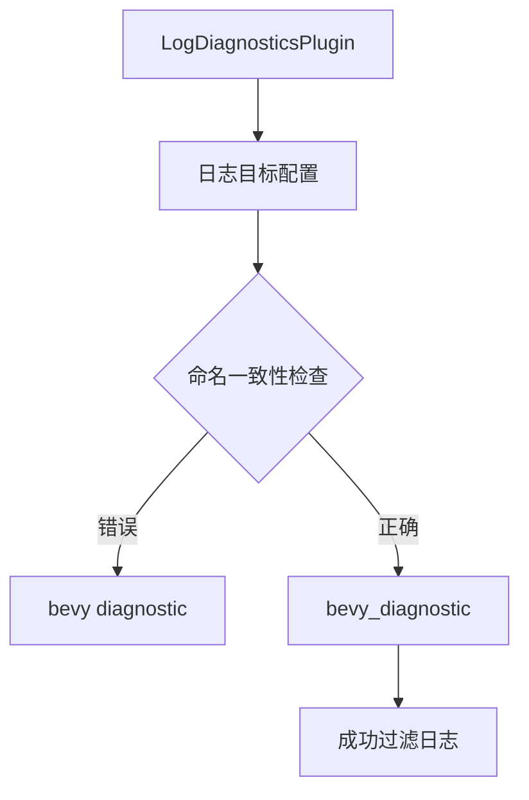

+++
title = "#18534 Fix LogDiagnosticsPlugin log target typo"
date = "2025-03-29T00:00:00"
draft = false
template = "pull_request_page.html"
in_search_index = false

[extra]
current_language = "zh-cn"
available_languages = {"en" = { name = "English", url = "/pull_request/bevy/2025-03/pr-18534-en-20250329" }, "zh-cn" = { name = "中文", url = "/pull_request/bevy/2025-03/pr-18534-zh-cn-20250329" }}
labels = ["C-Bug", "A-Diagnostics", "D-Straightforward"]
+++

# #18534 Fix LogDiagnosticsPlugin log target typo

## Basic Information
- **Title**: Fix LogDiagnosticsPlugin log target typo
- **PR Link**: https://github.com/bevyengine/bevy/pull/18534
- **Author**: Satellile
- **Status**: MERGED
- **Labels**: `C-Bug`, `S-Ready-For-Final-Review`, `A-Diagnostics`, `D-Straightforward`
- **Created**: 2025-03-25T10:29:43Z
- **Merged**: 2025-03-25T15:42:19Z
- **Merged By**: cart

## Description Translation
该PR的目标是修复LogDiagnosticsPlugin中的日志目标（log target）拼写错误。原来的日志目标使用带空格的"bevy diagnostic"，疑似应为下划线连接的"bevy_diagnostic"。修改后，日志过滤功能可按预期工作。

## The Story of This Pull Request

### 问题背景与发现
在Bevy引擎的诊断模块中，LogDiagnosticsPlugin负责将诊断信息输出到控制台。开发者Satellile在使用时发现，当尝试通过日志目标（log target）进行过滤时，预期的过滤行为无法正常工作。具体表现为：尽管设置了`RUST_LOG=bevy_diagnostic=info`的环境变量，INFO级别的日志仍然无法被正确捕获。

### 问题根源定位
通过审查代码，发现日志输出的宏调用中使用了不一致的日志目标标识符。在`log_diagnostics_plugin.rs`的关键位置，日志目标被错误地定义为带空格的字符串"bevy diagnostic"，而Bevy项目中通常使用下划线作为命名约定（如"bevy_diagnostic"）。这个细微的拼写差异导致日志过滤器无法正确匹配目标。

```rust
// 修改前的代码片段
info!(
    target: "bevy diagnostic",  // 此处使用空格
    // ...
);
```

### 解决方案与实现
修复方案直接明了：将日志目标字符串中的空格替换为下划线。这个修改保证了整个项目中日志目标标识符的一致性，同时遵循Rust生态系统中常见的下划线命名惯例。

```rust
// 修改后的代码片段
info!(
    target: "bevy_diagnostic",  // 修正为下划线
    // ...
);
```

### 技术影响与验证
这个看似简单的修改解决了以下关键问题：
1. **日志过滤功能恢复**：使用标准的下划线命名后，可以通过`RUST_LOG=bevy_diagnostic=info`正确过滤日志
2. **项目一致性维护**：遵循Bevy代码库现有的命名约定
3. **开发者体验改善**：消除了因拼写不一致导致的调试困惑

验证方式包括：
1. 手动测试日志输出过滤
2. 确保现有测试套件通过
3. 检查其他模块是否使用相同的命名约定

## Visual Representation



## Key Files Changed

### File: `crates/bevy_diagnostic/src/log_diagnostics_plugin.rs` (+2/-2)
**变更描述**：修正日志目标字符串的拼写错误

代码对比：
```rust
// Before:
info!(
    target: "bevy diagnostic",
    // ...
);

// After:
info!(
    target: "bevy_diagnostic",
    // ...
);
```

**影响分析**：
- 该修改直接影响日志系统的目标过滤功能
- 保持与Bevy其他模块的日志目标命名一致性
- 修复前后仅修改字符串内容，不涉及其他逻辑变更

## Further Reading
1. [env_logger文档 - 日志过滤语法](https://docs.rs/env_logger/latest/env_logger/#enabling-logging)
2. [Bevy官方日志指南](https://bevyengine.org/learn/book/getting-started/resources/#logging)
3. [Rust宏中的target参数规范](https://doc.rust-lang.org/log/log/macro.info.html)