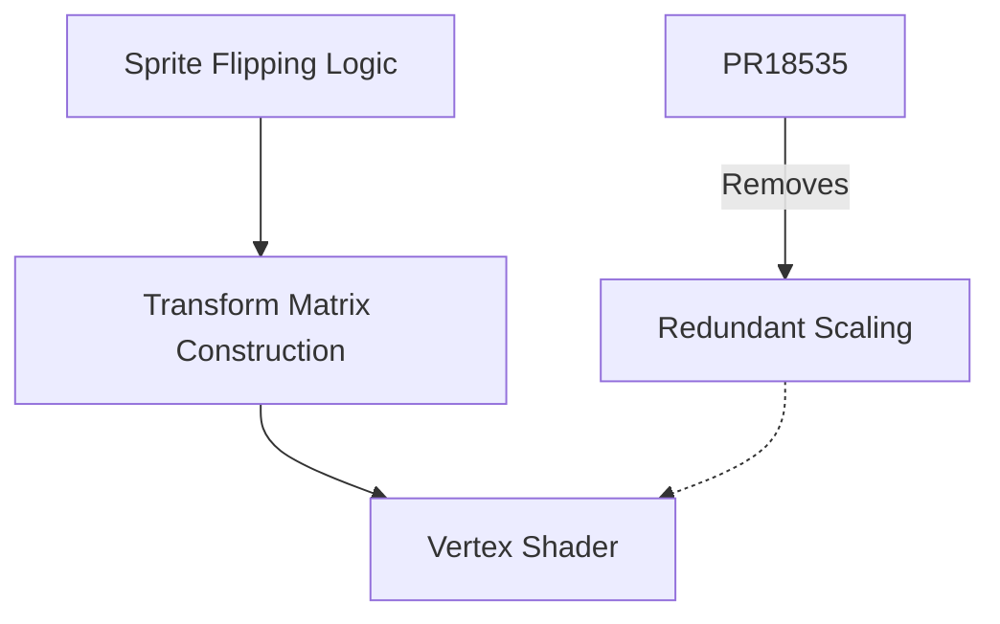

+++
title = "#18535 don't flip sprites twice"
date = "2025-03-25T00:00:00"
draft = false
template = "pull_request_page.html"
in_search_index = true

[taxonomies]
list_display = ["show"]

[extra]
current_language = "en"
available_languages = {"en" = { name = "English", url = "/pull_request/bevy/2025-03/pr-18535-en-20250325" }, "zh-cn" = { name = "中文", url = "/pull_request/bevy/2025-03/pr-18535-zh-cn-20250325" }}
labels = ["C-Bug", "A-Rendering"]
+++

# #18535 don't flip sprites twice

## Basic Information
- **Title**: don't flip sprites twice
- **PR Link**: https://github.com/bevyengine/bevy/pull/18535
- **Author**: mockersf
- **Status**: MERGED
- **Labels**: `C-Bug`, `A-Rendering`, `S-Ready-For-Final-Review`
- **Created**: 2025-03-25T11:14:26Z
- **Merged**: 2025-03-25T15:22:17Z
- **Merged By**: cart

## Description Translation
# Objective

- After #17041, sprite flipping doesn't work

## Solution

- Sprite flipping is applied twice:
https://github.com/bevyengine/bevy/blob/b6ccc2a2a0fac4d1a8d717920166b32f39b40cd9/crates/bevy_sprite/src/render/mod.rs#L766-L773
https://github.com/bevyengine/bevy/blob/b6ccc2a2a0fac4d1a8d717920166b32f39b40cd9/crates/bevy_sprite/src/render/mod.rs#L792-L799
- Keep one

## The Story of This Pull Request

The PR addresses a regression in sprite rendering introduced by #17041, where sprite flipping functionality stopped working correctly. The root cause was identified as duplicate transformation logic being applied during the rendering process.

In Bevy's sprite rendering pipeline, sprite flipping (both horizontal and vertical) is implemented through affine transformations. Prior to this fix, the flip transformations were being applied in two separate locations:

1. During the initial transform matrix construction using `Affine3A::from_scale_rotation_translation`
2. Later in the pipeline through explicit scaling factors in the transform calculation

This double application resulted in the flip operations canceling each other out. For example, a horizontal flip (scale_x = -1) applied twice would result in scale_x = 1, making sprites appear unflipped.

The solution involved removing the secondary transformation logic while preserving the initial flip application. By consolidating the flip handling to a single location, the PR restores correct flipping behavior while maintaining the architectural improvements from #17041.

Key code changes show the removal of redundant scaling factors:

```rust
// Before: Double flip application
let scale = Vec2::new(
    sprite.flip_x as u8 as f32 * 2.0 - 1.0,
    sprite.flip_y as u8 as f32 * 2.0 - 1.0,
);

// After: Single flip application preserved in Affine3A construction
let transform = Affine3A::from_scale_rotation_translation(
    Vec2::new(
        sprite.flip_x as u8 as f32 * 2.0 - 1.0,
        sprite.flip_y as u8 as f32 * 2.0 - 1.0,
    ).extend(1.0),
    // ... rest of transform parameters
);
```

This fix demonstrates the importance of maintaining clear ownership of spatial transformations in rendering pipelines. The regression occurred when flip handling was moved during refactoring without fully removing the original implementation.

## Visual Representation



## Key Files Changed

**File**: `crates/bevy_sprite/src/render/mod.rs`  
**Changes**: Removed 9 lines of redundant scaling logic

Before:
```rust
let scale = Vec2::new(
    sprite.flip_x as u8 as f32 * 2.0 - 1.0,
    sprite.flip_y as u8 as f32 * 2.0 - 1.0,
);
transform = transform * Affine3A::from_scale(scale.extend(1.0));
```

After:  
(This code block was completely removed)

These changes eliminate the secondary transformation application while preserving the primary flip handling in the initial transform matrix construction.

## Further Reading

1. [Affine Transformations in Computer Graphics](https://en.wikipedia.org/wiki/Affine_transformation)
2. [Bevy Sprite Rendering Documentation](https://docs.rs/bevy_sprite/latest/bevy_sprite/)
3. [WebGPU Shader Pipeline Overview](https://gpuweb.github.io/gpuweb/#pipelines)