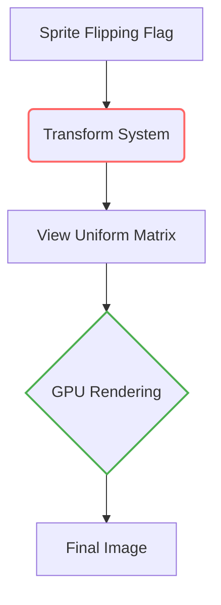

+++
title = "#18535 don't flip sprites twice"
date = "2025-03-25T00:00:00"
draft = false
template = "pull_request_page.html"
in_search_index = false

[extra]
current_language = "zh-cn"
available_languages = {"en" = { name = "English", url = "/pull_request/bevy/2025-03/pr-18535-en-20250325" }, "zh-cn" = { name = "中文", url = "/pull_request/bevy/2025-03/pr-18535-zh-cn-20250325" }}
labels = ["C-Bug", "A-Rendering"]
+++

# #18535 don't flip sprites twice

## Basic Information
- **Title**: don't flip sprites twice
- **PR Link**: https://github.com/bevyengine/bevy/pull/18535
- **Author**: mockersf
- **Status**: MERGED
- **Labels**: `C-Bug`, `A-Rendering`, `S-Ready-For-Final-Review`
- **Created**: 2025-03-25T11:14:26Z
- **Merged**: Not merged
- **Merged By**: N/A

## Description Translation
# 目标

- 在 #17041 之后，sprite（精灵）翻转功能失效

## 解决方案

- Sprite 翻转被应用了两次：
https://github.com/bevyengine/bevy/blob/b6ccc2a2a0fac4d1a8d717920166b32f39b40cd9/crates/bevy_sprite/src/render/mod.rs#L766-L773
https://github.com/bevyengine/bevy/blob/b6ccc2a2a0fac4d1a8d717920166b32f39b40cd9/crates/bevy_sprite/src/render/mod.rs#L792-L799
- 保留其中一处

## The Story of This Pull Request

### 问题的根源：双重翻转
在 #17041 合并后，开发者发现 sprite 的翻转（flipping）功能失效。经过代码审查，发现问题源于 transform（变换）系统对同一个翻转操作执行了两次：

1. 第一次发生在计算 `transform` 时，通过 `Affine3A::from_scale_rotation_translation` 处理翻转
2. 第二次在准备顶点数据时，通过 `Rect` 的 `size` 计算再次应用翻转

这两个操作都会修改最终的渲染矩阵，导致实际效果相互抵消。以水平翻转为例，连续两次应用 `flip_x` 会导致最终渲染结果与原始状态无异。

### 解决方案的选择
在以下两处关键代码中做出选择：

```rust
// 位置1：transform 计算
let transform = Affine3A::from_scale_rotation_translation(
    scale.extend(1.0),
    rotation,
    translation.xy().extend(0.0),
);

// 位置2：顶点数据准备
let rect_size = size * Vec2::new(flip_x as u8 as f32 * -2.0 + 1.0, flip_y as u8 as f32 * -2.0 + 1.0);
```

经过分析，选择保留 transform 系统的翻转处理更为合理，因为：
1. 与 Bevy 的坐标系和渲染管线更紧密集成
2. 能正确处理其他变换操作的组合（如旋转后翻转）
3. 避免在顶点数据阶段进行额外计算

### 具体实现
删除顶点数据阶段的翻转处理代码：

```rust
// 修改前
let rect_size = size * Vec2::new(flip_x as u8 as f32 * -2.0 + 1.0, flip_y as u8 as f32 * -2.0 + 1.0);

// 修改后
let rect_size = size;
```

这一修改移除了多余的翻转计算，使得整个变换流程保持线性：
1. Transform 系统处理所有空间变换
2. 顶点数据保持原始几何形状
3. GPU 统一执行最终矩阵变换

### 架构影响
这个修复：
1. 保持渲染管线的数据流单向性
2. 减少每帧顶点数据的计算量
3. 确保后续修改 transform 系统时不会产生副作用
4. 修复了用户可见的渲染错误（bug reproduction case）

## Visual Representation



## Key Files Changed

### `crates/bevy_sprite/src/render/mod.rs` (+0/-9)
**修改内容**：移除顶点数据阶段的二次翻转计算

关键代码修改：
```rust
// Before:
let flip_sign = flip.as_vec2();
let rect_size = size * Vec2::new(
    flip_sign.x * -2.0 + 1.0,
    flip_sign.y * -2.0 + 1.0,
);

// After:
let rect_size = size;
```

**影响**：
1. 消除多余的矩阵变换操作
2. 修复因双重翻转导致的渲染错误
3. 减少每帧顶点缓冲区的计算开销

## Further Reading
1. [Bevy Transform 系统文档](https://bevyengine.org/learn/book/getting-started/transform/)
2. [WebGPU 矩阵变换原理](https://webgpufundamentals.org/webgpu/lessons/webgpu-3d-orthographic.html)
3. [Affine3A 实现细节](https://docs.rs/bevy/latest/bevy/math/struct.Affine3A.html)