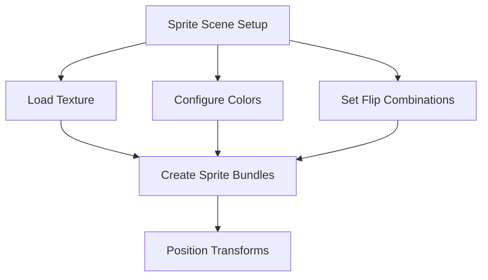

+++
title = "#18537 Add sprite flipping to `testbed_2d`'s sprite scene"
date = "2025-03-25T00:00:00"
draft = false
template = "pull_request_page.html"
in_search_index = false

[extra]
current_language = "zh-cn"
available_languages = {"en" = { name = "English", url = "/pull_request/bevy/2025-03/pr-18537-en-20250325" }, "zh-cn" = { name = "中文", url = "/pull_request/bevy/2025-03/pr-18537-zh-cn-20250325" }}
labels = ["A-Rendering", "C-Examples", "C-Testing", "M-Deliberate-Rendering-Change"]
+++

# #18537 Add sprite flipping to `testbed_2d`'s sprite scene

## Basic Information
- **Title**: Add sprite flipping to `testbed_2d`'s sprite scene
- **PR Link**: https://github.com/bevyengine/bevy/pull/18537
- **Author**: ickshonpe
- **Status**: MERGED
- **Labels**: `A-Rendering`, `C-Examples`, `S-Ready-For-Final-Review`, `C-Testing`, `M-Deliberate-Rendering-Change`
- **Created**: 2025-03-25T12:45:36Z
- **Merged**: Not merged
- **Merged By**: N/A

## Description Translation
### 目标
为`testbed_2d`的sprite场景添加sprite翻转功能

### 解决方案
在每条轴线和双轴线上绘制翻转的sprite。将sprite改为带有文字的矩形bevy横幅，并使用不同颜色的图片。

### 测试
```
cargo run --example testbed_2d
```


## The Story of This Pull Request

### 问题与背景
在Bevy引擎的2D测试平台（testbed）中，sprite场景原本缺乏对sprite翻转功能的直观演示。这对于测试渲染功能和展示引擎能力来说是一个缺口。开发者需要验证不同翻转组合（X轴/Y轴/双轴）的渲染效果，并确保这些功能在示例中正确展示。

### 解决方案与技术实现
核心思路是在sprite场景中创建四个不同翻转状态的sprite实例，每个实例使用不同的颜色和翻转组合。关键实现步骤包括：

1. **sprite配置**：将原始圆形sprite替换为矩形文字横幅，便于观察翻转效果
2. **颜色区分**：为每个sprite实例分配不同颜色
3. **翻转组合**：应用四种翻转模式（无翻转/X/Y/XY）
4. **布局调整**：使用Transform组件进行空间排列

代码修改集中在`sprite::setup`模块：

```rust
commands.spawn((
    SpriteBundle {
        texture: asset_server.load("branding/banner.png"),
        sprite: Sprite {
            color: Color::BLUE,
            flip_x: false,
            flip_y: false,
            custom_size: Some(Vec2::new(300.0, 100.0)),
        },
        transform: Transform::from_xyz(0.0, 0.0, 0.0),
        ..default()
    },
    StateScoped(super::Scene::Sprite),
));
// 类似创建其他三个sprite实例，调整color/flip_x/flip_y参数
```

### 技术考量
- **视觉对比**：使用不同颜色（BLUE/GREEN/YELLOW/RED）增强视觉区分度
- **纹理选择**：`banner.png`包含文字，便于验证镜像是否正确
- **布局策略**：通过坐标偏移（X轴-200到+200）保证四个sprite并列显示
- **API运用**：正确使用`Sprite`组件的`flip_x`和`flip_y`布尔属性

### 影响与验证
改动后运行测试场景可立即看到：
1. 四个不同颜色的横幅sprite
2. 每个sprite应用不同的翻转组合
3. 文字内容镜像显示验证翻转逻辑正确性
4. 明确的空间排列便于逐个检查

测试截图显示四种翻转状态正确渲染，验证了Bevy的sprite翻转功能正常工作。这对后续开发者和用户理解sprite系统行为提供了直观参考。

## Visual Representation



## Key Files Changed

### `examples/testbed/2d.rs` (+20/-4)
1. **修改内容**：
   - 重构sprite场景的初始化逻辑
   - 增加四个不同配置的sprite实例
   - 更新纹理资源和颜色配置

2. **关键代码片段**：
```rust
// 原始代码（简化版）
commands.spawn((
    SpriteBundle {
        texture: asset_server.load("branding/icon.png"),
        sprite: Sprite {
            color: Color::WHITE,
            custom_size: Some(Vec2::splat(128.0)),
            ..default()
        },
        ..default()
    },
    StateScoped(super::Scene::Sprite),
));

// 修改后代码
commands.spawn((
    SpriteBundle {
        texture: asset_server.load("branding/banner.png"),
        sprite: Sprite {
            color: Color::BLUE,
            flip_x: false,
            flip_y: false,
            custom_size: Some(Vec2::new(300.0, 100.0)),
        },
        transform: Transform::from_xyz(-200.0, 0.0, 0.0),
        ..default()
    },
    StateScoped(super::Scene::Sprite),
));
// 类似创建其他三个实例，调整颜色和翻转参数
```

3. **关联性**：
   - 通过具体示例演示sprite组件功能
   - 增强测试平台对渲染功能的覆盖度
   - 为后续开发提供可视化调试参考

## Further Reading
- [Bevy Sprite组件文档](https://docs.rs/bevy/latest/bevy/sprite/struct.Sprite.html)
- [2D图形变换原理](https://en.wikipedia.org/wiki/Transformation_matrix)
- [Bevy测试框架指南](https://bevyengine.org/learn/book/getting-started/testing/)