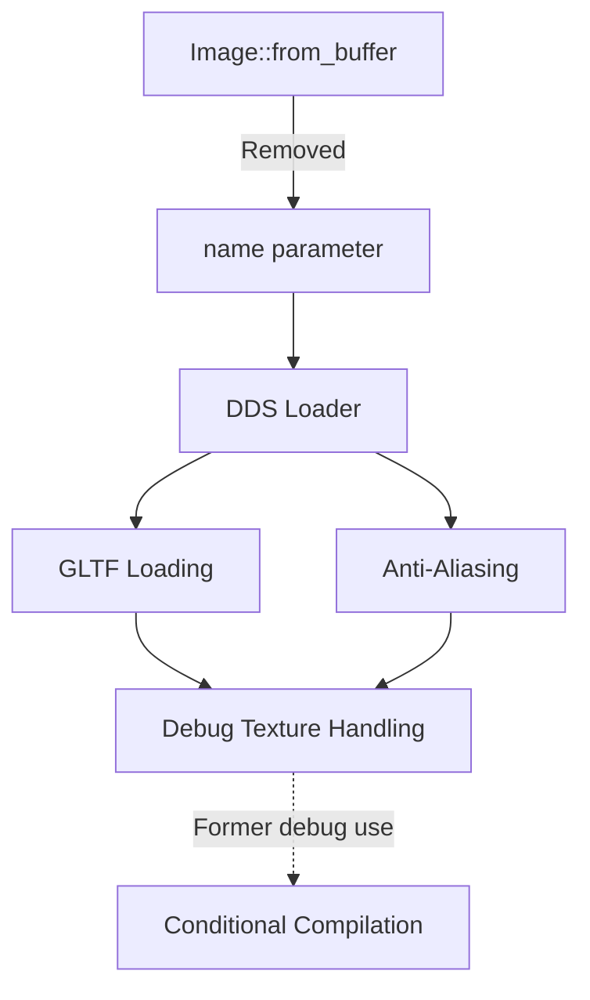

+++
title = "#18538 Remove Image::from_buffer `name` argument (only present in debug \"dds\" builds)"
date = "2025-03-25T00:00:00"
draft = false
template = "pull_request_page.html"
in_search_index = true

[taxonomies]
list_display = ["show"]

[extra]
current_language = "en"
available_languages = {"en" = { name = "English", url = "/pull_request/bevy/2025-03/pr-18538-en-20250325" }, "zh-cn" = { name = "中文", url = "/pull_request/bevy/2025-03/pr-18538-zh-cn-20250325" }}
labels = ["C-Usability", "D-Straightforward"]
+++

# #18538 Remove Image::from_buffer `name` argument (only present in debug "dds" builds)

## Basic Information
- **Title**: Remove Image::from_buffer `name` argument (only present in debug "dds" builds)
- **PR Link**: https://github.com/bevyengine/bevy/pull/18538
- **Author**: brianreavis
- **Status**: MERGED
- **Labels**: `C-Usability`, `S-Ready-For-Final-Review`, `D-Straightforward`
- **Created**: 2025-03-25T16:13:37Z
- **Merged**: Not merged
- **Merged By**: N/A

## Description Translation
# Objective

- Fixes https://github.com/bevyengine/bevy/issues/17891
- Cherry-picked from https://github.com/bevyengine/bevy/pull/18411

## Solution

The `name` argument could either be made permanent (by removing the `#[cfg(...)]` condition) or eliminated entirely. I opted to remove it, as debugging a specific DDS texture edge case in GLTF files doesn't seem necessary, and there isn't any other foreseeable need to have it.

## Migration Guide

- `Image::from_buffer()` no longer has a `name` argument that's only present in debug builds when the `"dds"` feature is enabled. If you happen to pass a name, remove it.

## The Story of This Pull Request

The problem stemmed from an inconsistent API in Bevy's image handling system. The `Image::from_buffer` method contained a `name` parameter that was only present when compiling with debug assertions and the "dds" feature enabled. This conditional parameter caused confusion and potential compilation errors when feature flags changed, as noted in issue #17891.

The solution required addressing the API inconsistency. The development team faced two options: make the parameter permanent by removing its conditional compilation attributes, or eliminate it entirely. After evaluating the parameter's usage, it became clear that the `name` argument was only used for debugging a specific DDS texture edge case in GLTF loading - functionality that wasn't essential for production use.

The implementation involved surgical removal of the `name` parameter across multiple subsystems:
1. In the DDS loader, where the parameter was originally used for debug logging
2. In the core Image struct's constructor
3. Throughout dependent systems like GLTF loading and anti-aliasing

This change required modifying conditional compilation attributes and updating all calling sites to remove the now-obsolete parameter. The team prioritized maintaining API consistency over preserving debug-only functionality, opting to simplify the interface for all users.

Key technical considerations included:
- Ensuring backward compatibility through careful migration guidance
- Maintaining texture loading functionality without the debug name
- Updating multiple crate dependencies that relied on the Image API
- Preserving error handling while removing debug-specific code paths

The impact is a more stable and predictable API surface. Developers no longer need to account for conditional parameters when working with image buffers, reducing cognitive overhead and potential compilation errors. This change aligns with Bevy's philosophy of maintaining clean, intuitive APIs while removing rarely used debug-specific features that complicate the public interface.

## Visual Representation



## Key Files Changed

### File: `crates/bevy_image/src/dds.rs`
**Changes**: Removed debug-only `name` parameter from DDS loading
```rust
// Before:
pub fn dds_buffer_to_image(
    buffer: &[u8],
    supported_compressed_formats: CompressedImageFormats,
    is_srgb: bool,
    name: &str,
) -> Result<Image, TextureError>

// After: 
pub fn dds_buffer_to_image(
    buffer: &[u8],
    supported_compressed_formats: CompressedImageFormats,
    is_srgb: bool,
) -> Result<Image, TextureError>
```

### File: `crates/bevy_image/src/image.rs`
**Changes**: Updated Image constructor signature
```rust
// Before:
#[cfg(all(debug_assertions, feature = "dds"))]
pub fn from_buffer(... name: &str)

// After:
pub fn from_buffer(...) // name parameter removed
```

### File: `crates/bevy_gltf/src/loader/mod.rs`
**Changes**: Removed name argument from DDS texture loading calls
```rust
// Before:
image = Image::from_buffer(
    &data,
    image_type,
    supported_compressed_formats,
    is_srgb,
    &format!("{base_name}{}", image_label),
);

// After:
image = Image::from_buffer(&data, image_type, supported_compressed_formats, is_srgb);
```

## Further Reading
1. [Rust Conditional Compilation](https://doc.rust-lang.org/reference/conditional-compilation.html)
2. [API Design Best Practices](https://rust-lang.github.io/api-guidelines/)
3. [Bevy Engine Asset System](https://bevyengine.org/learn/book/getting-started/assets/)