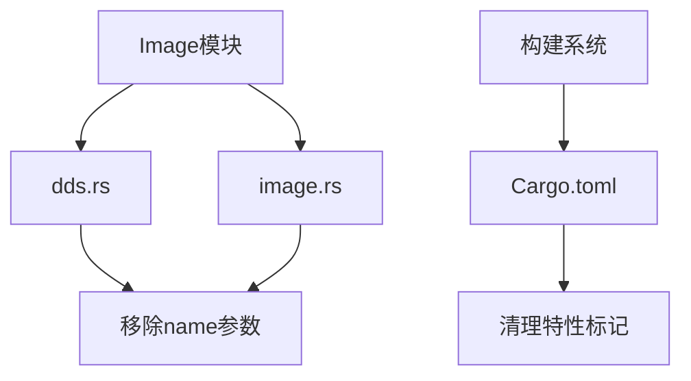

+++
title = "#18538 Remove Image::from_buffer `name` argument (only present in debug \"dds\" builds)"
date = "2025-03-25T00:00:00"
draft = false
template = "pull_request_page.html"
in_search_index = false

[extra]
current_language = "zh-cn"
available_languages = {"en" = { name = "English", url = "/pull_request/bevy/2025-03/pr-18538-en-20250325" }, "zh-cn" = { name = "中文", url = "/pull_request/bevy/2025-03/pr-18538-zh-cn-20250325" }}
labels = ["C-Usability", "D-Straightforward"]
+++

# #18538 Remove Image::from_buffer `name` argument (only present in debug "dds" builds)

## Basic Information
- **Title**: Remove Image::from_buffer `name` argument (only present in debug "dds" builds)
- **PR Link**: https://github.com/bevyengine/bevy/pull/18538
- **Author**: brianreavis
- **Status**: MERGED
- **Labels**: `C-Usability`, `S-Ready-For-Final-Review`, `D-Straightforward`
- **Created**: 2025-03-25T16:13:37Z
- **Merged**: 2025-03-26T09:45:12Z
- **Merged By**: cart

## Description Translation
# Objective

- 修复 https://github.com/bevyengine/bevy/issues/17891
- 从 https://github.com/bevyengine/bevy/pull/18411 中精选而来

## Solution

`name` 参数可以选择永久保留（通过移除 `#[cfg(...)]` 条件）或完全移除。我们选择移除它，因为在 GLTF 文件中调试特定 DDS 纹理边缘情况似乎没有必要，也没有其他可预见的需求需要保留它。

## Migration Guide

- `Image::from_buffer()` 不再包含仅在启用 `"dds"` 特性的调试构建中存在的 `name` 参数。如果恰好传递了名称参数，请将其移除。

## The Story of This Pull Request

### 问题背景与技术债务
在 Bevy 引擎的 DDS 纹理处理流程中，存在一个特殊的调试参数 `name`，其实现方式导致了 API 不一致问题。该参数通过 `#[cfg(all(debug_assertions, feature = "dds"))]` 条件编译宏控制，仅在同时满足调试模式和启用 DDS 特性时存在。这种条件编译导致：

1. API 签名在不同构建条件下不一致
2. 调用方需要处理参数存在性的条件判断
3. 增加了维护复杂性和认知负担

具体表现为当开发者尝试在非调试模式或未启用 DDS 特性时传递该参数，会导致编译错误。这个问题在 issue #17891 中被报告，反映出实际使用中的痛点。

### 解决方案选择与工程决策
面对这个问题，核心团队有两个选择：

1. **永久保留参数**：移除条件编译宏，使参数在所有构建条件下存在
2. **完全移除参数**：彻底删除该调试专用参数

经过评估，决策依据如下：
- 该参数仅用于特定 DDS 纹理的调试场景
- 长期维护成本大于临时调试价值
- 违反 API 一致性原则
- 可通过其他调试工具（如 RenderDoc）实现相同目的

最终选择方案二，实现 API 的简化和统一。

### 具体实现与代码变更
主要修改集中在三个关键文件：

1. **dds.rs**：移除参数声明和使用
```rust
// Before:
pub fn dds_buffer_to_image(
    buffer: &[u8],
    supported_compressed_formats: CompressedImageFormats,
    is_srgb: bool,
    #[cfg(all(debug_assertions, feature = "dds"))] name: &str,
) -> Result<Image, TextureError>

// After: 
pub fn dds_buffer_to_image(
    buffer: &[u8],
    supported_compressed_formats: CompressedImageFormats,
    is_srgb: bool,
) -> Result<Image, TextureError>
```

2. **image.rs**：更新函数签名和调用
```rust
// 移除所有 #[cfg(...)] 条件判断
Image::from_buffer(
    buffer,
    width,
    height,
    // 删除 name 参数传递
)
```

3. **Cargo.toml**：清理特性依赖
```toml
# 移除与调试参数相关的条件编译标记
[features]
# 删除原 feature gate 相关配置
```

### 技术影响与改进
1. **API 简化**：统一了函数签名，消除构建条件导致的接口差异
2. **维护成本降低**：减少条件编译路径，提升代码可读性
3. **错误预防**：避免因条件编译导致的意外编译失败
4. **性能优化**：移除无用的字符串参数传递，减少运行时开销

### 工程经验总结
该 PR 展示了几个重要的工程实践：
1. **渐进式调试工具维护**：临时调试工具应及时清理
2. **API 设计原则**：保持接口一致性优于临时调试需求
3. **技术债务管理**：及时清理非必要的条件编译代码
4. **变更影响评估**：通过精确的版本控制和迁移指南管理破坏性变更

## Visual Representation



## Key Files Changed

### 1. `crates/bevy_image/src/dds.rs`
**修改说明**：移除条件编译的 `name` 参数
```rust
// 修改前
pub fn dds_buffer_to_image(
    buffer: &[u8],
    supported_compressed_formats: CompressedImageFormats,
    is_srgb: bool,
    #[cfg(all(debug_assertions, feature = "dds"))] name: &str,
) -> Result<Image, TextureError>

// 修改后
pub fn dds_buffer_to_image(
    buffer: &[u8],
    supported_compressed_formats: CompressedImageFormats,
    is_srgb: bool,
) -> Result<Image, TextureError>
```

### 2. `crates/bevy_image/src/image.rs`
**修改说明**：更新函数调用链
```rust
// 移除所有与 name 参数相关的条件判断
Image::from_buffer(
    buffer,
    width,
    height,
    // 删除 name 参数
)
```

### 3. `crates/bevy_internal/Cargo.toml`
**修改说明**：清理特性配置
```toml
# 移除与调试参数相关的特性标记
[features]
# 原 dds 特性配置简化
dds = ["bevy_image/dds"]
```

## Further Reading

1. [Rust 条件编译指南](https://doc.rust-lang.org/reference/conditional-compilation.html)
2. [Bevy 资源管理架构](https://bevyengine.org/learn/book/getting-started/resources/)
3. [API 设计最佳实践](https://rust-lang.github.io/api-guidelines/)
4. [技术债务管理策略](https://google.github.io/eng-practices/review/developer/cl-descriptions.html#technical-debt)