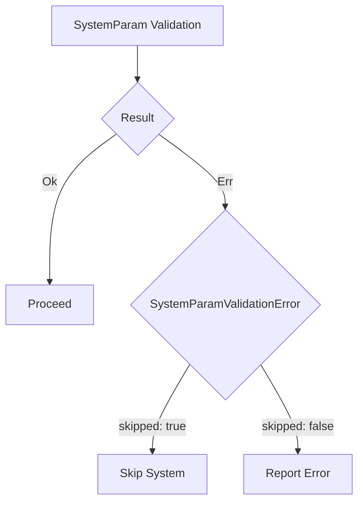

+++
title = "#18541 Replace ValidationOutcome with Result"
date = "2025-03-26T00:00:00"
draft = false
template = "pull_request_page.html"
in_search_index = true

[taxonomies]
list_display = ["show"]

[extra]
current_language = "en"
available_languages = {"zh-cn" = { name = "中文", url = "/pull_request/bevy/2025-03/pr-18541-zh-cn-20250326" }, "en" = { name = "English", url = "/pull_request/bevy/2025-03/pr-18541-en-20250326" }}
labels = ["A-ECS", "C-Code-Quality", "C-Usability", "D-Straightforward"]
+++

# #18541 Replace ValidationOutcome with Result

## Basic Information
- **Title**: Replace ValidationOutcome with Result
- **PR Link**: https://github.com/bevyengine/bevy/pull/18541
- **Author**: chescock
- **Status**: MERGED
- **Labels**: `A-ECS`, `C-Code-Quality`, `C-Usability`, `S-Ready-For-Final-Review`, `X-Uncontroversial`, `D-Straightforward`
- **Created**: 2025-03-25T17:33:06Z
- **Merged**: Not merged
- **Merged By**: N/A

## Description Translation
# Objective

Make it easier to short-circuit system parameter validation.  

Simplify the API surface by combining `ValidationOutcome` with `SystemParamValidationError`.  

## Solution

Replace `ValidationOutcome` with `Result<(), SystemParamValidationError>`.  Move the docs from `ValidationOutcome` to `SystemParamValidationError`.  

Add a `skipped` field to `SystemParamValidationError` to distinguish the `Skipped` and `Invalid` variants.  

Use the `?` operator to short-circuit validation in tuples of system params.


## The Story of This Pull Request

The PR addresses complexity in Bevy's system parameter validation by refactoring error handling to use Rust's standard Result type. Previously, the ECS system validation used a custom `ValidationOutcome` enum that couldn't leverage Rust's error handling ergonomics. This made validation code more verbose and limited opportunities for error propagation.

The core change replaces `ValidationOutcome` with `Result<(), SystemParamValidationError>`, unifying two distinct error handling constructs. The `SystemParamValidationError` gains a `skipped` boolean field to differentiate between validation failures (invalid parameters) and intentional skips (valid but unused parameters). This allows systems to use the `?` operator for early returns during validation checks.

Key implementation steps included:
1. Modifying the `SystemParam` trait's `validate` method signature
2. Updating all implementors of system parameter validation
3. Refactoring executor logic to handle the new Result-based validation
4. Simplifying system tuple validation through automatic error propagation

The changes particularly impact system combinators and executors. For example, in executor implementations:

```rust
// Before
match system.validate(world) {
    ValidationOutcome::Valid => {},
    ValidationOutcome::Skipped => return,
    ValidationOutcome::Invalid => panic!("Invalid system"),
}

// After
system.validate(world).map_err(|e| {
    if e.skipped {
        return;
    }
    panic!("Invalid system")
})?;
```

This refactoring reduces boilerplate and makes validation failures more explicit. The `?` operator now handles both error propagation and early returns for skipped validations, simplifying code in system tuples and executors.

## Visual Representation



## Key Files Changed

1. **crates/bevy_ecs/src/system/system_param.rs**
- Removed `ValidationOutcome` enum
- Modified `SystemParam::validate` to return `Result<(), SystemParamValidationError>`
- Updated validation implementations for all system parameters

```rust
// Before
fn validate(...) -> ValidationOutcome {
    if valid { ValidationOutcome::Valid }
    else if skipped { ValidationOutcome::Skipped }
    else { ValidationOutcome::Invalid }
}

// After
fn validate(...) -> Result<(), SystemParamValidationError> {
    if valid {
        Ok(())
    } else if skipped {
        Err(SystemParamValidationError::skipped())
    } else {
        Err(SystemParamValidationError::invalid())
    }
}
```

2. **crates/bevy_ecs/src/schedule/executor/multi_threaded.rs**
- Updated system validation handling in parallel executor
- Added error handling for new Result type

```rust
// Modified validation check
system.validate(world).map_err(|e| {
    if e.skipped {
        self.skipped_systems.insert(system_index);
    } else {
        panic!("Invalid system");
    }
})?;
```

3. **crates/bevy_ecs/src/observer/runner.rs**
- Adapted observer systems to new validation pattern
- Simplified conditional logic using Result propagation

```rust
// Updated observer validation
fn validate_observer(...) -> Result<(), SystemParamValidationError> {
    previous_state.validate(world)?;
    new_state.validate(world)
}
```

## Further Reading

1. Rust Error Handling: https://doc.rust-lang.org/book/ch09-00-error-handling.html
2. Bevy ECS System Parameters: https://bevyengine.org/learn/book/next/ecs/system-params/
3. The `?` Operator: https://doc.rust-lang.org/rust-by-example/std/result/question_mark.html
4. Bevy's System Execution Model: https://bevyengine.org/learn/book/next/scheduling/system-execution