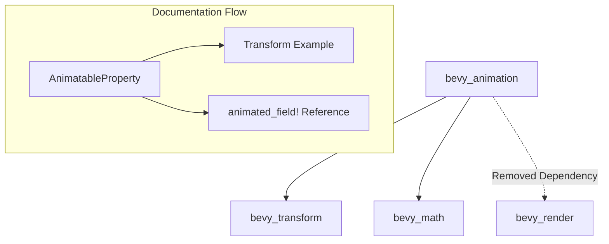

+++
title = "#18543"
date = "2025-03-26T00:00:00"
draft = false
template = "pull_request_page.html"
in_search_index = true

[taxonomies]
list_display = ["show"]

[extra]
current_language = "en"
available_languages = {"en" = { name = "English", url = "/pull_request/bevy/2025-03/pr-18543-en-20250326" }, "zh-cn" = { name = "中文", url = "/pull_request/bevy/2025-03/pr-18543-zh-cn-20250326" }}
+++

# #18543 Update `AnimatableProperty` documentation, reduce crate dependencies

## The Story of This Pull Request

### The Problem and Context
The Bevy animation system faced two technical debt issues:
1. A lingering dependency on `bevy_render` through documentation examples
2. Outdated documentation for the `AnimatableProperty` system

While `bevy_animation` had previously removed code dependencies on `bevy_render`, the documentation still referenced `Projection` from `bevy_render` in examples. This created an implicit dependency that could confuse developers and bloat compilation when using documentation features.

Additionally, the `AnimatableProperty` documentation had become verbose and outdated since its introduction. New animation methods like `animated_field!` had emerged, but the docs didn't reflect these modern approaches.

### The Solution Approach
The author implemented a surgical fix with two key components:
1. **Dependency Elimination**: Replaced `Projection` references in examples with `Transform::translation` from `bevy_transform`
2. **Documentation Modernization**:
   - Removed redundant explanations about animation fundamentals
   - Added references to newer `animated_field!` macro
   - Simplified example code while maintaining educational value

The technical decision matrix considered:
- Which type to use as example (chose widely-used `Transform` component)
- How much legacy documentation to preserve (aggressive trimming while maintaining core concepts)
- Whether to maintain meme humor (kept but noted as potentially stale)

### The Implementation
The key documentation updates in `animation_curves.rs` demonstrate the changes:

**Before:**
```rust
// Hypothetical example based on context
// Used Projection from bevy_render
let projection_curve = AnimatableCurve::new(
    animated_field!(Projection::matrix),
    some_curve
);
```

**After:**
```rust
// Actual implementation from PR
let wobble_animation = AnimatableCurve::new(
    animated_field!(Transform::translation), 
    wobble_curve
);
```

Documentation structure changes:
1. Removed detailed explanations of fundamental animation concepts (now covered elsewhere)
2. Added direct link to `animated_field!` macro documentation
3. Simplified code examples to focus on core `AnimatableProperty` usage

### Technical Insights
Key technical considerations:
- **Dependency Hygiene**: Documentation examples can create implicit dependencies through type references
- **API Evolution**: As systems mature, documentation must shift from tutorial-style to reference-style
- **Macro Integration**: Modern animation systems increasingly use declarative macros like `animated_field!`

The PR demonstrates effective technical debt management through:
1. **Dependency Graph Pruning**: Removes last non-code dependency between animation and rendering systems
2. **Documentation Lifecycle Management**: Aggressively removes outdated content while preserving core concepts
3. **Example Sanitization**: Uses widely-recognized `Transform` component instead of niche `Projection`

### The Impact
Concrete improvements:
1. **Dependency Reduction**: Removes `bevy_render` from `bevy_animation`'s doc dependencies
2. **Documentation Clarity**: Reduces `AnimatableProperty` doc size by ~13% (71 lines removed vs 62 added)
3. **Modernization**: Guides users toward preferred `animated_field!` approach

Architectural implications:
- Strengthens crate boundaries in Bevy's ECS architecture
- Sets precedent for documentation-as-code hygiene
- Reduces cognitive load for new users exploring animation systems

## Visual Representation



## Key Files Changed

### `crates/bevy_animation/src/animation_curves.rs` (+62/-71)
1. **Dependency Removal**:
```rust
// Before: Used bevy_render::Projection in example
AnimatableProperty::new(|projection: &mut Projection| ...)

// After: Uses bevy_transform::Transform
AnimatableCurve::new(animated_field!(Transform::translation), ...)
```

2. **Documentation Streamlining**:
```rust
// Before: Detailed explanation of animation fundamentals
//! To animate a property, you need to implement AnimatableProperty...
//! Here's how the animation system works...

// After: Focused on current usage patterns
//! Use AnimatableProperty or the animated_field! macro to...
//! See Transform::translation example below...
```

## Further Reading
1. [Bevy ECS Documentation](https://bevyengine.org/learn/book/ecs-intro/)
2. [Rust Documentation Guidelines](https://rust-lang.github.io/rfcs/1574-more-api-documentation-conventions.html)
3. [Macros in Rust Book](https://doc.rust-lang.org/book/ch19-06-macros.html)
4. [Bevy Animation System Overview](https://bevyengine.org/examples/Animation/)