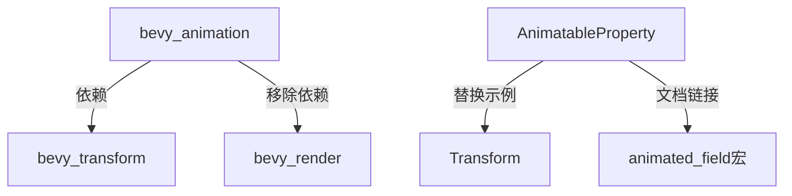

+++
title = "#18543 Update `AnimatableProperty` documentation, reduce crate dependencies"
date = "2025-03-26T00:00:00"
draft = false
template = "pull_request_page.html"
in_search_index = false

[extra]
current_language = "zh-cn"
available_languages = {"en" = { name = "English", url = "/pull_request/bevy/2025-03/pr-18543-en-20250326" }, "zh-cn" = { name = "中文", url = "/pull_request/bevy/2025-03/pr-18543-zh-cn-20250326" }}
labels = ["C-Docs", "C-Code-Quality", "A-Animation", "D-Straightforward"]
+++

# #18543 Update `AnimatableProperty` documentation, reduce crate dependencies

## Basic Information
- **Title**: Update `AnimatableProperty` documentation, reduce crate dependencies
- **PR Link**: https://github.com/bevyengine/bevy/pull/18543
- **Author**: greeble-dev
- **Status**: MERGED
- **Labels**: `C-Docs`, `C-Code-Quality`, `S-Ready-For-Final-Review`, `A-Animation`, `X-Uncontroversial`, `D-Straightforward`
- **Created**: 2025-03-25T18:31:51Z
- **Merged**: 2025-03-26T09:14:22Z
- **Merged By**: cart

## Description Translation
### 目标
- 移除`bevy_animation`对`bevy_render`的倒数第二个依赖
- 更新过时文档以反映最新的crate变化

### 叙述
尝试使`bevy_animation`独立于`bevy_render`。`bevy_animation::AnimatableProperty`的文档是最后的几个依赖之一，它使用`bevy_render::Projection`来演示如何动画化任意值。作者认为可以轻松替换为其他类型。

同时发现文档的其他部分已有些过时。最初`AnimatableProperty`是唯一动画属性的方式，因此文档非常详细。但随着时间推移，crate增加了更多文档和其他属性绑定方式，导致部分文档陈旧或重复。因此精简了`AnimatableProperty`文档，并添加了主要替代方案（`animated_field`）的链接。

### 展示


### 测试
```
cargo doc -p bevy_animation --no-deps --all-features
cargo test -p bevy_animation --doc --all-features
```

## The Story of This Pull Request

### 问题背景与技术约束
该PR主要解决两个技术债务：  
1. 消除`bevy_animation`对`bevy_render`的残留依赖。虽然大部分代码依赖已移除，但文档示例仍引用`bevy_render::Projection`类型  
2. 文档系统未能及时跟进架构演进，`AnimatableProperty`的说明仍保持早期设计时的详细程度，而实际上已有更简洁的`animated_field`宏作为替代方案

技术约束体现在需要保持向后兼容性的同时，确保文档示例使用的类型来自基础模块（如`bevy_transform`而非`bevy_render`）。

### 解决方案与技术实现
核心修改策略分为两部分：  
1. **依赖解耦**：将文档示例中的`Projection`替换为`Transform`类型  
```rust
// 修改前示例代码片段
AnimatableProperty::new(
    |projection: &mut Projection| &mut projection.aspect_ratio,
    "Camera Projection::aspect_ratio",
);

// 修改后示例代码片段
AnimatableProperty::new(
    |transform: &mut Transform| &mut transform.translation,
    "Transform::translation",
);
```  
2. **文档重构**：  
   - 移除过时的实现细节说明  
   - 增加对`animated_field!`宏的引用  
   - 简化类型参数说明  

### 技术洞察与架构影响
该修改展示了几个重要工程实践：  
1. **依赖管理**：通过替换具体类型实现模块解耦，保持`bevy_animation`作为基础动画模块的独立性  
2. **文档维护**：采用"文档即代码"的理念，确保示例与当前架构同步更新  
3. **API演进**：通过引导用户使用更现代的`animated_field`宏，简化属性动画的配置过程  

性能方面，该修改不影响运行时表现，主要提升代码可维护性和开发者体验。

### 后续改进空间
作者在PR讨论中提到潜在改进方向：  
1. 添加更全面的`AnimatableProperty`使用示例  
2. 展示不同组件选择的可能性  
3. 更新文档中的示意图和示例场景  

## Visual Representation



## Key Files Changed

### `crates/bevy_animation/src/animation_curves.rs` (+62/-71)
**修改重点**：重构文档内容并替换示例类型

**代码片段对比**：
```rust
// 修改前文档示例
/// let mut projection = Projection::Orthographic(OrthographicProjection {
///     scale: 1.0,
///     ..default()
/// });
/// let mut property = AnimatableProperty::new(
///     |projection: &mut Projection| &mut projection.aspect_ratio,
///     "Camera Projection::aspect_ratio",
/// );

// 修改后文档示例
/// let mut transform = Transform::from_translation(Vec3::X);
/// let mut property = AnimatableProperty::new(
///     |transform: &mut Transform| &mut transform.translation,
///     "Transform::translation",
/// );
```

**相关修改**：  
1. 移除与`Projection`相关的类型导入  
2. 简化`AnimatableProperty` trait的说明文档  
3. 增加指向`animated_field!`宏的快速链接  

## Further Reading
1. [Bevy ECS 组件系统文档](https://bevyengine.org/learn/book/ecs/components/)
2. [Rust宏编程指南](https://doc.rust-lang.org/book/ch19-06-macros.html)
3. [模块解耦最佳实践](https://rust-unofficial.github.io/patterns/patterns/structural/entry_interface.html)