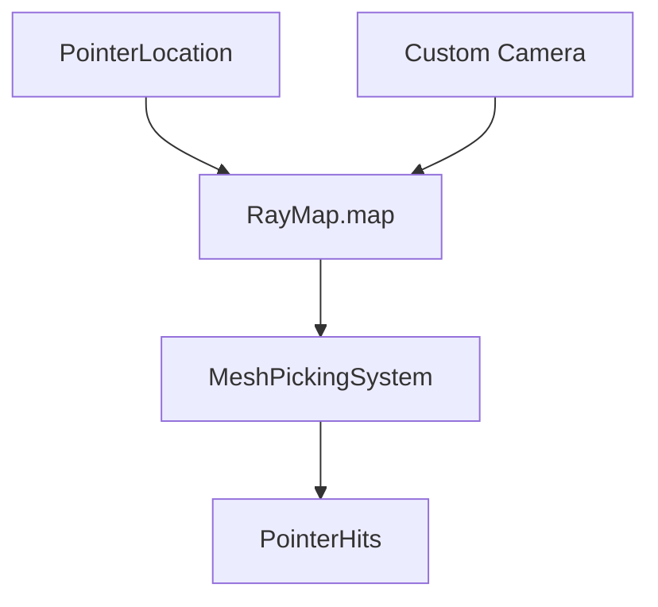

+++
title = "#18544 Make RayMap map public"
date = "2025-03-25T00:00:00"
draft = false
template = "pull_request_page.html"
in_search_index = true

[taxonomies]
list_display = ["show"]

[extra]
current_language = "en"
available_languages = {"en" = { name = "English", url = "/pull_request/bevy/2025-03/pr-18544-en-20250325" }, "zh-cn" = { name = "中文", url = "/pull_request/bevy/2025-03/pr-18544-zh-cn-20250325" }}
labels = ["D-Trivial", "C-Usability", "A-Picking"]
+++

# #18544 Make RayMap map public

## Basic Information
- **Title**: Make RayMap map public
- **PR Link**: https://github.com/bevyengine/bevy/pull/18544
- **Author**: Sorseg
- **Status**: MERGED
- **Labels**: `D-Trivial`, `C-Usability`, `S-Ready-For-Final-Review`, `M-Needs-Migration-Guide`, `A-Picking`
- **Created**: 2025-03-25T18:51:44Z
- **Merged**: Not merged
- **Merged By**: N/A

## Description Translation
Migration guide:
# Objective

Currently there seems to be no way to enable picking through render-to-texture cameras

## Solution

This PR allows casting rays from the game code quite easily.

## Testing

- I've tested these in my game and it seems to work
- I haven't tested edge cases

--- 

## Showcase

<details>
  <summary>Click to view showcase</summary>

```rust

fn cast_rays_from_additional_camera(
    cameras: Query<(&GlobalTransform, &Camera, Entity), With<RenderToTextureCamera>>,
    mut rays: ResMut<RayMap>,
    pointers: Query<(&PointerId, &PointerLocation)>,
) {
    for (camera_global_transform, camera, camera_entity) in &cameras {
        for (pointer_id, pointer_loc) in &pointers {
            let Some(viewport_pos) = pointer_loc.location() else {
                continue;
            };
            // if camera result is transformed in any way, the reverse transformation
            // should be applied somewhere here
            let ray = camera
                .viewport_to_world(camera_global_transform, viewport_pos.position)
                .ok();
            if let Some(r) = ray {
                rays.map.insert(RayId::new(camera_entity, *pointer_id), r);
            }
        }
    }
}

```

</details>

## Migration Guide
The `bevy_picking::backend::ray::RayMap::map` method is removed as redundant,
In systems using `Res<RayMap>` replace `ray_map.map()` with `&ray_map.map`

## The Story of This Pull Request

The PR addresses a specific limitation in Bevy's picking system where developers couldn't implement picking for render-to-texture cameras. This capability is crucial for scenarios like implementing in-game security cameras, picture-in-picture views, or any situation requiring multiple active viewports with independent picking.

The core issue stemmed from the `RayMap` struct's internal storage being inaccessible. `RayMap` manages 3D rays used for picking operations, mapping camera/pointer combinations to their corresponding world-space rays. Previously, the `map` field was private, forcing developers to use the provided automatic ray generation. This prevented custom ray insertion needed for secondary cameras not managed by the default system.

The solution modifies the `RayMap` struct's visibility:
```rust
// Before (hypothetical):
struct RayMap {
    map: HashMap<RayId, Ray>,
}

// After:
pub struct RayMap {
    pub map: HashMap<RayId, Ray>,
}
```
By making `map` public, developers gain direct access to the ray storage. This enables manual insertion of rays from custom cameras as demonstrated in the PR's showcase code. The migration guide removes the redundant `map()` accessor method since direct field access is now possible.

The implementation maintains API consistency by preserving existing automatic ray generation while opening new extension points. Developers can now:
1. Add rays for custom cameras
2. Modify existing rays
3. Implement hybrid picking systems mixing automatic and manual rays

The changes affect two key areas:
1. **Backend Core**: Public exposure of `RayMap.map`
2. **Mesh Picking**: Removal of now-redundant method calls

This approach balances flexibility with maintainability. While exposing internal structures can increase coupling, the tradeoff was deemed acceptable given:
- The picking system's extension-focused design
- Clear migration path for existing users
- Immediate unlock of advanced use cases

Performance impact is negligible since the change only affects data access patterns, not computation logic. The main architectural implication is clearer ownership of ray data - systems now directly manipulate the collection rather than going through accessors.

## Visual Representation



## Key Files Changed

### `crates/bevy_picking/src/backend.rs`
**Change**: Made `RayMap.map` field public  
**Before**:
```rust
pub struct RayMap {
    map: HashMap<RayId, Ray>,
}
```
**After**:
```rust
pub struct RayMap {
    pub map: HashMap<RayId, Ray>,
}
```
**Impact**: Enables direct manipulation of ray storage for custom cameras

### `crates/bevy_picking/src/mesh_picking/mod.rs`
**Change**: Removed redundant method call  
**Before**:
```rust
rays.map().insert(...)
```
**After**:
```rust
rays.map.insert(...)
```
**Impact**: Updates code to use direct field access per new visibility rules

## Further Reading
- [Bevy Picking Documentation](https://github.com/bevyengine/bevy/tree/main/crates/bevy_picking)
- [ECS Resource Management](https://bevy-cheatbook.github.io/programming/res.html)
- [Render to Texture Example](https://github.com/bevyengine/bevy/blob/main/examples/3d/render_to_texture.rs)