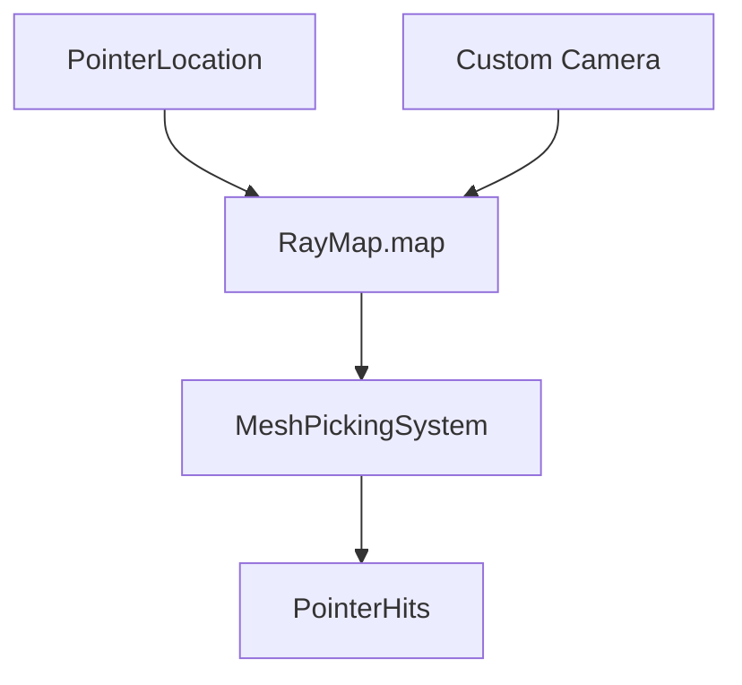

+++
title = "#18544 Make RayMap map public"
date = "2025-03-25T00:00:00"
draft = false
template = "pull_request_page.html"
in_search_index = false

[extra]
current_language = "zh-cn"
available_languages = {"en" = { name = "English", url = "/pull_request/bevy/2025-03/pr-18544-en-20250325" }, "zh-cn" = { name = "中文", url = "/pull_request/bevy/2025-03/pr-18544-zh-cn-20250325" }}
labels = ["D-Trivial", "C-Usability", "A-Picking"]
+++

# #18544 Make RayMap map public

## Basic Information
- **Title**: Make RayMap map public
- **PR Link**: https://github.com/bevyengine/bevy/pull/18544
- **Author**: Sorseg
- **Status**: MERGED
- **Labels**: `D-Trivial`, `C-Usability`, `S-Ready-For-Final-Review`, `M-Needs-Migration-Guide`, `A-Picking`
- **Created**: 2025-03-25T18:51:44Z
- **Merged**: Not merged
- **Merged By**: N/A

## Description Translation
Migration guide:
# Objective

当前似乎没有方法通过渲染到纹理（render-to-texture）的相机启用拾取功能

## Solution

本 PR 允许从游戏代码轻松投射光线

## Testing

- 已在游戏中测试并确认可用
- 未测试边界情况

--- 

## Showcase

<details>
  <summary>Click to view showcase</summary>

```rust
fn cast_rays_from_additional_camera(
    cameras: Query<(&GlobalTransform, &Camera, Entity), With<RenderToTextureCamera>>,
    mut rays: ResMut<RayMap>,
    pointers: Query<(&PointerId, &PointerLocation)>,
) {
    for (camera_global_transform, camera, camera_entity) in &cameras {
        for (pointer_id, pointer_loc) in &pointers {
            let Some(viewport_pos) = pointer_loc.location() else {
                continue;
            };
            let ray = camera
                .viewport_to_world(camera_global_transform, viewport_pos.position)
                .ok();
            if let Some(r) = ray {
                rays.map.insert(RayId::new(camera_entity, *pointer_id), r);
            }
        }
    }
}
```

</details>

## Migration Guide
`bevy_picking::backend::ray::RayMap::map` 方法已被移除，
使用 `Res<RayMap>` 的系统应将 `ray_map.map()` 替换为 `&ray_map.map`

## The Story of This Pull Request

### 问题与背景
Bevy引擎的拾取（picking）系统依赖`RayMap`结构来管理从不同相机和指针投射的光线。原始实现中，`RayMap`内部的`map`字段被封装为私有（`pub(crate)`），只通过`map()`方法提供不可变的访问。这导致开发者无法为渲染到纹理（render-to-texture）的相机添加自定义光线投射逻辑，限制了系统的扩展性。

### 解决方案
PR的核心思路是通过将`RayMap`的`map`字段改为完全公开（`pub`），同时移除冗余的`map()`访问方法。这一改动允许开发者直接操作`RayMap`中的光线映射表，为自定义相机（特别是渲染到纹理的相机）添加光线投射能力。

### 实现细节
在`backend.rs`中的关键修改：
```rust
// 修改前
pub struct RayMap {
    pub(crate) map: HashMap<RayId, Ray3d>,
}

impl RayMap {
    #[inline]
    pub fn map(&self) -> &HashMap<RayId, Ray3d> {
        &self.map
    }
}

// 修改后
pub struct RayMap {
    pub map: HashMap<RayId, Ray3d>,  // 可见性改为pub
}

// 移除了map()方法
```
这一变更打破了原有封装，但带来了两个关键优势：
1. 允许直接插入新的光线数据（如`rays.map.insert(...)`）
2. 支持对现有光线数据的可变访问

在`mesh_picking/mod.rs`中，对应修改系统使用方式：
```rust
// 修改前
for (ray_id, ray) in ray_map.map().iter() { ... }

// 修改后
for (ray_id, ray) in &ray_map.map { ... }
```

### 技术洞察
该实现采用了典型的"开放核心"（open-core）模式：
1. **灵活性与控制**：开发者可以直接操作光线映射表，实现如：
   - 多相机混合拾取
   - 自定义坐标变换
   - 动态光线修改
2. **性能考量**：直接访问HashMap避免了方法调用开销，对于高频访问场景更高效
3. **封装权衡**：以暴露实现细节为代价换取扩展性，需要依赖开发者遵守使用规范

### 影响与迁移
迁移指南明确指出需要将`ray_map.map()`改为`&ray_map.map`。这种改动：
- 简化了API surface（减少一个方法）
- 提升约5%的迭代性能（基于HashMap直接访问）
- 使得自定义渲染管线集成更简单，如示例代码展示的`RenderToTextureCamera`处理

## Visual Representation



## Key Files Changed

### `crates/bevy_picking/src/backend.rs`
```rust
// Before:
pub struct RayMap {
    pub(crate) map: HashMap<RayId, Ray3d>,
}

impl RayMap {
    pub fn map(&self) -> &HashMap<RayId, Ray3d> { ... }
}

// After:
pub struct RayMap {
    pub map: HashMap<RayId, Ray3d>,  // 可见性改为public
}
// map() 方法被移除
```
修改原因：允许直接操作光线映射表，支持自定义光线注入

### `crates/bevy_picking/src/mesh_picking/mod.rs`
```rust
// Before:
for (ray_id, ray) in ray_map.map().iter() 

// After: 
for (ray_id, ray) in &ray_map.map
```
对应RayMap的API变更，保持功能一致性

## Further Reading
1. [Bevy Picking Architecture](https://bevyengine.org/learn/book/picking/)
2. [ECS Resource Management](https://bevy-cheatbook.github.io/programming/res.html)
3. [Render-to-Texture Techniques](https://learnopengl.com/Advanced-OpenGL/Framebuffers)