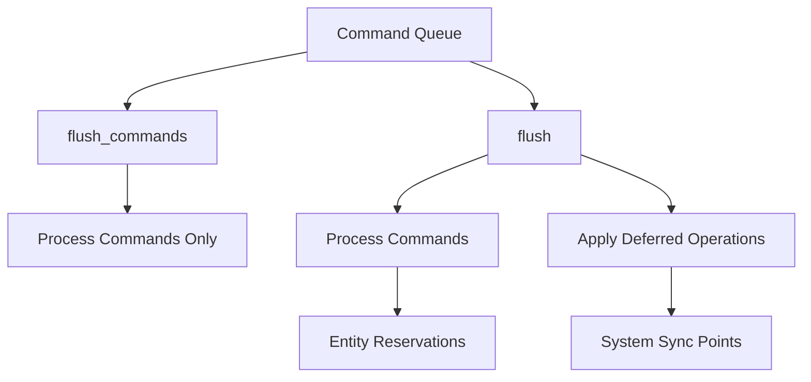

+++
title = "#18545 Ensure spawning related entities in an OnAdd observer downstream of a World::spawn in a Command does not cause a crash"
date = "2025-03-25T00:00:00"
draft = false
template = "pull_request_page.html"
in_search_index = true

[taxonomies]
list_display = ["show"]

[extra]
current_language = "en"
available_languages = {"en" = { name = "English", url = "/pull_request/bevy/2025-03/pr-18545-en-20250325" }, "zh-cn" = { name = "中文", url = "/pull_request/bevy/2025-03/pr-18545-zh-cn-20250325" }}
labels = ["C-Bug", "D-Trivial", "A-ECS"]
+++

# #18545 Ensure spawning related entities in an OnAdd observer downstream of a World::spawn in a Command does not cause a crash

## Basic Information
- **Title**: Ensure spawning related entities in an OnAdd observer downstream of a World::spawn in a Command does not cause a crash
- **PR Link**: https://github.com/bevyengine/bevy/pull/18545
- **Author**: ElliottjPierce
- **Status**: MERGED
- **Labels**: `C-Bug`, `D-Trivial`, `A-ECS`, `S-Ready-For-Final-Review`
- **Created**: 2025-03-25T18:58:16Z
- **Merged**: 2025-03-26T14:22:10Z
- **Merged By**: alice-i-cecile

## Description Translation
# Objective

fixes #18452.

## Solution

Spawning used to flush commands only, but those commands can reserve entities. Now, spawning flushes everything, including reserved entities. I checked, and this was the only place where `flush_commands` is used instead of `flush` by mistake.

## Testing

I simplified the MRE from #18452 into its own test, which fails on main, but passes on this branch.

## The Story of This Pull Request

The problem stemmed from a timing issue in Bevy's ECS command processing. When using `World::spawn` within a command followed by entity spawning in an `OnAdd` observer, the system could crash due to accessing uninitialized entity references. This occurred because command processing and entity reservation weren't properly synchronized.

In Bevy's command system, operations like entity creation are deferred. The original implementation used `flush_commands` after spawning, which only processed the command queue. However, this didn't handle _reserved entities_ - entities allocated through commands but not yet fully initialized. When an observer tried to spawn entities referencing these reserved entities before they were fully created, it led to invalid entity accesses.

The key fix was changing a single method call in `World::spawn`:

```rust
// Before (problematic):
self.flush_commands();

// After (fixed):
self.flush();
```

This change ensures both command processing _and_ deferred operations (like entity reservation) complete before proceeding. The `flush()` method combines:
1. `apply_commands` (command queue processing)
2. `apply_deferred` (system ordering guarantees)
3. Entity reservation finalization

The impact becomes clear when considering this execution flow:

1. Command reserves Entity A
2. Observer triggers on Entity A's component addition
3. Observer tries to spawn Entity B referencing Entity A

Without proper flushing, step 3 could execute before Entity A's reservation was finalized. The full flush ensures Entity A exists before observers execute.

The implementation maintains Bevy's ECS invariants by:
- Preserving command execution order
- Ensuring entity consistency across system boundaries
- Preventing dangling entity references in observer callbacks

Testing confirmed the fix using a minimal reproduction case that:
1. Spawns an entity via commands
2. Uses `OnAdd` observer to spawn child entities
3. Verifies entity relationships exist

This change demonstrates the importance of understanding Bevy's execution stages:
- **Commands**: Deferred operations stored for later execution
- **Flush**: Processes commands and applies system ordering
- **Deferred Operations**: Finalizes entity reservations and other delayed actions

## Visual Representation



## Key Files Changed

### `crates/bevy_ecs/src/world/mod.rs` (+1/-1)
**Change Purpose**: Fix entity reservation synchronization in spawning flow

Code Change:
```rust
// Before:
self.flush_commands();

// After:
self.flush();
```

This single-line change addresses the core issue by ensuring full processing of both commands and deferred operations when spawning entities. The `flush()` method provides comprehensive synchronization where `flush_commands()` was insufficient.

### `crates/bevy_ecs/src/observer/mod.rs` (+17/-0)
**Change Purpose**: Enhanced event triggering documentation (ancillary improvement)

Added documentation clarifying entity targeting in event observers:
```rust
/// Returns the [`Entity`] that was targeted by the `event`...
pub fn target(&self) -> Entity {
    self.trigger.target
}
```

While not directly related to the crash fix, these documentation improvements help prevent similar issues by better explaining observer entity relationships.

## Further Reading

1. Bevy ECS Commands Guide: https://bevyengine.org/learn/book/ECS/commands/
2. Entity Reservation Documentation: https://docs.rs/bevy_ecs/latest/bevy_ecs/world/struct.World.html#method.reserve_entity
3. System Flushing Explained: https://bevy-cheatbook.github.io/programming/system-order.html#flush