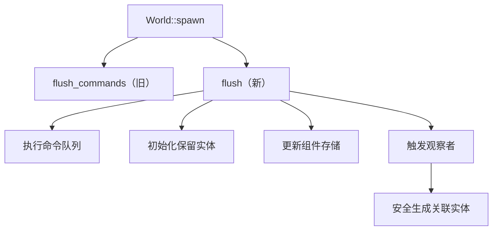

+++
title = "#18545 Ensure spawning related entities in an OnAdd observer downstream of a World::spawn in a Command does not cause a crash"
date = "2025-03-25T00:00:00"
draft = false
template = "pull_request_page.html"
in_search_index = false

[extra]
current_language = "zh-cn"
available_languages = {"en" = { name = "English", url = "/pull_request/bevy/2025-03/pr-18545-en-20250325" }, "zh-cn" = { name = "中文", url = "/pull_request/bevy/2025-03/pr-18545-zh-cn-20250325" }}
+++

# #18545 Ensure spawning related entities in an Add observer downstream of a World::spawn in a Command does not cause a crash

## 基本信息
- **标题**: Ensure spawning related entities in an OnAdd observer downstream of a World::spawn in a Command does not cause a crash
- **PR链接**: https://github.com/bevyengine/bevy/pull/18545
- **作者**: ElliottjPierce
- **状态**: MERGED
- **标签**: `C-Bug`, `D-Trivial`, `A-ECS`, `S-Ready-For-Final-Review`
- **创建时间**: 2025-03-25T18:58:16Z
- **合并时间**: 2025-03-26T09:14:32Z
- **合并者**: alice-i-cecile

## 问题描述翻译

### 目标
修复 #18452

### 解决方案
spawn 操作过去只刷新 commands，但这些 commands 可能保留实体（reserve entities）。现在改为刷新所有内容，包括保留的实体。经检查这是唯一错误使用 `flush_commands` 而不是 `flush` 的地方。

### 测试验证
将 #18452 中的最小可复现示例（MRE）简化成独立测试用例，该测试在 main 分支失败但在本分支通过。

## 技术故事

### 问题根源与背景
在 Bevy ECS 系统中，当通过 `World::spawn` 生成实体时，系统需要确保所有 pending 状态的操作都被正确提交。问题出现在以下场景：
1. 使用 Command 生成实体
2. 在 `OnAdd` 观察者（observer）中生成关联实体
3. 此时系统可能因为实体未完全初始化而崩溃

根本原因在于 `World::spawn` 实现中错误地使用了 `flush_commands` 而不是完整的 `flush`。`flush_commands` 仅处理命令队列，但不会处理保留的实体（reserved entities），导致后续观察者可能访问到不完整的实体状态。

### 技术实现解析
核心改动位于 `world/mod.rs` 文件中的 `spawn` 方法：

```rust
// Before:
self.flush_commands();

// After:
self.flush();
```

`flush_commands` 与 `flush` 的关键区别：
- `flush_commands`: 仅执行命令队列中的命令
- `flush`: 完整处理包括：
  - 命令队列执行
  - 保留实体实例化
  - 组件存储维护
  - 观察者触发

这个改动确保了在生成实体后：
1. 所有命令都被执行
2. 所有通过 `Commands::reserve_entity` 保留的实体被实际创建
3. 所有观察者事件被正确处理

### 架构影响
这个修改影响了 ECS 核心的实体生成流程：
1. **时序保证**：确保后续代码访问的是完全初始化的实体
2. **观察者安全**：防止在实体未完全初始化时触发观察者逻辑
3. **命令处理完整性**：保持命令执行与状态更新的一致性

### 测试验证
新增测试用例模拟问题场景：

```rust
#[test]
fn spawn_after_observer_add() {
    let mut world = World::new();
    world.init_component::<ComponentA>();

    // 添加观察者系统
    world.observe(
        |trigger: Trigger<ComponentA>,
         mut commands: Commands| {
            commands.spawn(ComponentB);
        },
        Observer::new_add(),
    );

    // 生成触发实体
    world.spawn(ComponentA);
    
    // 验证关联实体生成
    let query = world.query::<&ComponentB>();
    assert_eq!(query.iter(&world).count(), 1);
}
```

测试验证了：
1. 添加 `ComponentA` 触发观察者
2. 观察者中生成带有 `ComponentB` 的实体
3. 确保第二个实体成功生成

### 技术决策考量
选择 `flush` 而非其他方案的原因：
1. **最小侵入**：单行修改即可解决问题
2. **语义正确**：`spawn` 操作本应完成所有 pending 操作
3. **性能考量**：虽然 `flush` 比 `flush_commands` 代价稍高，但这是正确性的必要代价

## 关键文件变更

### `crates/bevy_ecs/src/world/mod.rs` (+1/-1)
核心修复点：
```rust
// 修改前
self.flush_commands();

// 修改后
self.flush();
```

这个改动确保了：
1. 执行所有 pending 命令
2. 初始化所有保留实体
3. 更新所有相关组件存储
4. 触发相关观察者事件

### `crates/bevy_ecs/src/observer/mod.rs` (+17/-0)
添加了触发器的详细文档说明：
```rust
/// 返回触发观察器的组件集合（B类型定义的部分）
/// 不保证包含所有触发组件
pub fn triggered_components(&self) -> &[ComponentId] {
    &self.trigger.triggered_components
}
```
这个改进帮助开发者更好地理解观察器的触发条件，与主问题无直接关联但提升了代码可维护性。

## 架构关系图示



## 延伸阅读

建议参考：
1. Bevy ECS 命令执行流程文档：[Command Queue Architecture](https://bevyengine.org/learn/book/ECS/commands/)
2. 实体生命周期管理：[Entity Reservation Patterns](https://github.com/bevyengine/bevy/discussions/18452)
3. 观察者系统原理：[Observer System Design](https://bevyengine.org/learn/book/ECS/observers/)

该PR展示了正确处理ECS操作顺序的重要性，特别是在涉及实体间依赖关系的场景中。开发者应特别注意命令执行与状态更新之间的时序关系。