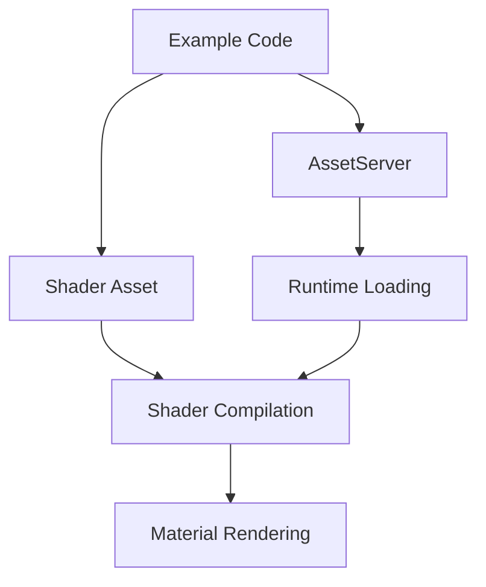

+++
title = "#18551 don't include file not available on docs.rs"
date = "2025-03-26T00:00:00"
draft = false
template = "pull_request_page.html"
in_search_index = true

[taxonomies]
list_display = ["show"]

[extra]
current_language = "en"
available_languages = {"en" = { name = "English", url = "/pull_request/bevy/2025-03/pr-18551-en-20250326" }, "zh-cn" = { name = "中文", url = "/pull_request/bevy/2025-03/pr-18551-zh-cn-20250326" }}
labels = ["C-Bug", "C-Docs", "A-Rendering"]
+++

# #18551 don't include file not available on docs.rs

## Basic Information
- **Title**: don't include file not available on docs.rs
- **PR Link**: https://github.com/bevyengine/bevy/pull/18551
- **Author**: mockersf
- **Status**: MERGED
- **Labels**: `C-Bug`, `C-Docs`, `A-Rendering`, `S-Ready-For-Final-Review`
- **Created**: 2025-03-25T21:37:44Z
- **Merged**: Not merged
- **Merged By**: N/A

## Description Translation
# Objective

- Fixes #18539 
- Doc failed to build as an example `include_str!` an asset, but assets are not available in the packaged crate

## Solution

- Don't `include_str!` the shader but read it at runtime

## The Story of This Pull Request

The problem stemmed from Bevy's documentation builds failing due to an example attempting to include shader assets using `include_str!` at compile time. This approach works during normal development when assets are present, but fails in packaged crate distributions like docs.rs where asset files aren't included. The specific error occurred because `include_str!` requires the file to exist at compile time, which isn't the case in documentation generation environments.

The solution required changing how the example handles shader assets. Instead of embedding the shader source directly into the binary using compile-time inclusion, the implementation was modified to load the shader at runtime through Bevy's asset system. This approach aligns with standard Bevy practices where assets are typically loaded dynamically rather than compiled into the executable.

In the `shader_material_wesl.rs` example, the key modification was replacing static shader inclusion with runtime asset loading. The previous implementation might have used direct shader source inclusion through `include_str!`, but the updated code now leverages Bevy's `AssetServer` to load the shader file from the assets directory during runtime:

```rust
const FRAGMENT_SHADER_ASSET_PATH: &str = "shaders/custom_material.wesl";

// Previous problematic approach (hypothetical):
// const SHADER: &str = include_str!("shaders/custom_material.wesl");

// New runtime loading approach:
let handle = app.world_mut()
    .resource_mut::<AssetServer>()
    .load::<Shader>("shaders/util.wesl");
```

This change required adjustments to the material implementation's `fragment_shader` method to return the asset path instead of embedded source code:

```rust
impl Material for CustomMaterial {
    fn fragment_shader() -> ShaderRef {
        FRAGMENT_SHADER_ASSET_PATH.into()
    }
}
```

The technical insight here is understanding the difference between compile-time and runtime asset handling in Rust. While `include_str!` is useful for embedding small files directly into binaries, it's not suitable for examples meant to demonstrate typical Bevy asset handling patterns. The modified approach better reflects real-world usage where assets are loaded from external files during application execution.

The impact of this change is twofold: it fixes documentation builds by removing the dependency on compile-time asset availability, and improves the example's educational value by demonstrating proper runtime asset loading techniques. This also prevents potential confusion for developers trying to replicate the example's patterns in their own projects.

## Visual Representation



## Key Files Changed

### `examples/shader/shader_material_wesl.rs` (+13/-9)
1. **Change**: Switched from compile-time shader inclusion to runtime asset loading
2. **Code Snippet**:
```rust
// Before (hypothetical):
// const SHADER: &str = include_str!("shaders/custom_material.wesl");

// After:
const FRAGMENT_SHADER_ASSET_PATH: &str = "shaders/custom_material.wesl";
```
3. **Relation to PR**: Fixes doc builds by removing compile-time asset dependency while maintaining example functionality through proper runtime loading

## Further Reading
- [Rust include_str! documentation](https://doc.rust-lang.org/std/macro.include_str.html)
- [Bevy Asset System Guide](https://bevyengine.org/learn/book/getting-started/assets/)
- [Shader Handling in Bevy](https://bevyengine.org/examples/Shaders/shader-material/)