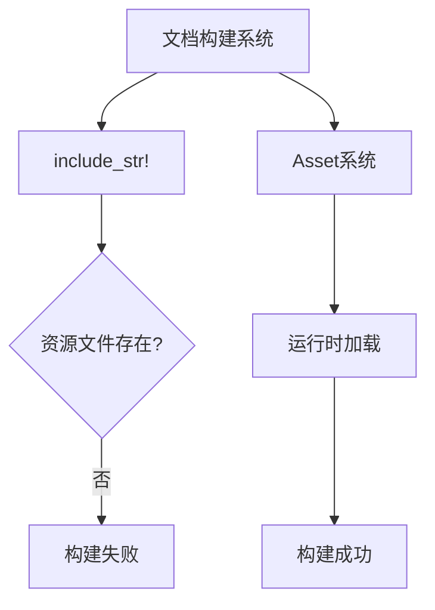

+++
title = "#18551 don't include file not available on docs.rs"
date = "2025-03-26T00:00:00"
draft = false
template = "pull_request_page.html"
in_search_index = false

[extra]
current_language = "zh-cn"
available_languages = {"en" = { name = "English", url = "/pull_request/bevy/2025-03/pr-18551-en-20250326" }, "zh-cn" = { name = "中文", url = "/pull_request/bevy/2025-03/pr-18551-zh-cn-20250326" }}
labels = ["C-Bug", "C-Docs", "A-Rendering"]
+++

# #18551 don't include file not available on docs.rs

## Basic Information
- **Title**: don't include file not available on docs.rs
- **PR Link**: https://github.com/bevyengine/bevy/pull/18551
- **Author**: mockersf
- **Status**: MERGED
- **Labels**: `C-Bug`, `C-Docs`, `A-Rendering`, `S-Ready-For-Final-Review`
- **Created**: 2025-03-25T21:37:44Z
- **Merged**: Not merged
- **Merged By**: N/A

## Description Translation
### 目标
- 修复 #18539 
- 文档构建失败，因为示例使用`include_str!`包含资源文件，但打包后的crate中不包含这些资源

### 解决方案
- 不再使用`include_str!`直接包含shader代码，改为运行时读取

## The Story of This Pull Request

### 问题背景与上下文
Bevy引擎的文档构建系统docs.rs在打包示例代码时遇到致命错误。问题根源在于`shader_material_wesl.rs`示例中使用了`include_str!`宏直接嵌入shader文件内容。当文档构建系统尝试编译这个示例时，由于打包后的crate不包含实际的shader资源文件，导致编译失败。

这是典型的开发环境与生产环境差异问题。开发时本地有完整的assets目录，但docs.rs的构建环境无法访问这些运行时资源。直接包含文件内容的编译时策略在文档生成场景下不可行。

### 解决方案与技术实现
核心思路是将shader加载方式从编译时静态包含改为运行时动态加载。具体实现涉及以下关键修改：

1. **移除编译时依赖**：
   删除原有的`include_str!`调用，避免在编译阶段直接嵌入shader文件内容

2. **采用Asset系统**：
   复用Bevy现有的Asset加载机制，通过`AssetServer`在运行时加载shader文件：
   ```rust
   const FRAGMENT_SHADER_ASSET_PATH: &str = "shaders/custom_material.wesl";
   
   // 在插件初始化时加载shader
   let handle = app.world_mut().resource_mut::<AssetServer>()
       .load::<Shader>("shaders/util.wesl");
   ```

3. **保持shader路径引用**：
   保留shader路径常量作为运行时加载的依据，但不再用于编译时文件包含

### 技术细节与工程决策
- **保持API兼容性**：通过继续使用`MaterialPlugin`和`AsBindGroup` trait，确保自定义材质系统接口不变
- **资源生命周期管理**：使用`UtilityShader`资源包装Handle，确保shader资源在内存中持续存在
- **条件编译取舍**：相比通过feature flag实现环境适配，直接改用运行时加载更符合Bevy的跨平台资源管理哲学

### 影响与改进
1. **修复文档构建**：彻底解决docs.rs上的构建失败问题
2. **增强环境适应性**：使示例代码在不同部署环境下更健壮
3. **示范最佳实践**：展示如何正确使用Bevy的Asset系统处理着色器资源

关键代码修改对比：
```rust
// Before: 编译时直接包含shader内容
#[derive(AsBindGroup)]
struct CustomMaterial {
    // 隐式依赖 include_str! 包含的shader文件
}

// After: 运行时加载shader资源
const FRAGMENT_SHADER_ASSET_PATH: &str = "shaders/custom_material.wesl";

impl Material for CustomMaterial {
    fn fragment_shader() -> ShaderRef {
        FRAGMENT_SHADER_ASSET_PATH.into()
    }
}
```

## Visual Representation



## Key Files Changed

### `examples/shader/shader_material_wesl.rs` (+13/-9)
1. **核心修改**：
   - 移除编译时shader包含逻辑
   - 实现运行时shader加载

2. **关键代码段**：
```rust
// 定义shader资源路径常量
const FRAGMENT_SHADER_ASSET_PATH: &str = "shaders/custom_material.wesl";

// 在插件初始化时加载shader资源
impl Plugin for CustomMaterialPlugin {
    fn build(&self, app: &mut App) {
        let handle = app.world_mut()
            .resource_mut::<AssetServer>()
            .load::<Shader>("shaders/util.wesl");
        app.insert_resource(UtilityShader(handle));
    }
}
```

3. **关联性**：
   - 直接解决文档构建失败问题
   - 展示Bevy资源系统的正确用法

## Further Reading
- [Bevy Asset System Documentation](https://bevyengine.org/learn/book/assets/)
- [Rust include_str! vs File I/O](https://doc.rust-lang.org/std/macro.include_str.html)
- [Docs.rs Build Environment](https://docs.rs/about)