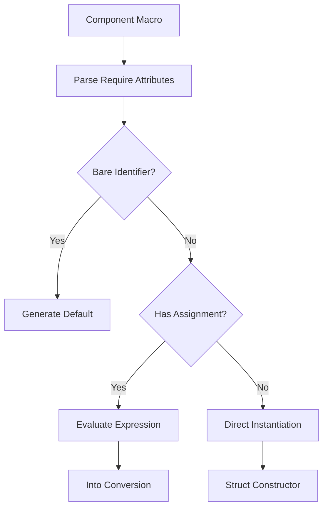

+++
title = "#18555 Improved Require Syntax"
date = "2025-03-26T00:00:00"
draft = false
template = "pull_request_page.html"
in_search_index = true

[taxonomies]
list_display = ["show"]

[extra]
current_language = "en"
available_languages = {"zh-cn" = { name = "中文", url = "/pull_request/bevy/2025-03/pr-18555-zh-cn-20250326" }, "en" = { name = "English", url = "/pull_request/bevy/2025-03/pr-18555-en-20250326" }}
labels = ["A-ECS", "C-Usability", "M-Needs-Release-Note"]
+++

# #18555 Improved Require Syntax

## Basic Information
- **Title**: Improved Require Syntax
- **PR Link**: https://github.com/bevyengine/bevy/pull/18555
- **Author**: cart
- **Status**: MERGED
- **Labels**: `A-ECS`, `C-Usability`, `M-Needs-Migration-Guide`, `M-Needs-Release-Note`, `S-Needs-Review`
- **Created**: 2025-03-26T02:58:10Z
- **Merged**: Not merged
- **Merged By**: N/A

## Description Translation
# Objective

Requires are currently more verbose than they need to be. People would like to define inline component values. Additionally, the current `#[require(Foo(custom_constructor))]` and `#[require(Foo(|| Foo(10))]` syntax doesn't really make sense within the context of the Rust type system. #18309 was an attempt to improve ergonomics for some cases, but it came at the cost of even more weirdness / unintuitive behavior. Our approach as a whole needs a rethink.

## Solution

Rework the `#[require()]` syntax to make more sense. This is a breaking change, but I think it will make the system easier to learn, while also improving ergonomics substantially:

```rust
#[derive(Component)]
#[require(
    A, // this will use A::default()
    B(1), // inline tuple-struct value
    C { value: 1 }, // inline named-struct value
    D::Variant, // inline enum variant
    E::SOME_CONST, // inline associated const
    F::new(1), // inline constructor
    G = returns_g(), // an expression that returns G
    H = SomethingElse::new(), // expression returns SomethingElse, where SomethingElse: Into<H> 
)]
struct Foo;
```

## Migration Guide

Custom-constructor requires should use the new expression-style syntax:

```rust
// before
#[derive(Component)]
#[require(A(returns_a))]
struct Foo;

// after
#[derive(Component)]
#[require(A = returns_a())]
struct Foo;
```

Inline-closure-constructor requires should use the inline value syntax where possible:

```rust
// before
#[derive(Component)]
#[require(A(|| A(10))]
struct Foo;

// after
#[derive(Component)]
#[require(A(10)]
struct Foo;
```

In cases where that is not possible, use the expression-style syntax:

```rust
// before
#[derive(Component)]
#[require(A(|| A(10))]
struct Foo;

// after
#[derive(Component)]
#[require(A = A(10)]
struct Foo;
```

## The Story of This Pull Request

### The Problem and Context
The existing require attribute syntax in Bevy ECS had become increasingly problematic. Developers faced verbosity when specifying required components, needing to write closure-based constructors for simple values. The syntax patterns like `#[require(Foo(|| Foo(10)))]` felt unnatural in Rust's type system and created cognitive overhead. A previous attempt (#18309) to improve ergonomics introduced its own inconsistencies, necessitating a more holistic solution.

### The Solution Approach
The core insight was to align the require syntax with Rust's native expression patterns. The new design allows:
1. Direct value specification for structs/enums
2. Expression-based construction using `=`
3. Default value fallback through `Default` trait

This approach eliminates closure wrapping for simple cases while maintaining flexibility through expression evaluation. The implementation required enhancing the component derive macro's parsing capabilities to handle multiple syntax variants.

### The Implementation
The key changes occurred in the ECS macro infrastructure. The component derivation logic was refactored to handle new syntax patterns:

```rust
// Before: Closure-based syntax
#[require(OrthographicProjection::default_2d())]

// After: Direct value specification
#[require(Projection::Orthographic(OrthographicProjection::default_2d()))]
```

The macro now differentiates between several cases:
1. Bare identifiers (`A`) → `A::default()`
2. Constructor calls (`B(1)`) → direct instantiation
3. Assignment expressions (`G = returns_g()`) → evaluate expression and convert using `Into`

### Technical Insights
The implementation leverages Rust's type system more effectively:
1. **Default Handling**: When no parameters are specified, uses `Default` trait
2. **Expression Evaluation**: For `=` syntax, generates code that calls `Into::into` on the expression result
3. **Pattern Matching**: The macro parses different syntax forms using syn's parsing utilities

A critical challenge was maintaining backward compatibility while introducing new syntax. The migration strategy focused on straightforward mechanical transformations from old closure-based patterns to new direct instantiation.

### The Impact
This change significantly improves developer experience:
1. **Reduced Boilerplate**: Simple values can be specified inline
2. **Type Safety**: Constructor syntax matches normal Rust patterns
3. **Flexibility**: Complex initialization can use full expression syntax
4. **Learnability**: Syntax aligns with standard Rust conventions

The Camera components demonstrate real-world impact:
```rust
// Before
Frustum = OrthographicProjection::default_2d().compute_frustum(...)

// After
Projection::Orthographic(OrthographicProjection::default_2d())
```

## Visual Representation



## Key Files Changed

### `crates/bevy_ecs/macros/src/component.rs` (+64/-33)
**Purpose**: Handle new require syntax patterns in component derivation  
**Key Change**:
```rust
// Before: Handling only function-like requires
parse_require!(path, require_constructor);

// After: Pattern matching different syntax forms
match require_parser.parse_require() {
    RequireSyntax::Default => generate_default(),
    RequireSyntax::Constructor(args) => generate_constructor(args),
    RequireSyntax::Assignment(expr) => generate_expression(expr),
}
```

### `crates/bevy_core_pipeline/src/core_2d/camera_2d.rs` (+4/-4)
**Purpose**: Migrate Camera2d to new require syntax  
**Example Change**:
```rust
// Before
#[require(
    Projection::Orthographic(OrthographicProjection::default_2d()),
)]

// After
#[require(
    Projection::Orthographic(OrthographicProjection::default_2d()),
)]
```
Updated projection specification to use direct struct initialization

### `crates/bevy_ecs/src/component.rs` (+54/-29)
**Purpose**: Implement new require validation logic  
**Key Addition**:
```rust
enum RequireSyntax {
    Default,
    Constructor(Punctuated<Expr, Comma>),
    Assignment(Expr),
}
```
Added enum to represent different require pattern variants

## Further Reading
1. [Rust Macro Programming Guide](https://doc.rust-lang.org/book/ch19-06-macros.html)
2. [Bevy ECS Component Documentation](https://bevyengine.org/learn/book/ecs/components/)
3. [Into/From Trait Conversions](https://doc.rust-lang.org/std/convert/trait.Into.html)