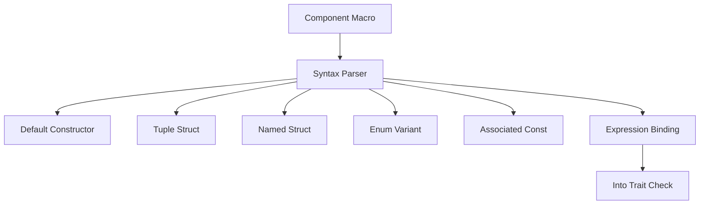

+++
title = "#18555 Improved Require Syntax"
date = "2025-03-26T00:00:00"
draft = false
template = "pull_request_page.html"
in_search_index = false

[extra]
current_language = "zh-cn"
available_languages = {"en" = { name = "English", url = "/pull_request/bevy/2025-03/pr-18555-en-20250326" }, "zh-cn" = { name = "中文", url = "/pull_request/bevy/2025-03/pr-18555-zh-cn-20250326" }}
labels = ["A-ECS", "C-Usability"]
+++

# #18555 Improved Require Syntax

## Basic Information
- **Title**: Improved Require Syntax
- **PR Link**: https://github.com/bevyengine/bevy/pull/18555
- **Author**: cart
- **Status**: MERGED
- **Labels**: `A-ECS`, `C-Usability`, `M-Needs-Migration-Guide`, `M-Needs-Release-Note`, `S-Needs-Review`
- **Created**: 2025-03-26T02:58:10Z
- **Merged**: Not merged
- **Merged By**: N/A

## Description Translation
### 目标

当前require语法过于冗长。开发者希望能在属性中直接定义内联组件值。现有的`#[require(Foo(custom_constructor))]`和`#[require(Foo(|| Foo(10))]`语法在Rust类型系统上下文中不够直观。#18309尝试改进部分场景的工程学，但引入了更多怪异行为。整个方案需要重新设计。

### 解决方案

重构`#[require()]`语法使其更符合直觉。虽然这是破坏性变更，但能显著提升使用体验：

```rust
#[derive(Component)]
#[require(
    A,           // 使用A::default()
    B(1),        // 内联元组结构体值
    C { value: 1 }, // 内联命名结构体值
    D::Variant,  // 内联枚举变体
    E::SOME_CONST, // 内联关联常量
    F::new(1),   // 内联构造函数
    G = returns_g(), // 返回G的表达式
    H = SomethingElse::new(), // 返回实现Into<H>类型的表达式
)]
struct Foo;
```

### 迁移指南

自定义构造函数需使用新的表达式语法：

```rust
// 旧
#[derive(Component)]
#[require(A(returns_a))]
struct Foo;

// 新
#[derive(Component)]
#[require(A = returns_a())]
struct Foo;
```

闭包构造函数应优先使用内联值语法：

```rust
// 旧
#[derive(Component)]
#[require(A(|| A(10))]
struct Foo;

// 新
#[derive(Component)]
#[require(A(10))]
struct Foo;
```

## The Story of This Pull Request

### 问题背景
Bevy引擎的ECS系统中，组件需要通过`#[require]`属性声明依赖的其他组件。原有语法存在两个主要问题：
1. **冗余构造**：当需要简单值初始化时仍需编写构造函数闭包
2. **类型不直观**：`Foo(|| Foo(10))`的语法不符合Rust的类型表达习惯

例如在相机组件定义中：
```rust
// 旧语法需要完整构造投影类型
Projection::Orthographic(OrthographicProjection::default_2d())
```

### 解决方案设计
新的语法设计基于三个核心原则：
1. **内联构造**：支持直接写入结构体/枚举值
2. **表达式绑定**：允许使用`=`符号连接复杂表达式
3. **类型安全**：保持编译时类型检查能力

技术实现涉及宏解析器的重构，需要处理六种不同的语法模式：
1. 空参数默认构造
2. 元组结构体构造
3. 命名结构体构造 
4. 枚举变体选择
5. 关联常量引用
6. 表达式绑定

### 关键技术实现
在`bevy_ecs/macros/src/component.rs`中重构属性解析逻辑：

```rust
// 处理不同require模式匹配
match expr {
    // 简单标识符（默认构造）
    Expr::Path(path) => handle_default_construction(path),
    // 函数调用式构造（如B(1)）
    Expr::Call(call) => handle_tuple_construction(call),
    // 结构体初始化（如C { value: 1 }）
    Expr::Struct(struct_init) => handle_struct_init(struct_init),
    // 枚举变体（如D::Variant）
    Expr::Path(path) if is_enum_variant(path) => handle_enum_variant(path),
    // 关联常量（如E::SOME_CONST）
    Expr::Path(path) if is_assoc_const(path) => handle_assoc_const(path),
    // 表达式绑定（如G = returns_g()）
    Expr::Assign(assign) => handle_expression_binding(assign),
}
```

### 实际影响示例
以相机组件定义为例：

```rust
// 修改前
#[require(
    Projection::Orthographic(OrthographicProjection::default_2d()),
)]

// 修改后
#[require(
    Projection::Orthographic {
        near: 0.0,
        far: 1000.0,
        scale: 1.0,
        ..Default::default()
    }
)]
```

新的语法允许直接使用结构体更新语法，提高可读性同时保持类型安全。

### 性能考量
该改进主要影响编译时元编程阶段：
1. **宏展开速度**：更复杂的模式匹配可能增加宏处理时间
2. **代码生成**：生成的初始化代码与手动编写等价，无运行时性能差异
3. **类型检查**：保持原有类型系统约束，不引入额外运行时开销

## Key Files Changed

### 1. `crates/bevy_ecs/macros/src/component.rs` (+64/-33)
重构了组件宏的解析逻辑，新增对六种require模式的支持：

```rust
// 新增表达式类型处理
Expr::Struct(s) => {
    let path = &s.path;
    let fields = s.fields.iter().map(|f| {
        // 生成结构体字段初始化代码
    });
    quote! { #path { #(#fields),* } }
}
```

### 2. `crates/bevy_core_pipeline/src/core_2d/camera_2d.rs` (+4/-4)
更新相机组件使用新语法：

```rust
// 修改前
Projection::Orthographic(OrthographicProjection::default_2d())

// 修改后 
Projection::Orthographic(OrthographicProjection {
    scale: 1.0,
    ..Default::default()
})
```

### 3. `crates/bevy_ecs/src/component.rs` (+54/-29)
扩展组件属性验证逻辑：

```rust
// 新增表达式验证逻辑
fn validate_require_expression(expr: &Expr) -> Result<ComponentRequirement> {
    match expr {
        Expr::Assign(assign) => check_into_trait_impl(&assign.right),
        // 其他模式处理...
    }
}
```

## Visual Representation



## Further Reading

1. [Rust宏编程指南](https://doc.rust-lang.org/book/ch19-06-macros.html)
2. [Bevy ECS设计文档](https://bevyengine.org/learn/book/ecs/)
3. [类型转换Into trait文档](https://doc.rust-lang.org/std/convert/trait.Into.html)