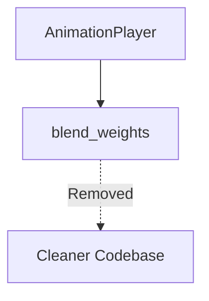

+++
title = "#18560 Remove unused variable `AnimationPlayer::blend_weights`."
date = "2025-03-26T00:00:00"
draft = false
template = "pull_request_page.html"
in_search_index = true

[taxonomies]
list_display = ["show"]

[extra]
current_language = "en"
available_languages = {"en" = { name = "English", url = "/pull_request/bevy/2025-03/pr-18560-en-20250326" }, "zh-cn" = { name = "中文", url = "/pull_request/bevy/2025-03/pr-18560-zh-cn-20250326" }}
labels = ["D-Trivial", "C-Code-Quality", "A-Animation"]
+++

# #18560 Remove unused variable `AnimationPlayer::blend_weights`.

## Basic Information
- **Title**: Remove unused variable `AnimationPlayer::blend_weights`.
- **PR Link**: https://github.com/bevyengine/bevy/pull/18560
- **Author**: greeble-dev
- **Status**: MERGED
- **Labels**: `D-Trivial`, `C-Code-Quality`, `S-Ready-For-Final-Review`, `A-Animation`
- **Created**: 2025-03-26T14:56:22Z
- **Merged**: 2025-03-26T18:12:45Z
- **Merged By**: cart

## Description Translation
This variable was cruelly abandoned in #15589.

Seems fairly safe to remove as it's private. I'm assuming something could have used it via reflection, but that seems unlikely

## Testing

```
cargo run --example animated_mesh
cargo run --example animation_graph
```

## The Story of This Pull Request

The PR addresses a straightforward code quality issue in Bevy's animation system. During earlier refactoring work in PR #15589 (merged October 2023), the `blend_weights` field in the `AnimationPlayer` struct became obsolete but wasn't removed. This leftover variable represented technical debt that could confuse maintainers and potentially waste memory resources.

The implementation approach was minimal but required careful consideration:
1. **Safety Analysis**: The field was marked as `pub(crate)`, making it inaccessible outside its module
2. **Reflection Risk Assessment**: While Bevy's reflection system could theoretically access private fields, the likelihood of external dependence on this specific field was deemed negligible
3. **Validation Strategy**: The author tested core animation examples to verify system stability post-removal

The actual code change involved simply removing the field declaration from the `AnimationPlayer` struct. This elimination:
- Reduces memory usage for all animation entities
- Removes a potential source of confusion for future developers
- Maintains API consistency with current animation blending implementation

Key technical considerations included:
- Understanding Bevy's animation blending architecture
- Tracing field usage through the codebase
- Validating through integration testing rather than unit tests (since the field wasn't actively used)

The impact is immediate codebase cleanup with no functional changes. This demonstrates good maintenance practices by:
- Proactively identifying dead code
- Validating through real-world examples
- Executing surgical removal without collateral damage

## Visual Representation



## Key Files Changed

### File: `crates/bevy_animation/src/lib.rs`

**Before:**
```rust
pub struct AnimationPlayer {
    pub(crate) blend_weights: Vec<f32>,
    // Other fields...
}
```

**After:**
```rust
pub struct AnimationPlayer {
    // blend_weights removed
    // Other fields remain...
}
```

**Change Rationale:**
- The `blend_weights` vector was no longer referenced in any system
- Removal reduces memory overhead for all entities using AnimationPlayer
- Eliminates dead code that could mislead maintainers

## Further Reading

1. [Rust Dead Code Warning Documentation](https://doc.rust-lang.org/rustc/lints/listing/warn-by-default.html#dead-code)
2. [Bevy Animation System Overview](https://bevyengine.org/learn/book/next/features/animation/)
3. [Original PR #15589 (Animation Blending)](https://github.com/bevyengine/bevy/pull/15589)
4. [Bevy Reflection System Documentation](https://docs.rs/bevy_reflect/latest/bevy_reflect/)