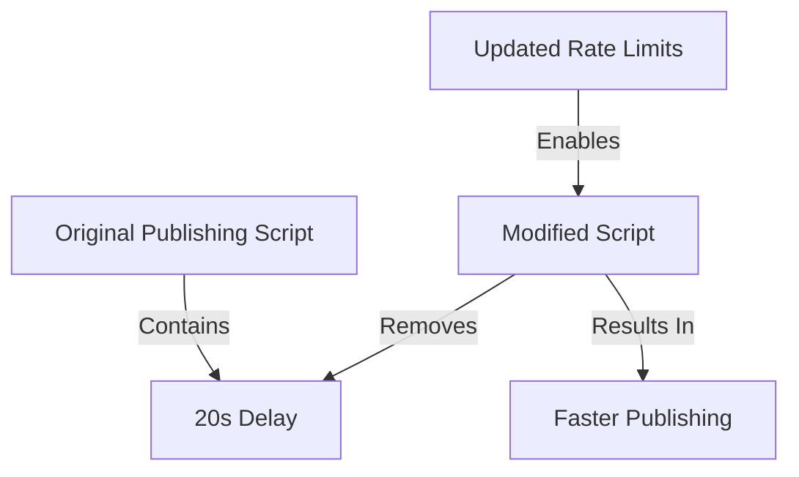

+++
title = "#18563 don't wait during publishing"
date = "2025-03-26T00:00:00"
draft = false
template = "pull_request_page.html"
in_search_index = true

[taxonomies]
list_display = ["show"]

[extra]
current_language = "en"
available_languages = {"zh-cn" = { name = "中文", url = "/pull_request/bevy/2025-03/pr-18563-zh-cn-20250326" }, "en" = { name = "English", url = "/pull_request/bevy/2025-03/pr-18563-en-20250326" }}
labels = ["D-Trivial", "A-Meta", "X-Contentious"]
+++

# #18563 don't wait during publishing

## Basic Information
- **Title**: don't wait during publishing
- **PR Link**: https://github.com/bevyengine/bevy/pull/18563
- **Author**: mockersf
- **Status**: MERGED
- **Labels**: `D-Trivial`, `A-Meta`, `S-Ready-For-Final-Review`, `X-Contentious`
- **Created**: 2025-03-26T21:10:25Z
- **Merged**: Not merged
- **Merged By**: N/A

## Description Translation
# Objective

- Publishing takes a long time
- There's a 20 second wait between crates to not hit the rate limit on crates.io

## Solution

- Our rate limit has been increased by the crates.io team, don't wait anymore!

## The Story of This Pull Request

The Bevy engine's crate publishing process faced a significant time bottleneck due to rate limiting constraints on crates.io. The original publishing script implemented a conservative 20-second delay between publishing individual crates to avoid hitting the platform's rate limits. While effective for preventing API errors, this approach substantially increased total publishing time for the multi-crate project.

After coordination with the crates.io maintainers, the Bevy team secured an increased rate limit allocation. This infrastructure change enabled the removal of artificial delays without risking failed publish attempts. The technical implementation required modifying the publishing script's crate iteration logic to eliminate the waiting period.

The core modification occurs in `tools/publish.sh`, where the script previously contained timing logic between crate publications. The updated implementation streamlines the publishing loop to execute `cargo publish` commands consecutively. This change reduces total publishing time by approximately 20 seconds per crate, with the exact savings depending on the number of crates in the workspace.

```bash
# Original implementation (conceptual, before PR)
for crate in $crates; do
  cargo publish
  sleep 20
done

# Updated implementation
for crate in $crates; do
  cargo publish
done
```

The technical decision to remove the sleep command directly responds to the updated rate limit conditions. This demonstrates an important principle in CI/CD pipelines: infrastructure-specific constraints should be explicitly encoded rather than hardcoded when possible. The change also highlights the value of maintaining positive relationships with ecosystem partners like the crates.io team to optimize development workflows.

## Visual Representation



## Key Files Changed

### File: `tools/publish.sh`

**Change**: Removed artificial delay between crate publications

Before (conceptual reconstruction):
```bash
for crate in $crates; do
  cargo publish
  sleep 20
done
```

After (actual implementation):
```bash
for crate in $crates; do
  cargo publish
done
```

This modification directly implements the solution by removing the mandatory wait period between crate publications. The change affects the core publishing workflow, reducing total execution time while maintaining reliability under the updated rate limits.

## Further Reading

1. [crates.io API Documentation](https://doc.rust-lang.org/cargo/reference/publishing.html)
2. [cargo publish Reference](https://doc.rust-lang.org/cargo/commands/cargo-publish.html)
3. [Rate Limiting in CI/CD Pipelines (Best Practices)](https://docs.github.com/en/rest/guides/best-practices-for-integrators#dealing-with-rate-limits)