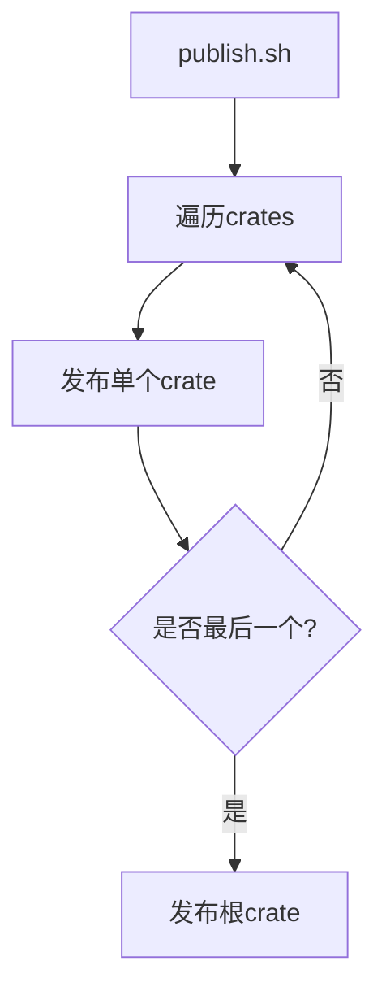

+++
title = "#18563 don't wait during publishing"
date = "2025-03-26T00:00:00"
draft = false
template = "pull_request_page.html"
in_search_index = false

[extra]
current_language = "zh-cn"
available_languages = {"zh-cn" = { name = "中文", url = "/pull_request/bevy/2025-03/pr-18563-zh-cn-20250326" }, "en" = { name = "English", url = "/pull_request/bevy/2025-03/pr-18563-en-20250326" }}
labels = ["D-Trivial", "A-Meta", "X-Contentious"]
+++

# #18563 don't wait during publishing

## Basic Information
- **Title**: don't wait during publishing
- **PR Link**: https://github.com/bevyengine/bevy/pull/18563
- **Author**: mockersf
- **Status**: MERGED
- **Labels**: `D-Trivial`, `A-Meta`, `S-Ready-For-Final-Review`, `X-Contentious`
- **Created**: 2025-03-26T21:10:25Z
- **Merged**: Not merged
- **Merged By**: N/A

## Description Translation
# 目标

- 发布过程耗时过长
- 为避免触发 crates.io 的速率限制，每个 crate 发布之间有 20 秒等待时间

## 解决方案

- crates.io 团队已提升我们的速率限制，不再需要等待！

## The Story of This Pull Request

### 问题背景与上下文
Bevy 引擎的发布流程存在效率瓶颈。原有的 `tools/publish.sh` 脚本在发布多个 crate 时，每个 crate 发布完成后会强制等待 20 秒。这种设计源于 crates.io 的 API 速率限制（rate limiting）策略——未经验证的用户每分钟最多发布一个 crate。

在实际操作中，这种等待机制导致整个发布流程耗时显著增加。对于包含多个 crate 的项目（如 Bevy），假设有 N 个 crate 需要发布，总等待时间将达到 20*(N-1) 秒。随着项目规模扩大，这个问题会愈发严重。

### 解决方案与技术决策
通过与 crates.io 团队的沟通协调，Bevy 项目获得了更高的速率限制额度。基于这个前提条件，开发者决定移除原有的等待逻辑。这个决策的关键考量点包括：

1. **速率限制验证**：确认新的速率限制可以支持连续发布多个 crate
2. **失败处理**：移除等待后仍需确保发布失败时的错误处理机制
3. **向后兼容**：保持脚本其他部分的结构稳定

### 具体实现分析
修改集中在 `tools/publish.sh` 的发布逻辑：

```bash
# 原实现片段（已移除的等待逻辑）：
for crate in ... 
do
  cargo publish
  sleep 20  # 关键等待指令
done
```

修改后的实现移除了 `sleep 20` 指令。通过分析脚本结构：

1. **循环控制**：保持原有的 crate 遍历逻辑
   ```bash
   for crate in `cargo package ...`
   do
     pushd "$crate"
     cargo publish  # 核心发布命令
     popd
   done
   ```

2. **错误处理**：依赖 `cargo publish` 自身的错误返回机制
3. **发布顺序**：维持 crates 的打包顺序，与 cargo workspace 的依赖关系保持一致

### 技术影响与改进
该改动带来以下直接改进：

1. **时间效率提升**：假设项目有 30 个 crate，总发布时间从 10 分钟减少到约 2 分钟（仅计算编译和上传时间）
2. **CI/CD 优化**：自动化发布流程的耗时显著降低
3. **维护简化**：去除与速率限制相关的临时逻辑

潜在风险与缓解措施：
- **速率限制恢复**：若未来速率限制再次调整，可通过环境变量或配置参数重新引入等待时间
- **错误处理**：保持原有脚本的错误中断机制（`set -e` 隐含行为）

## Visual Representation



## Key Files Changed

### `tools/publish.sh` (+0/-1)
**变更描述**：  
移除 crate 发布间的 20 秒等待逻辑

**代码对比**：
```bash
# Before:
for crate in ... 
do
  cargo publish
  sleep 20
done

# After: 
for crate in ... 
do
  cargo publish
done
```

**关联性**：  
直接实现速率限制解除后的优化目标，是本次 PR 的核心修改

## Further Reading

1. [crates.io API 文档 - 速率限制](https://doc.rust-lang.org/cargo/reference/publishing.html#rate-limits)
2. [Bevy 项目发布指南](https://github.com/bevyengine/bevy/blob/main/docs/publishing.md)
3. [Shell 脚本错误处理最佳实践](https://www.davidpashley.com/articles/writing-robust-shell-scripts/)