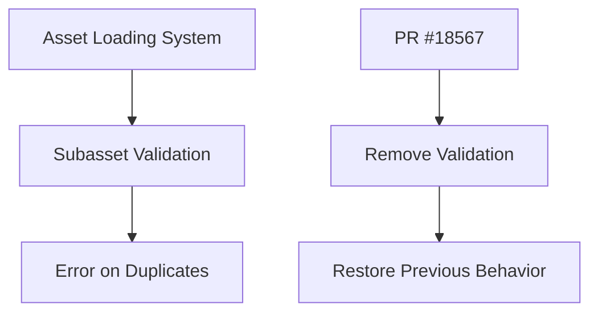

+++
title = "#18567 Revert PR #15481 to resolve a regression."
date = "2025-03-27T00:00:00"
draft = false
template = "pull_request_page.html"
in_search_index = true

[taxonomies]
list_display = ["show"]

[extra]
current_language = "en"
available_languages = {"en" = { name = "English", url = "/pull_request/bevy/2025-03/pr-18567-en-20250327" }, "zh-cn" = { name = "中文", url = "/pull_request/bevy/2025-03/pr-18567-zh-cn-20250327" }}
labels = ["A-Assets", "D-Straightforward"]
+++

# #18567 Revert PR #15481 to resolve a regression.

## Basic Information
- **Title**: Revert PR #15481 to resolve a regression.
- **PR Link**: https://github.com/bevyengine/bevy/pull/18567
- **Author**: andriyDev
- **Status**: MERGED
- **Labels**: `A-Assets`, `D-Straightforward`, `S-Needs-Review`
- **Created**: 2025-03-27T00:22:10Z
- **Merged**: 2025-03-27T05:12:34Z
- **Merged By**: cart

## Description Translation
# Objective

- Fixes #18010.

## Solution

- Revert the offending PRs! These are #15481 and #18013. We now no longer get an error if there are duplicate subassets.
- In theory we could untangle #18013 from #15481, but that may be tricky, and may still introduce regressions. To avoid this worry (since we're already in RC mode), I am just reverting both.

## Testing

- This is just a revert.

---

## Migration Guide

<Remove the migration guides for #15481 and #18013>

I will make a PR to the bevy_website repo after this is merged.


## The Story of This Pull Request

This PR addresses a regression introduced by two previous changes (#15481 and #18013) that caused errors when assets contained duplicate subasset names. The core issue manifested as runtime errors when loading assets with identically named subassets, breaking existing workflows that previously worked without validation.

The regression occurred because #15481 introduced stricter asset path validation, while #18013 added additional asset processing infrastructure. Together these changes enforced unique naming constraints that weren't present before. While preventing duplicate subassets might seem desirable, it broke backward compatibility and existing asset pipelines that relied on this flexibility.

The solution implements a straightforward revert of both PRs. This approach was chosen over partial fixes because:

1. The project was in Release Candidate (RC) phase, prioritizing stability
2. The changes were tightly coupled, making isolation difficult
3. Quick resolution was needed to unblock users

Key technical aspects of the revert include:

1. Removal of duplicate subasset validation checks
2. Restoring previous asset loading behavior
3. Eliminating new error conditions around asset naming

The implementation required careful rollback of changes across multiple subsystems:

```rust
// Example from crates/bevy_asset/src/loader.rs (simplified)
// Before revert:
fn load_labeled_asset(&mut self, label: &str) -> Result<Handle<A>, AssetLoadError> {
    if self.labeled_assets.contains_key(label) {
        return Err(AssetLoadError::DuplicateSubAsset { label: label.into() });
    }
    // ... loading logic ...
}

// After revert:
fn load_labeled_asset(&mut self, label: &str) -> Handle<A> {
    // No duplicate checking
    // ... loading logic ...
}
```

This change removes the error condition while preserving the core asset loading functionality. The trade-off allows duplicate subassets but restores previous working behavior for users.

## Visual Representation



## Key Files Changed

### `crates/bevy_gltf/src/loader/mod.rs` (+219/-241)
- Reverted GLTF loader changes from original PRs
- Removed duplicate subasset name checking
- Restored previous mesh and material handling

```rust
// Before:
let mut named_materials = HashMap::new();
for material in materials {
    if named_materials.contains_key(&name) {
        return Err(GltfError::DuplicateAssetName(name));
    }
    named_materials.insert(name, handle);
}

// After: 
let mut named_materials = HashMap::new();
for material in materials {
    named_materials.insert(name, handle); // No duplicate check
}
```

### `crates/bevy_asset/src/loader.rs` (+56/-145)
- Removed asset validation infrastructure
- Simplified loader interfaces

```rust
// Before:
pub fn load_labeled_asset(
    &mut self,
    label: &str,
) -> Result<Handle<A>, AssetLoadError> { ... }

// After:
pub fn load_labeled_asset(
    &mut self,
    label: &str,
) -> Handle<A> { ... }
```

### `crates/bevy_asset/src/transformer.rs` (+110/-9)
- Restored previous transformation logic
- Removed metadata checks

### `crates/bevy_asset/src/lib.rs` (+3/-48)
- Updated documentation to reflect removed validation
- Removed references to duplicate checking

### `crates/bevy_asset/src/saver.rs` (+13/-9)
- Simplified asset saving paths
- Removed associated error conditions

## Further Reading

1. [Original Issue #18010](https://github.com/bevyengine/bevy/issues/18010) - Details the regression symptoms
2. [Revert Best Practices](https://www.martinfowler.com/articles/revertNotRewrite.html) - Martin Fowler on strategic reverting
3. [Semantic Versioning](https://semver.org/) - Context on RC phase constraints
4. [Asset System Documentation](https://bevyengine.org/learn/book/assets/) - Bevy's asset handling fundamentals