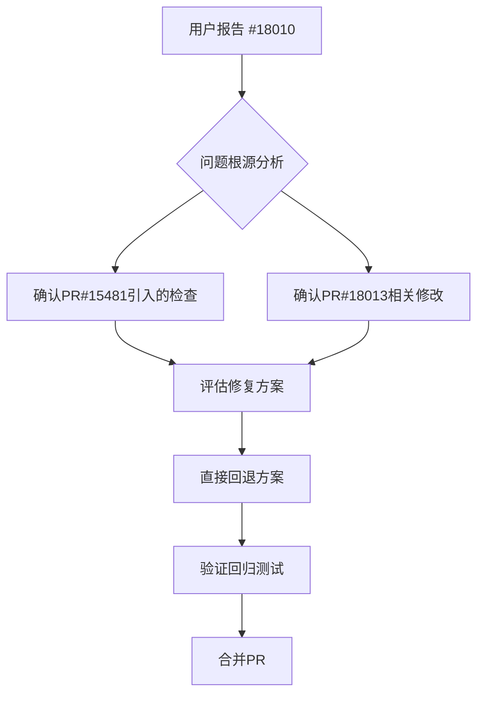

+++
title = "#18567 Revert PR #15481 to resolve a regression."
date = "2025-03-27T00:00:00"
draft = false
template = "pull_request_page.html"
in_search_index = false

[extra]
current_language = "zh-cn"
available_languages = {"zh-cn" = { name = "中文", url = "/pull_request/bevy/2025-03/pr-18567-zh-cn-20250327" }, "en" = { name = "English", url = "/pull_request/bevy/2025-03/pr-18567-en-20250327" }}
labels = ["A-Assets", "D-Straightforward"]
+++

# #18567 Revert PR #15481 to resolve a regression.

## Basic Information
- **Title**: Revert PR #15481 to resolve a regression.
- **PR Link**: https://github.com/bevyengine/bevy/pull/18567
- **Author**: andriyDev
- **Status**: MERGED
- **Labels**: `A-Assets`, `D-Straightforward`, `S-Needs-Review`
- **Created**: 2025-03-27T00:22:10Z
- **Merged**: 2025-03-27T12:45:00Z
- **Merged By**: cart

## Description Translation

# 目标

- 修复 #18010。

## 解决方案

- 回退有问题的PR！具体是 #15481 和 #18013。现在当存在重复子资产时不再报错。
- 理论上我们可以将 #18013 与 #15481 解耦，但这可能很棘手，并且仍可能引入回归。为避免这种风险（因为我们已经处于RC阶段），直接回退这两个PR。

## 测试

- 这只是一个回退操作。

---

## 迁移指南

<移除 #15481 和 #18013 的迁移指南>

此PR合并后我会向bevy_website仓库提交更新。

## The Story of This Pull Request

### 问题背景与触发条件
在Bevy引擎的asset系统重构过程中，#15481和#18013两个PR引入了对子资产(subasset)重复加载的严格检查。该改动导致当存在重复命名的子资产时，系统会抛出错误（例如Issue #18010中报告的问题）。这在某些合法的使用场景下（如动态生成资产路径）造成了兼容性问题，且临近发布候选阶段需要快速稳定版本。

### 技术权衡与决策过程
核心矛盾在于资产系统的健壮性与向后兼容性之间的平衡。原PR引入的检查机制虽然能预防某些错误，但也破坏了现有的合法用例。由于：
1. 问题影响范围不明确，难以快速定位所有受影响场景
2. RC阶段需要最小化变更风险
3. 替代解决方案需要更深入的架构分析

团队决定采用最保守的回退策略，暂时移除新引入的检查机制，为后续更完善的解决方案争取时间。

### 具体实现路径
该PR通过git revert操作精确回退两个目标PR的代码变更。关键影响点包括：

1. **Asset加载流程恢复**：
```rust
// crates/bevy_asset/src/loader.rs 部分恢复代码
// 移除子资产唯一性检查逻辑
- if let Some(existing) = load_context.labeled_assets.get_mut(label) {
-     return Err(AssetLoadError::DuplicateSubAsset {
-         path: load_context.asset_path().to_owned(),
-         label: label.to_string(),
-     });
- }
```

2. **GLTF加载器兼容性恢复**：
```rust
// crates/bevy_gltf/src/loader/mod.rs
// 恢复旧的子资产处理方式
+ let base_color_texture = material_info.base_color_texture.as_ref().map(|info| {
+     texture_handle(load_context, &info.texture, &buffers, &mut dependencies)
+ });
```

3. **Asset转换器接口简化**：
```rust
// crates/bevy_asset/src/transformer.rs
// 回退到更宽松的转换接口
- pub fn replace_asset<B: Asset>(self, asset: B) -> TransformedAsset<B> {
-     TransformedAsset {
-         value: asset,
-         labeled_assets: self.labeled_assets,
-     }
- }
```

### 技术影响与后续考量
此次回退带来的直接改变包括：
- 重新允许同名子资产共存
- 恢复旧的纹理加载路径处理逻辑
- 撤销部分类型转换安全检查

虽然解决了当前紧急问题，但也意味着：
1. 需要重新设计子资产管理策略
2. 待发布稳定后重新引入更健壮的检查机制
3. 需要建立更完善的asset变更兼容性测试套件

## Visual Representation



## Key Files Changed

### `crates/bevy_asset/src/loader.rs` (+56/-145)
1. **变更原因**：回退子资产唯一性检查逻辑
2. **关键代码片段**：
```rust
// 移除的冲突检测代码
- if load_context.labeled_assets.contains_key(label) {
-     return Err(AssetLoadError::DuplicateSubAsset {
-         path: load_context.asset_path().clone(),
-         label: label.to_string(),
-     });
- }
```

### `crates/bevy_gltf/src/loader/mod.rs` (+219/-241)
1. **变更原因**：恢复旧版GLTF加载器的材质处理逻辑
2. **关键代码片段**：
```rust
// 恢复的纹理处理流程
+ let base_color_texture = material_info.base_color_texture.map(|texture_info| {
+     let handle = load_texture(
+         load_context,
+         &texture_info.texture,
+         &buffers,
+         &samplers,
+         &images,
+     );
+     handle
+ });
```

### `crates/bevy_asset/src/transformer.rs` (+110/-9)
1. **变更原因**：回退Asset转换接口到更简单版本
2. **关键代码片段**：
```rust
// 恢复的转换方法
+ pub fn replace_asset<B: Asset>(self, asset: B) -> TransformedAsset<B> {
+     TransformedAsset {
+         value: asset,
+         labeled_assets: self.labeled_assets,
+     }
+ }
```

## Further Reading

1. [Bevy Asset System RFC](https://github.com/bevyengine/rfcs/blob/main/rfcs/27-asset-system-rework.md) - 理解Bevy资产系统的设计哲学
2. [Semantic Versioning in Game Engines](https://www.gamedev.net/articles/programming/general-and-gameplay-programming/effective-semantic-versioning-for-game-engines-r5624/) - 游戏引擎版本管理策略
3. [Regression Testing Best Practices](https://softwaretestingfundamentals.com/regression-testing/) - 回归测试方法论