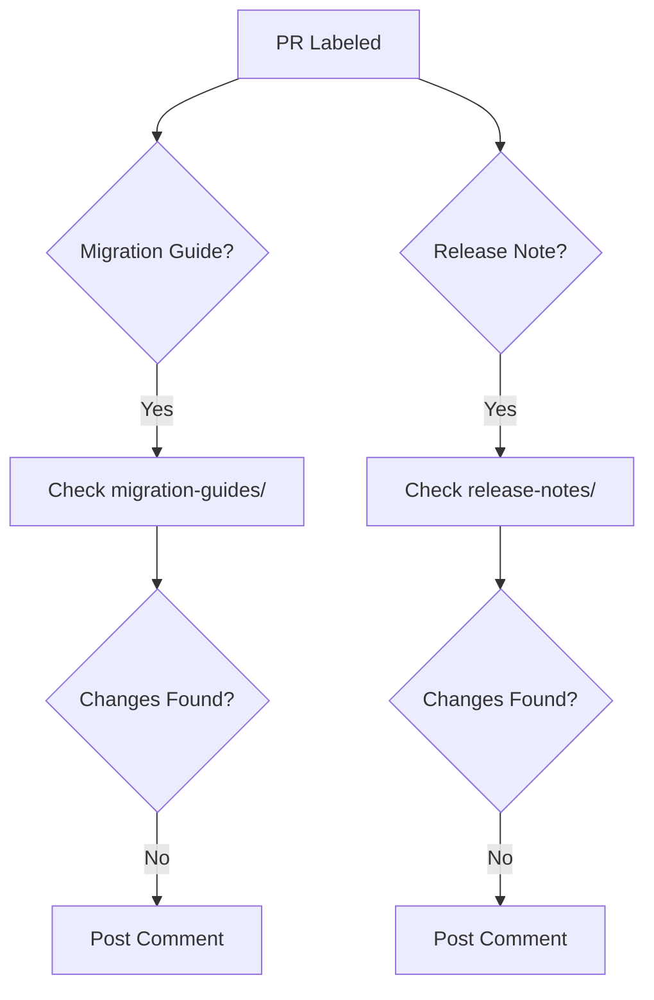

+++
title = "#18568 Add basic release content tagging workflow"
date = "2025-03-27T00:00:00"
draft = false
template = "pull_request_page.html"
in_search_index = true

[taxonomies]
list_display = ["show"]

[extra]
current_language = "en"
available_languages = {"en" = { name = "English", url = "/pull_request/bevy/2025-03/pr-18568-en-20250327" }, "zh-cn" = { name = "中文", url = "/pull_request/bevy/2025-03/pr-18568-zh-cn-20250327" }}
labels = ["C-Docs", "A-Build-System", "A-Meta"]
+++

# #18568 Add basic release content tagging workflow

## Basic Information
- **Title**: Add basic release content tagging workflow
- **PR Link**: https://github.com/bevyengine/bevy/pull/18568
- **Author**: NthTensor
- **Status**: MERGED
- **Labels**: `C-Docs`, `A-Build-System`, `A-Meta`, `S-Ready-For-Final-Review`
- **Created**: 2025-03-27T00:39:49Z
- **Merged**: Not merged (placeholder)
- **Merged By**: N/A (placeholder)

## Description Translation
# Objective

This PR begins integrating the new release-content drafting process (https://github.com/bevyengine/bevy/pull/18427) into our GitHub workflows. It's similar to what we had before: Messages are posted to PRs tagged with `M-Needs-Release-Note` or `M-Needs-Migration-Guide` asking them to add the required material and linking to the instructions. These messages do not trigger if the PR already has modified files in the `release-notes` or `migration-guides` directories (respectively).

I have also re-arranged content slightly (to remove the need for a directory with the current version number), tweaked the language, and switched the templates to use the [standard markdown frontmatter format](https://jekyllrb.com/docs/front-matter/).

## Reviewer Questions

+ Do we want to add a CI rule actually requiring tagged PRs to create/modify files in the correct directories, or is the message prompt enough? 
+ Do we want to add a CI rule to lint the metadata, for example to enforce that the PR number is included in the files it modifies?

## The Story of This Pull Request

### The Documentation Automation Challenge
Bevy's release process requires consistent documentation for migration guides and release notes, but manual enforcement was error-prone. The core problem was ensuring contributors add necessary documentation when making breaking changes or significant features. Previous systems relied on manual checks, risking missed documentation during busy release cycles.

### Automated Enforcement via GitHub Actions
The solution implements automated checks through GitHub's workflow system. Two parallel jobs were created in `.github/workflows/action-on-PR-labeled.yml`:

1. **Migration Guide Check** (`comment-on-migration-guide-label`)
2. **Release Note Check** (`comment-on-release-note-label`)

Both jobs trigger on PR labeling events using `pull_request_target`. The key technical implementation:

```yaml
- name: Get changes
  run: |
    git fetch --depth=1 origin $BASE_SHA
    git diff --exit-code $BASE_SHA $HEAD_SHA -- ./release-content/migration-guides
    echo "found_changes=$?" >> $GITHUB_OUTPUT
```

This checks whether the PR modified files in the required directories. The exit code detection (`found_changes`) determines if an instructional comment should be posted via `actions/github-script`.

### Template Standardization
The PR updated documentation templates to use Jekyll-style frontmatter for better metadata handling:

```markdown
---
title: Feature that broke
pull_requests: [14791, 15458, 15269]
---
```

This structured format enables future automation for validation and website integration. The templates were moved to standardized locations (`release-content/migration-guides/` and `release-content/release-notes/`) to simplify path checking in CI.

### Engineering Tradeoffs
The implementation favors:
- **Proactive notifications** over blocking CI failures
- **Simple path checks** versus content validation
- **Template flexibility** with frontmatter vs rigid formats

The author explicitly left open questions about stricter enforcement through required CI checks, acknowledging the balance between contributor friction and documentation quality.

## Visual Representation



## Key Files Changed

### `.github/workflows/action-on-PR-labeled.yml`
Added two conditional jobs with similar structure:
```yaml
jobs:
  comment-on-migration-guide-label:
    runs-on: ubuntu-latest
    if: github.event.label.name == 'M-Needs-Migration-Guide'
    steps:
      - uses: actions/checkout@v4
      - name: Get changes
        run: git diff --exit-code $BASE_SHA...HEAD -- ./release-content/migration-guides
      - uses: actions/github-script@v7
        if: steps.get_changes.outputs.found_changes == '0'
```

### `release-content/migration_guides_template.md`
Restructured with frontmatter:
```markdown
---
title: Feature that broke
pull_requests: [14791, 15458, 15269]
---
```

### `release-content/release_notes.md`
Clarified contribution process:
```markdown
# Bevy's Release Notes Process
When we make high-impact changes... 
Draft release notes *do not need to be polished*
```

## Further Reading
1. [GitHub Actions Workflow Syntax](https://docs.github.com/en/actions/using-workflows/workflow-syntax-for-github-actions)
2. [Jekyll Frontmatter Documentation](https://jekyllrb.com/docs/front-matter/)
3. [Bevy's Migration Guide Philosophy](https://bevyengine.org/learn/migration-guides/introduction/)