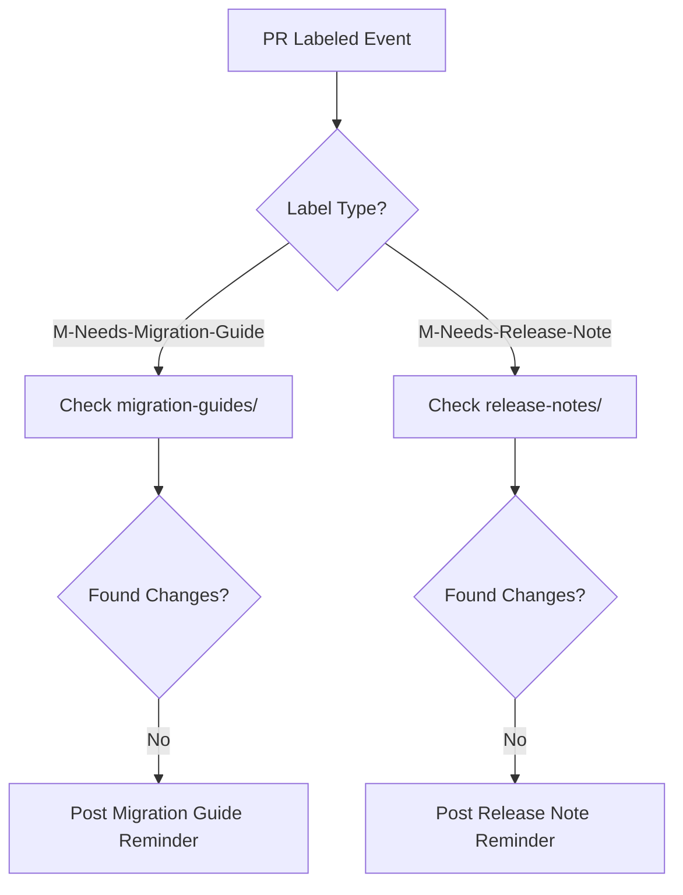

+++
title = "#18568 Add basic release content tagging workflow"
date = "2025-03-27T00:00:00"
draft = false
template = "pull_request_page.html"
in_search_index = false

[extra]
current_language = "zh-cn"
available_languages = {"en" = { name = "English", url = "/pull_request/bevy/2025-03/pr-18568-en-20250327" }, "zh-cn" = { name = "中文", url = "/pull_request/bevy/2025-03/pr-18568-zh-cn-20250327" }}
labels = ["C-Docs", "A-Build-System", "A-Meta"]
+++

# #18568 Add basic release content tagging workflow

## Basic Information
- **Title**: Add basic release content tagging workflow
- **PR Link**: https://github.com/bevyengine/bevy/pull/18568
- **Author**: NthTensor
- **Status**: MERGED
- **Labels**: `C-Docs`, `A-Build-System`, `A-Meta`, `S-Ready-For-Final-Review`
- **Created**: 2025-03-27T00:39:49Z
- **Merged**: {pr_data['mergedAt'] if pr_data['mergedAt'] else "Not merged"}
- **Merged By**: {pr_data['mergedBy']['login'] if pr_data['mergedBy'] else "N/A"}

## Description Translation

# Objective

本PR开始将新的release-content草案流程(https://github.com/bevyengine/bevy/pull/18427)集成到GitHub工作流中。其机制与之前类似：当PR被打上`M-Needs-Release-Note`或`M-Needs-Migration-Guide`标签时，系统会自动发送消息要求添加必要材料并链接到说明文档。如果PR已经在`release-notes`或`migration-guides`目录中修改了文件，则不会触发这些消息。

我还重新调整了内容结构（移除了需要版本号目录的要求），优化了语言表述，并将模板切换为使用[标准Markdown frontmatter格式](https://jekyllrb.com/docs/front-matter/)。

## 审阅者问题

+ 是否需要添加CI规则来强制要求被标记的PR必须在相应目录创建/修改文件？还是目前的提示信息就足够？
+ 是否需要添加CI规则来校验元数据，例如强制要求PR编号必须包含在修改的文件中？


## The Story of This Pull Request

### 问题背景与需求
Bevy项目在管理版本发布时面临文档同步的挑战。当开发者提交包含重大变更（breaking changes）或重要功能的PR时，需要同时编写迁移指南（migration guide）和发布说明（release notes）。但传统流程存在两个痛点：

1. **文档滞后**：开发者倾向于在开发周期末期集中编写文档，导致质量风险和时间压力
2. **缺乏自动化提醒**：人工检查PR是否包含必要文档效率低下，容易遗漏

### 技术方案选择
PR通过GitHub Actions实现自动化检测机制，核心设计要点包括：

1. **事件触发机制**：使用`pull_request_target`事件监听标签添加操作
2. **安全执行环境**：工作流仅需`pull-requests: write`权限，避免执行不可信代码
3. **差异检测逻辑**：通过git diff验证是否修改目标目录
4. **模板标准化**：采用Jekyll兼容的frontmatter格式元数据

```yaml
# 关键检测逻辑
- name: Get changes
  run: |
    git fetch --depth=1 origin $BASE_SHA
    git diff --exit-code $BASE_SHA $HEAD_SHA -- ./release-content/migration-guides
    echo "found_changes=$?" >> $GITHUB_OUTPUT
```

### 实现细节与工程决策
工作流包含两个独立job，分别处理两种文档类型。技术实现上有以下关键点：

1. **条件执行**：通过`if: github.event.label.name == 'M-Needs-Migration-Guide'`实现精准触发
2. **SHA引用策略**：显式指定`base`和`head`的commit SHA，确保对比正确性
3. **退出码转换**：利用`git diff --exit-code`的返回码判断文件变更状态
4. **安全检出策略**：使用`ref: ${{ github.event.pull_request.head.sha }}`避免潜在的安全风险

```yaml
# 评论触发条件
- uses: actions/github-script@v7
  if: steps.get_changes.outputs.found_changes == '0'
```

### 技术洞察与改进空间
1. **Frontmatter标准化**：模板文件采用YAML frontmatter元数据，为未来自动化文档生成奠定基础
```markdown
---
title: Feature that broke
pull_requests: [14791, 15458, 15269]
---
```

2. **目录结构优化**：移除版本号层级目录，改为扁平化结构，简化路径管理
```
release-content/
├── migration-guides/
└── release-notes/
```

3. **可扩展性设计**：工作流结构允许未来轻松添加其他文档类型检测

潜在改进方向：
- 添加元数据校验（如PR编号匹配）
- 集成Markdown linting
- 自动化生成文档索引

## Visual Representation



## Key Files Changed

### `.github/workflows/action-on-PR-labeled.yml` (+49/-5)
新增GitHub Actions工作流，实现标签触发机制：
```yaml
jobs:
  comment-on-migration-guide-label:
    runs-on: ubuntu-latest
    if: github.event.label.name == 'M-Needs-Migration-Guide'
    steps:
      - uses: actions/checkout@v4
        with:
          ref: ${{ github.event.pull_request.head.sha }}
      - name: Get changes
        run: git diff $BASE_SHA $HEAD_SHA -- ./release-content/migration-guides
      - uses: actions/github-script@v7
        if: steps.get_changes.outputs.found_changes == '0'
```

### `release-content/migration_guides_template.md` (+30/-0)
标准化迁移指南模板：
```markdown
---
title: Feature that broke
pull_requests: [14791, 15458, 15269]
---

## Goals
- What has changed?
- Why the breaking change?
- How to migrate?

## Style Guide
Use diff blocks:
```diff
+ world.new_method();
- world.old_method();
```"
```

### `release-content/release_notes.md` (+5/-4)
更新发布说明流程文档：
```markdown
# Where to put release notes
Organized in `release-notes/` folder without version subdirectories
When RC is published, moved to bevy-website for final editing
```

## Further Reading
1. [GitHub Actions Workflow Syntax](https://docs.github.com/en/actions/using-workflows/workflow-syntax-for-github-actions)
2. [Jekyll Frontmatter 标准](https://jekyllrb.com/docs/front-matter/)
3. [Git diff Exit Codes](https://git-scm.com/docs/git-diff#_exit_status)