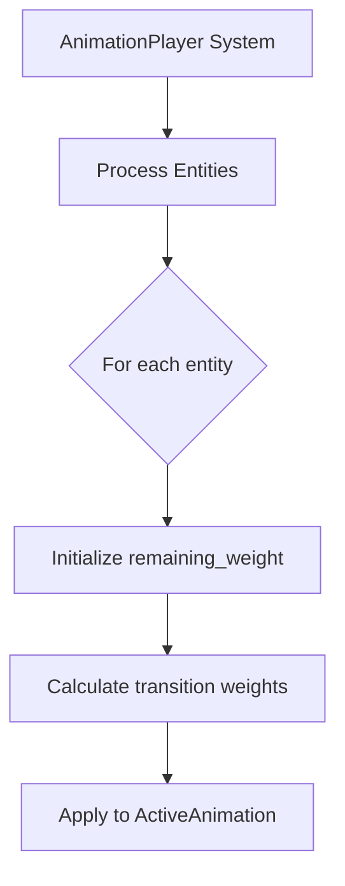

+++
title = "#18572 Fix animation transitions affecting other entities"
date = "2025-03-27T00:00:00"
draft = false
template = "pull_request_page.html"
in_search_index = true

[taxonomies]
list_display = ["show"]

[extra]
current_language = "en"
available_languages = {"en" = { name = "English", url = "/pull_request/bevy/2025-03/pr-18572-en-20250327" }, "zh-cn" = { name = "中文", url = "/pull_request/bevy/2025-03/pr-18572-zh-cn-20250327" }}
+++

# #18572 Fix animation transitions affecting other entities

## Basic Information
- **Title**: Fix animation transitions affecting other entities
- **PR Link**: https://github.com/bevyengine/bevy/pull/18572
- **Author**: greeble-dev
- **Status**: MERGED
- **Labels**: None
- **Created**: 2025-03-27T11:50:21Z
- **Merged**: 2025-03-28T09:15:47Z
- **Merged By**: cart

## Description Translation
## Objective

 Fix #18557.

## Solution

As described in the bug, `remaining_weight` should have been inside the loop.

## Testing

Locally changed the `animated_mesh_control` example to spawn multiple meshes and play different transitions.

## The Story of This Pull Request

The PR addresses a critical bug in Bevy's animation system where transition weight calculations were improperly affecting multiple entities. This occurred because the `remaining_weight` variable was incorrectly scoped outside the loop processing animation transitions, leading to residual values carrying over between different entities' animations.

### The Problem and Context
In the original implementation, when multiple entities with animation players were present, transitioning one entity's animation could inadvertently influence others. This manifested as irregular blending weights and unexpected visual artifacts. The root cause was identified in weight calculation logic where `remaining_weight` maintained state across different animation transitions rather than being reset per-entity.

### The Solution Approach
The fix required localizing the `remaining_weight` variable to each transition processing iteration. By moving the variable declaration inside the loop that handles individual transitions, each animation transition calculation starts with a fresh baseline. This ensures weight calculations are properly isolated between different entities and their respective animations.

### The Implementation
The key modification occurs in the transition weight calculation logic. Here's the critical code change:

```rust
// Before (incorrect scope):
let mut remaining_weight = 1.0;
for transition in &mut self.transitions {
    // ...
}

// After (corrected scope):
for transition in &mut self.transitions {
    let mut remaining_weight = 1.0;
    // ...
}
```

This change ensures each transition's weight calculation begins with a clean `remaining_weight` value rather than accumulating from previous transitions. The scoping fix prevents cross-contamination of weight values between different entities' animation transitions.

### Technical Insights
The repair demonstrates three important principles:
1. **Variable Scoping**: Critical calculations should use the narrowest possible scope to prevent state leakage
2. **Entity Isolation**: Systems processing multiple entities must ensure per-entity state doesn't persist between iterations
3. **Animation Blending**: Proper weight management is essential for correct interpolation between animation states

### The Impact
This correction:
- Eliminates cross-entity animation transition interference
- Ensures accurate weight calculations for each individual entity
- Maintains expected behavior when multiple animated entities exist in a scene
- Preserves the existing API while fixing underlying logic

The fix required minimal code changes but had significant impact on system correctness. It reinforces the importance of careful state management in ECS-based game engines, particularly when processing multiple entities through shared systems.

## Visual Representation



## Key Files Changed

### File: `crates/bevy_animation/src/transition.rs` (+2/-1)
**Change Summary**: Fixed variable scoping in animation transition weight calculation

**Code Diff**:
```rust
// Before:
let mut remaining_weight = 1.0;
for transition in &mut self.transitions {

// After:
for transition in &mut self.transitions {
    let mut remaining_weight = 1.0;
```

**Rationale**:
- Moved `remaining_weight` initialization inside transition processing loop
- Prevents residual weight values affecting subsequent entities
- Ensures correct weight distribution for each animation transition

## Further Reading
1. [Bevy ECS System Execution Model](https://bevyengine.org/learn/book/getting-started/ecs/)
2. [Animation Blending Techniques](https://www.gameenginebook.com/animation-blending/)
3. [Rust Variable Scoping Rules](https://doc.rust-lang.org/rust-by-example/variable_bindings/scope.html)