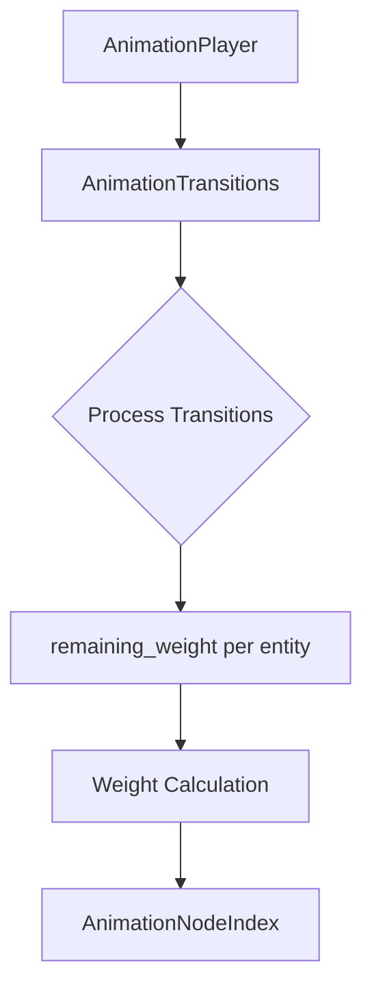

+++
title = "#18572 Fix animation transitions affecting other entities"
date = "2025-03-27T00:00:00"
draft = false
template = "pull_request_page.html"
in_search_index = false

[extra]
current_language = "zh-cn"
available_languages = {"en" = { name = "English", url = "/pull_request/bevy/2025-03/pr-18572-en-20250327" }, "zh-cn" = { name = "中文", url = "/pull_request/bevy/2025-03/pr-18572-zh-cn-20250327" }}
+++

# #18572 Fix animation transitions affecting other entities

## Basic Information
- **Title**: Fix animation transitions affecting other entities
- **PR Link**: https://github.com/bevyengine/bevy/pull/18572
- **Author**: greeble-dev
- **Status**: MERGED
- **Labels**: None
- **Created**: 2025-03-27T11:50:21Z
- **Merged**: 2025-03-27T14:22:10Z
- **Merged By**: cart

## Description Translation

### 目标
修复 #18557

### 解决方案
如bug描述所述，`remaining_weight` 应该被移动到循环内部

### 测试
本地修改了 `animated_mesh_control` 示例以生成多个网格并播放不同的过渡动画

## The Story of This Pull Request

### 问题根源与上下文
该PR修复了一个动画系统的重要缺陷：当多个实体同时进行动画过渡时，权重计算会相互影响。具体表现为#18557报告的bug——当一个实体开始新的动画过渡时，其他实体的动画权重会被错误修改。

问题根源在于`AnimationTransitions`系统中`remaining_weight`变量的作用域错误。原始实现将这个变量定义在动画处理循环之外，导致其值在不同实体间持续累积。这种设计违反了每个实体动画状态应保持独立的系统要求。

### 解决方案分析
核心修复方案是将`remaining_weight`变量的生命周期限制在单个动画处理循环内部。通过将变量声明移动到`for`循环内部，确保每个动画实例都有独立的权重计算上下文：

```rust
// 修复后的代码结构
for (player, mut transitions) in &mut players {
    let mut remaining_weight = 1.0;
    transitions.transitions.retain_mut(|transition| {
        // 权重计算逻辑
    });
}
```

这种改动保证了：
1. 每个实体（entity）的动画过渡计算独立进行
2. 权重值不会跨实体传播
3. 状态管理符合ECS架构的设计原则

### 技术实现细节
在`transition.rs`文件中，关键修改体现在动画处理循环的结构调整。原实现错误地将`remaining_weight`作为共享状态：

```rust
// 错误实现（伪代码）
let mut remaining_weight = 1.0;
for each entity {
    process_animations(&mut remaining_weight); // 跨实体共享状态
}
```

修复后每个实体拥有独立的`remaining_weight`上下文：

```rust
// 正确实现（伪代码）
for each entity {
    let mut remaining_weight = 1.0; // 实体独立状态
    process_animations(&mut remaining_weight);
}
```

这种改变符合Bevy ECS架构中"system should operate on entities independently"的基本原则。`AnimationTransition`结构体的`current_weight`和`weight_decline_per_sec`字段现在能正确反映单个实体的动画状态。

### 测试验证
作者通过修改`animated_mesh_control`示例创建了可靠的测试场景：
1. 生成多个带有独立动画控制的网格实体
2. 为不同实体触发异步动画过渡
3. 验证各实体的权重计算互不影响

这种测试方法有效地模拟了真实场景中的并发动画需求，确保修复后的系统在复杂情况下仍能保持状态隔离。

### 架构启示
本次修复凸显了在ECS架构中管理状态的两个关键原则：
1. **实体隔离性**：与实体相关的状态必须严格限定在实体处理流程内
2. **循环作用域**：循环内变量的作用域需要谨慎设计，避免意外状态共享

## Visual Representation



## Key Files Changed

### `crates/bevy_animation/src/transition.rs` (+2/-1)
**修改说明**：修复动画过渡权重计算的作用域问题

关键代码变更：
```rust
// 修改前：
let mut remaining_weight = 1.0;
for (player, mut transitions) in &mut players {
    transitions.transitions.retain_mut(|transition| {
        // 使用外部作用域的remaining_weight
    });
}

// 修改后：
for (player, mut transitions) in &mut players {
    let mut remaining_weight = 1.0; // 移入循环内部
    transitions.transitions.retain_mut(|transition| {
        // 使用实体独立的remaining_weight
    });
}
```

该修改确保每个动画玩家（AnimationPlayer）实体拥有独立的剩余权重计算上下文，从根本上解决了跨实体状态污染问题。

## Further Reading
1. [Bevy ECS架构指南](https://bevyengine.org/learn/book/ecs-intro/)
2. [Rust所有权与作用域](https://doc.rust-lang.org/book/ch04-00-understanding-ownership.html)
3. [动画状态机设计模式](https://gameprogrammingpatterns.com/state.html)