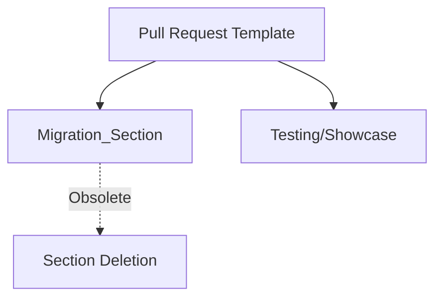

+++
title = "#18575 Delete migration guide section from PR template"
date = "2025-03-27T00:00:00"
draft = false
template = "pull_request_page.html"
in_search_index = true

[taxonomies]
list_display = ["show"]

[extra]
current_language = "en"
available_languages = {"en" = { name = "English", url = "/pull_request/bevy/2025-03/pr-18575-en-20250327" }, "zh-cn" = { name = "中文", url = "/pull_request/bevy/2025-03/pr-18575-zh-cn-20250327" }}
labels = ["D-Trivial", "A-Meta", "X-Blessed"]
+++

# #18575 Delete migration guide section from PR template

## Basic Information
- **Title**: Delete migration guide section from PR template
- **PR Link**: https://github.com/bevyengine/bevy/pull/18575
- **Author**: alice-i-cecile
- **Status**: MERGED
- **Labels**: `D-Trivial`, `A-Meta`, `S-Ready-For-Final-Review`, `X-Blessed`
- **Created**: 2025-03-27T17:39:39Z
- **Merged**: 2025-03-27T18:12:45Z
- **Merged By**: cart

## Description Translation
# Objective

Due to the work outlined in #18441, we're no longer storing the migration guides on the PR description.

## Solution

Delete the section of the PR template that suggests you do this.

## The Story of This Pull Request

The Bevy engine team recently underwent a structural change in how they manage migration guides, as documented in issue #18441. Previously, contributors were expected to include migration guide content directly in pull request descriptions using a specific template section. However, this approach led to maintenance challenges and discoverability issues as the project scaled.

The core problem addressed by this PR was an outdated contribution process. The existing PR template contained instructions that no longer matched the team's actual practices after the migration guide storage location changed. Leaving these instructions in place would have created confusion for new contributors and risked inconsistent documentation practices.

The solution implemented was a surgical removal of the obsolete template section. The author identified the exact lines in `.github/pull_request_template.md` that referenced migration guides and removed them while preserving other template elements. This change required understanding both the current contribution workflow and the recent documentation restructuring.

The implementation consists of a single focused commit that deletes 8 lines from the PR template. The removed section specifically instructed contributors to include migration guide content in their PR descriptions if applicable, which became unnecessary after the team moved to a different documentation strategy. By eliminating this outdated guidance, the PR reduces cognitive load for contributors and maintains consistency with the project's updated practices.

This change demonstrates the importance of keeping contribution documentation synchronized with actual development processes. The clean removal without affecting other template sections shows careful attention to maintaining existing workflows for showcase content and testing instructions while excising obsolete requirements.

## Visual Representation



## Key Files Changed

### File: `.github/pull_request_template.md`

**Change**: Removed migration guide instructions from PR template

Before:
```markdown
## Showcase

> This section is optional. If this PR does not include a visual change or does not add a new feature, you can delete this section.

- Help others understand the result of this PR by showcasing your awesome work!
- If this PR adds a new feature or public API, consider adding a brief pseudo-code snippet of it in action
- If this PR includes a visual change, consider adding a screenshot, GIF, or video
  - If you want, you could even include a before/after comparison!
- If the Migration Guide adequately covers the changes, you can delete this section
```

After:
```markdown
## Showcase

> This section is optional. If this PR does not include a visual change or does not add a new feature, you can delete this section.

- Help others understand the result of this PR by showcasing your awesome work!
- If this PR adds a new feature or public API, consider adding a brief pseudo-code snippet of it in action
- If this PR includes a visual change, consider adding a screenshot, GIF, or video
  - If you want, you could even include a before/after comparison!

While a showcase should aim to be brief and digestible, you can use a toggleable section to save space on longer showcases:
```

The key modification removes the line referencing Migration Guide deletion instructions (`- If the Migration Guide adequately covers the changes, you can delete this section`), bringing the template in line with current documentation practices.

## Further Reading

1. Original migration guide restructuring issue: #18441
2. GitHub documentation on pull request templates: [Creating a pull request template for your repository](https://docs.github.com/en/communities/using-templates-to-encourage-useful-issues-and-pull-requests/creating-a-pull-request-template-for-your-repository)
3. Bevy's contribution guidelines: [CONTRIBUTING.md](https://github.com/bevyengine/bevy/blob/main/CONTRIBUTING.md)