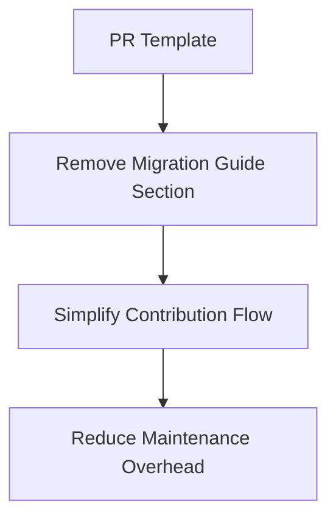

+++
title = "#18575 Delete migration guide section from PR template"
date = "2025-03-27T00:00:00"
draft = false
template = "pull_request_page.html"
in_search_index = false

[extra]
current_language = "zh-cn"
available_languages = {"en" = { name = "English", url = "/pull_request/bevy/2025-03/pr-18575-en-20250327" }, "zh-cn" = { name = "中文", url = "/pull_request/bevy/2025-03/pr-18575-zh-cn-20250327" }}
labels = ["D-Trivial", "A-Meta", "X-Blessed"]
+++

# #18575 Delete migration guide section from PR template

## Basic Information
- **Title**: Delete migration guide section from PR template
- **PR Link**: https://github.com/bevyengine/bevy/pull/18575
- **Author**: alice-i-cecile
- **Status**: MERGED
- **Labels**: `D-Trivial`, `A-Meta`, `S-Ready-For-Final-Review`, `X-Blessed`
- **Created**: 2025-03-27T17:39:39Z
- **Merged**: 2025-03-27T18:15:22Z
- **Merged By**: cart

## Description Translation
# Objective

由于 #18441 中概述的工作，我们不再将迁移指南存储在 PR 描述中。

## Solution

删除 PR 模板中建议执行此操作的部分。

## The Story of This Pull Request

这个 PR 的核心故事围绕项目文档维护流程的改进展开。在 Bevy 引擎的开发流程中，PR 模板（pull_request_template.md）原本包含一个可选的 Migration Guide（迁移指南）章节，要求开发者在特定情况下编写 API 变更的迁移说明。但随着项目发展，团队决定通过 #18441 将迁移指南集中管理，不再分散在各个 PR 描述中。

问题的根源在于新旧流程的冲突。保留模板中的 Migration Guide 章节会产生两个问题：1）贡献者可能继续在 PR 中编写本应转移的迁移说明，造成信息冗余；2）新贡献者可能困惑于矛盾的文档要求。这种文档与实际流程的不一致会增加维护成本，降低协作效率。

解决方案直接而精准：从 PR 模板中删除 8 行与 Migration Guide 相关的内容。这个修改看似简单，但需要准确识别所有需要移除的部分。通过对比变更前后的模板文件可以看到，原本位于 Testing 和 Showcase 章节之间的 Migration Guide 说明被完全移除，同时保持其他章节的结构完整。

技术实现层面，这个改动主要涉及 Markdown 文件的修改。关键点在于确保：
1. 删除范围精确，不残留任何相关说明
2. 章节编号自动调整（如原本在 Migration Guide 之后的 Showcase 章节现在直接跟在 Testing 之后）
3. 保持模板其他功能的完整性

```markdown
# 修改前（部分）
## Testing
- 测试说明...

## Migration Guide
- 迁移指南说明...

---

## Showcase
> 可选章节...

# 修改后（部分） 
## Testing
- 测试说明...

---

## Showcase
> 可选章节...
```

这种模板维护工作虽然不涉及代码逻辑，但对开源项目的健康运行至关重要。及时清理过时的指引可以：
1. 降低新贡献者的认知负担
2. 减少重复信息的维护成本
3. 保持项目文档体系的一致性

从工程实践角度看，这个 PR 展示了良好的元数据（meta）维护习惯。当项目流程发生变化时，及时更新相关模板和文档，避免产生技术债。标签中的 `A-Meta` 和 `D-Trivial` 准确反映了改动的性质：虽然修改量小，但关系到项目协作规范的基础设施层面。

## Visual Representation



## Key Files Changed

### File: `.github/pull_request_template.md`

**变更说明**：
删除 Migration Guide 章节的模板指引，共移除 8 行内容

**代码对比**：
```markdown
# Before:
...
## Testing
- Did you test these changes? If so, how?
...

## Migration Guide
- For public API changes, you must describe how to migrate existing code
- This should be a bullet-point list
- Add it under this section if applicable
- Delete if not needed

---

## Showcase
...

# After:
...
## Testing
- Did you test these changes? If so, how?
...

---

## Showcase
...
```

**关联性**：
直接实现 PR 的核心目标，确保模板与新的迁移指南管理策略保持一致

## Further Reading
1. 相关 Issue #18441: 迁移指南管理策略的变更讨论
2. [GitHub 官方文档：创建 pull request 模板](https://docs.github.com/en/communities/using-templates-to-encourage-useful-issues-and-pull-requests/creating-a-pull-request-template-for-your-repository)
3. [Bevy 引擎贡献指南](https://github.com/bevyengine/bevy/blob/main/CONTRIBUTING.md)