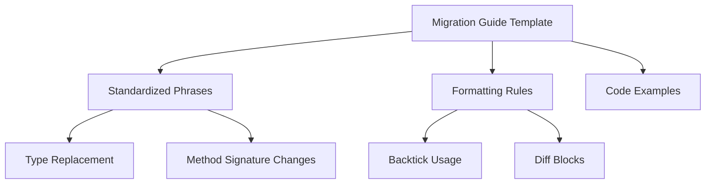

+++
title = "#18576 Use desired language in migration guide template"
date = "2025-03-28T00:00:00"
draft = false
template = "pull_request_page.html"
in_search_index = true

[taxonomies]
list_display = ["show"]

[extra]
current_language = "en"
available_languages = {"en" = { name = "English", url = "/pull_request/bevy/2025-03/pr-18576-en-20250328" }, "zh-cn" = { name = "中文", url = "/pull_request/bevy/2025-03/pr-18576-zh-cn-20250328" }}
labels = ["C-Docs", "A-Meta", "D-Straightforward"]
+++

# #18576 Use desired language in migration guide template

## Basic Information
- **Title**: Use desired language in migration guide template
- **PR Link**: https://github.com/bevyengine/bevy/pull/18576
- **Author**: alice-i-cecile
- **Status**: MERGED
- **Labels**: `C-Docs`, `A-Meta`, `S-Ready-For-Final-Review`, `D-Straightforward`
- **Created**: 2025-03-27T17:45:18Z
- **Merged**: 2025-03-28T09:12:45Z
- **Merged By**: cart

## Description Translation

# Objective

Both reading and writing migration guides is easier when the language is standardized.

However, migration guide authors don't have clear guidelines for the tone and phrasing to use.

## Solution

Communicate this information to authors by creating stub text with a clear and polite standard style.

We could instead write a style guide, but turning style guides into a writing style is slower and much harder than simply filling in the blanks. While style guides are a good fit for more free-form writing, they don't work well for the very mechanical and dry migration guides.

## The Story of This Pull Request

The PR addresses a documentation challenge in maintaining consistent migration guides for Bevy engine updates. Migration guides serve as critical reference material for developers adapting their codebases to new versions, but their effectiveness depends on clear, standardized communication.

**The Problem and Context**  
Prior to this change, Bevy's migration guide template lacked specific language guidelines. Contributors writing migration guides had to infer the appropriate style from existing examples, leading to inconsistencies in tone, phrasing, and structure. This variability could confuse readers and reduce the guides' effectiveness in communicating breaking changes.

**The Solution Approach**  
Instead of creating a separate style guide document (which might be overlooked or require additional context switching), the author chose to embed style guidance directly into the migration guide template. This approach provides immediate, contextual examples while maintaining a single source of truth. The template now offers:

1. Standardized phrases for common migration scenarios
2. Explicit formatting rules
3. Code diff examples demonstrating preferred presentation

**The Implementation**  
The core changes appear in `release-content/migration_guides_template.md`, which received targeted additions to guide content structure:

```markdown
- Some helpful standardized phrases:
  - `OldType` is now `NewType`. Replace all references and imports.
  - The `Struct::method()` method now requires an additional `magnitude: f32` argument.
  - `Enum` has a new variant, `Enum::NewVariant`, which must be handled during `match` statements.
  - The `Type::method` method has been removed. Use `Type::other_method` instead.
```

These concrete examples help authors communicate changes using consistent patterns. The template also emphasizes technical precision through:

- Direct naming of affected types/methods
- Backtick-enclosed code references
- Bullet-point lists for complex changes
- Diff blocks showing code modifications

**Technical Insights**  
The implementation demonstrates effective documentation design by:
1. **Reducing cognitive load**: Authors can copy-paste standardized phrases rather than compose new ones
2. **Improving searchability**: Explicit type/method references help CTRL-F navigation
3. **Enforcing consistency**: Mandated backtick usage prevents mixed formatting
4. **Balancing flexibility**: While prescriptive, the template allows expansion through its bullet-point structure

**The Impact**  
These changes create several tangible improvements:
- Faster guide authoring through predefined templates
- More predictable content structure for readers
- Reduced maintenance overhead through consistent patterns
- Better compatibility with automated documentation tooling

## Visual Representation



## Key Files Changed

### `release-content/migration_guides_template.md` (+12/-3)
This file received targeted additions to establish documentation standards:

1. Added standardized phrasing examples:
```markdown
- Some helpful standardized phrases:
  - `OldType` is now `NewType`. Replace all references and imports.
  - The `Struct::method()` method now requires an additional `magnitude: f32` argument.
```

2. Enhanced code presentation guidelines:
```markdown
- Use backticks for types, methods and modules (e.g. `Vec<T>` or `core::mem::swap`).
- Use bullet points to explain complex changes.
```

3. Introduced diff block examples:
```diff
fn my_system(world: &mut World) {
+ world.new_method();
- world.old_method();
}
```

These changes directly support the PR's goal of standardizing migration guide content through in-template examples rather than external style documents.

## Further Reading

1. [Bevy's Documentation Guidelines](https://github.com/bevyengine/bevy/blob/main/docs/CODE_OF_CONDUCT.md)
2. [Rust API Guidelines on Documentation](https://rust-lang.github.io/api-guidelines/documentation.html)
3. [Effective Technical Writing by Google](https://developers.google.com/tech-writing)