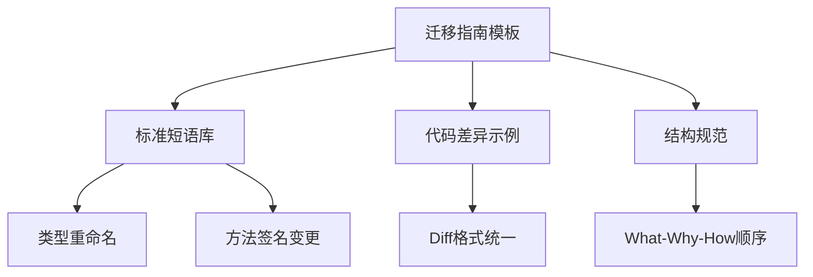

+++
title = "#18576 Use desired language in migration guide template"
date = "2025-03-28T00:00:00"
draft = false
template = "pull_request_page.html"
in_search_index = false

[extra]
current_language = "zh-cn"
available_languages = {"en" = { name = "English", url = "/pull_request/bevy/2025-03/pr-18576-en-20250328" }, "zh-cn" = { name = "中文", url = "/pull_request/bevy/2025-03/pr-18576-zh-cn-20250328" }}
labels = ["C-Docs", "A-Meta", "D-Straightforward"]
+++

# #18576 Use desired language in migration guide template

## Basic Information
- **Title**: Use desired language in migration guide template
- **PR Link**: https://github.com/bevyengine/bevy/pull/18576
- **Author**: alice-i-cecile
- **Status**: MERGED
- **Labels**: `C-Docs`, `A-Meta`, `S-Ready-For-Final-Review`, `D-Straightforward`
- **Created**: 2025-03-27T17:45:18Z
- **Merged**: 2025-03-28T09:12:45Z
- **Merged By**: cart

## Description Translation
### 目标

当语言标准化时，迁移指南的阅读和编写都会更加容易。

但目前迁移指南作者缺乏明确的语气和措辞指导。

### 解决方案

通过在模板中创建具有清晰礼貌标准风格的占位文本，向作者传达这些信息。

虽然可以编写风格指南，但将风格指南转化为写作风格比直接填空更耗时费力。对于机械枯燥的迁移指南而言，模板方式比风格指南更有效。

## The Story of This Pull Request

### 问题背景与挑战
Bevy 引擎团队在维护迁移指南时面临文档一致性问题。迁移指南作为框架升级的重要参考，需要清晰传达 API 变更细节，但不同作者的写作风格差异导致指南质量参差不齐。主要痛点体现在：

1. 缺乏标准术语：相同类型的变更（如类型重命名、方法签名修改）存在多种表述方式
2. 结构不统一：有些指南包含过多章节，有些又缺少关键迁移步骤
3. 可搜索性差：类型和方法名称未规范标记，影响文档检索效率

传统解决方案是编写风格指南（style guide），但实践发现：
- 开发者更倾向于直接参考示例而非阅读抽象规则
- 机械式变更需要模板化指导而非自由写作
- 维护成本随规则数量增长而增加

### 技术方案选择
核心思路是用结构化模板替代自由格式文档。在 `migration_guides_template.md` 中：
1. 定义标准语句模式（standardized phrases）
2. 提供典型变更的代码差异示例（diff codeblocks）
3. 强制规定内容结构（Goals -> 变更内容 -> 原因 -> 迁移步骤）

决策权衡：
- **模板 vs 风格指南**：模板提供即时可用的写作框架，降低认知负担
- **严格结构 vs 灵活格式**：牺牲部分灵活性换取统一性，提升文档可维护性
- **嵌入式示例 vs 外部参考**：在模板中直接集成代码片段，减少上下文切换

### 具体实现解析
主要修改集中在迁移指南模板的结构化增强：

```markdown
- Some helpful standardized phrases:
  - `OldType` is now `NewType`. Replace all references and imports.
  - The `Struct::method()` method now requires an additional `magnitude: f32` argument.
  
- Diff codeblocks can be useful for succinctly communicating changes.
```diff
fn my_system(world: &mut World) {
+ world.new_method();
- world.old_method();
}
```

关键改进点：
1. **标准化短语库**：预定义 6 种常见变更模式的描述模板
2. **代码差异块规范**：使用统一格式展示 API 变更前后对比
3. **内容优先级指导**：强制要求按"What -> Why -> How"顺序组织内容
4. **技术术语标记规范**：强制使用反引号包裹类型/方法名，增强可搜索性

### 技术洞察
1. **认知负荷优化**：通过填空式模板将写作任务分解为选择预定义模式，而非从头创作
2. **机器可读性增强**：标准化的代码差异块格式为未来自动化检测工具奠定基础
3. **版本控制友好**：明确的 diff 格式使变更记录更清晰，便于与代码变更关联

### 影响分析
1. **质量一致性**：新作者可快速产出符合标准的指南，减少 review 成本
2. **维护效率**：统一结构使长期维护更可预测，特别是跨版本更新时
3. **可扩展性**：标准化短语库可随着常见变更模式的积累持续扩充

## Visual Representation



## Key Files Changed

### `release-content/migration_guides_template.md`
1. **变更描述**：增加标准化写作指导和代码差异示例
2. **代码片段对比**：
```markdown
# Before PR
## Style Guide
Keep it short and sweet...

# After PR
## Style Guide
Keep it short and sweet:
- Some helpful standardized phrases:
  - `OldType` is now `NewType`. Replace all references and imports.
  - The `Struct::method()` method now requires...
  
- Diff codeblocks can be useful...
```diff
fn my_system(world: &mut World) {
+ world.new_method();
- world.old_method();
}
```
3. **关联性**：通过具体示例和规范约束实现文档标准化目标

## Further Reading
1. [Google Developer Documentation Style Guide](https://developers.google.com/style)
2. [Rust API Guidelines on Documentation](https://rust-lang.github.io/api-guidelines/documentation.html)
3. [Bevy Migration Guide Example](https://bevyengine.org/learn/migration-guides/)