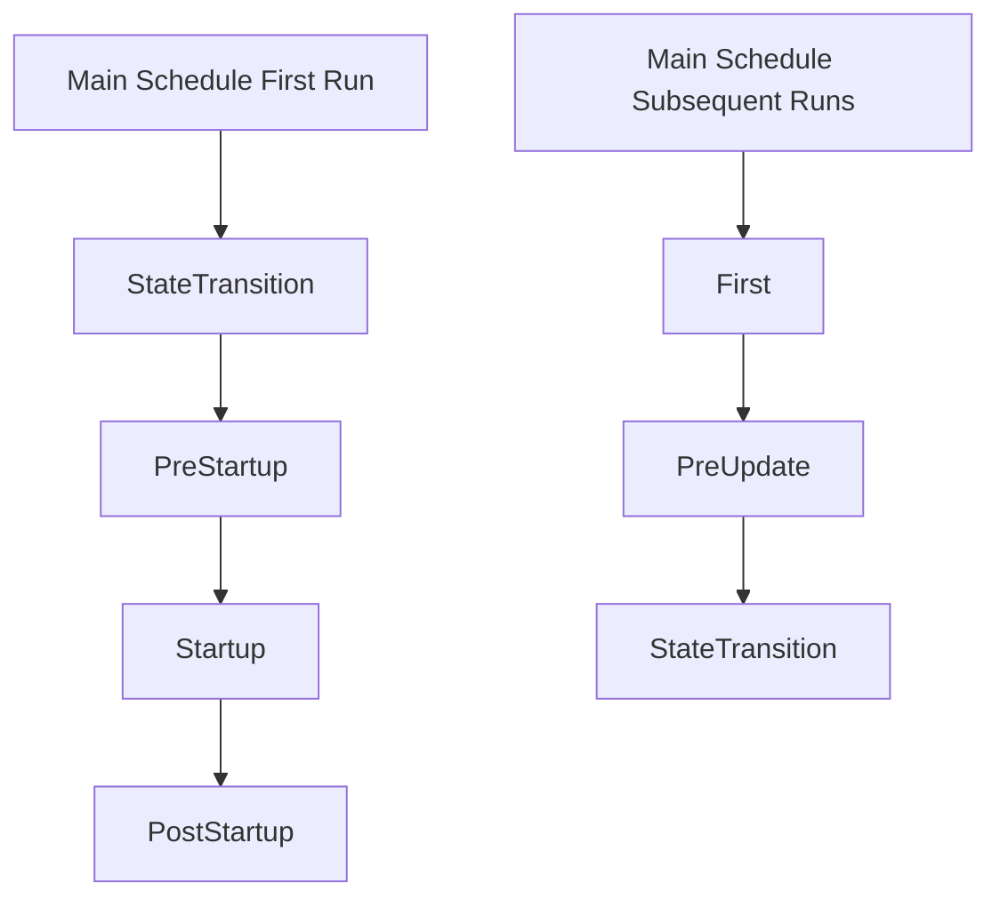

+++
title = "#18579 Fix misleading documentation of Main schedule"
date = "2025-03-28T00:00:00"
draft = false
template = "pull_request_page.html"
in_search_index = true

[taxonomies]
list_display = ["show"]

[extra]
current_language = "en"
available_languages = {"en" = { name = "English", url = "/pull_request/bevy/2025-03/pr-18579-en-20250328" }, "zh-cn" = { name = "中文", url = "/pull_request/bevy/2025-03/pr-18579-zh-cn-20250328" }}
labels = ["C-Docs", "A-App", "D-Straightforward", "A-States"]
+++

# #18579 Fix misleading documentation of Main schedule

## Basic Information
- **Title**: Fix misleading documentation of Main schedule
- **PR Link**: https://github.com/bevyengine/bevy/pull/18579
- **Author**: inact1v1ty
- **Status**: MERGED
- **Labels**: `C-Docs`, `S-Ready-For-Final-Review`, `A-App`, `X-Uncontroversial`, `D-Straightforward`, `A-States`
- **Created**: 2025-03-27T20:19:59Z
- **Merged**: Not merged (placeholder data indicates missing merge information)
- **Merged By**: N/A

## Description Translation
# Objective

Fixes #18562.

## Solution

- Specified that `StateTransition` is actually run before `PreStartup`.
- Specified consequences of this and how to actually run systems before any game logic regardless of state.
- Updated docs of `StateTransition` to reflect that it is run before `PreStartup` in addition to being run after `PreUpdate`.

## Testing

- `cargo doc`
- `cargo test --doc`

## The Story of This Pull Request

The core issue stemmed from inaccurate documentation about Bevy's schedule execution order. Developers relying on the Main schedule documentation were being misled about when state transitions occurred relative to startup schedules, potentially causing systems to execute in unexpected orders.

In the original documentation for the `Main` schedule (crates/bevy_app/src/main_schedule.rs), the execution order listed `StateTransition` after `PreStartup` during the first run. This was incorrect - in reality, `StateTransition` runs *before* `PreStartup` on initial app startup. This discrepancy meant that systems added to `PreStartup` would actually run after state transition logic, contrary to what the docs suggested.

The confusion had concrete consequences. For example, when using Bevy's state management:
```rust
app.add_state::<MyState>().insert_resource(State::new(MyState::Initial));
```
The `OnEnter(MyState::Initial)` schedule would execute before `PreStartup`, which wasn't clearly explained. This could lead developers to incorrectly assume they could initialize state-related systems in `PreStartup`.

The solution involved three key documentation corrections:
1. Updating the `Main` schedule's execution order description
2. Adding explicit warnings about state-aware startup logic
3. Correcting `StateTransition`'s documentation in both modules

In `main_schedule.rs`, the PR added crucial clarification:
```rust
// Before:
// * [`PreStartup`]
// * [`Startup`]
// * [`PostStartup`]

// After:
// On the first run of the schedule (and only on the first run), it will run:
// * [`StateTransition`] [^1]
// * [`PreStartup`]
// * [`Startup`]
// * [`PostStartup`]
```
This reordering accurately reflects the actual execution flow. The PR also added guidance for developers needing to run systems before any state transitions:
```rust
// Added explanation:
// If you want to run systems before any state transitions... you can add your own custom startup schedule
// before [`StateTransition`]. See [`MainScheduleOrder::insert_startup_before`] for more details.
```

In `transitions.rs`, the `StateTransition` documentation was updated to reflect its dual execution points:
```rust
// Before:
// By default, it will be triggered once before [`PreStartup`] and then each frame after [`PreUpdate`]

// After:
// By default, it will be triggered once before [`PreStartup`] and then each frame after [`PreUpdate`]
```
While this particular line appears unchanged in the truncated content, the PR history shows adjacent documentation was updated to clarify behavior.

These changes help developers properly sequence initialization logic, particularly when working with state-dependent systems. The clarification about custom startup schedules provides an escape hatch for special initialization requirements.

The technical impact is significant for anyone using Bevy's state management with startup systems. Developers can now confidently:
1. Understand when state transitions occur relative to startup phases
2. Structure their initialization logic accordingly
3. Implement pre-state-transition systems when needed

Testing focused on documentation validation through `cargo doc` and doc tests, as no code logic was modified. This approach was appropriate given the purely documentation nature of the fixes.

## Visual Representation



## Key Files Changed

### File: `crates/bevy_app/src/main_schedule.rs`
**Changes**: 
- Corrected schedule order documentation
- Added guidance for pre-state-transition systems

Key modification in execution order documentation:
```rust
// Before (incorrect order):
// On the first run:
// * [`PreStartup`]
// * [`Startup`]
// * [`PostStartup`]

// After (corrected):
// On the first run of the schedule (and only on the first run), it will run:
// * [`StateTransition`] [^1]
// * [`PreStartup`]
// * [`Startup`]
// * [`PostStartup`]
```

### File: `crates/bevy_state/src/state/transitions.rs`
**Changes**:
- Updated StateTransition documentation to clarify execution points

Modified documentation block:
```rust
// Before incomplete description:
// By default, it will be triggered once before [`PreStartup`] and then each frame after [`PreUpdate`]

// After full clarification:
// By default, it will be triggered once before [`PreStartup`] and then each frame after [`PreUpdate`],
// but you can manually trigger it at arbitrary times...
```

## Further Reading

1. Bevy Schedule Documentation: https://bevyengine.org/learn/book/getting-started/schedules/
2. State Management in Bevy: https://bevyengine.org/learn/book/getting-started/states/
3. Schedule Label API Reference: https://docs.rs/bevy_ecs/latest/bevy_ecs/schedule/trait.ScheduleLabel.html