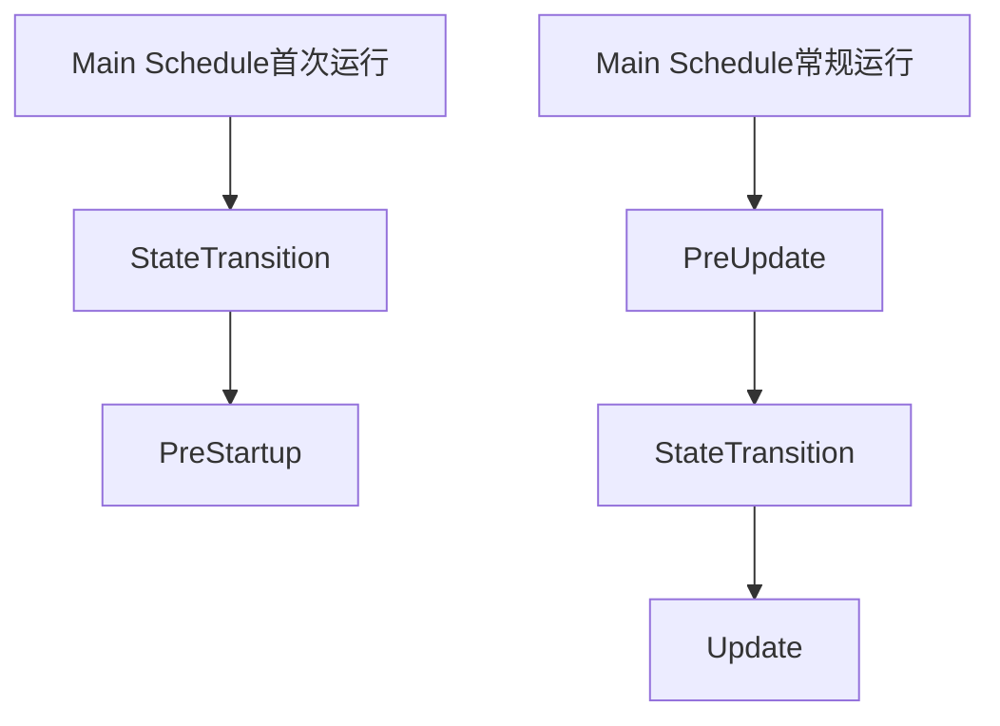

+++
title = "#18579 Fix misleading documentation of Main schedule"
date = "2025-03-28T00:00:00"
draft = false
template = "pull_request_page.html"
in_search_index = false

[extra]
current_language = "zh-cn"
available_languages = {"en" = { name = "English", url = "/pull_request/bevy/2025-03/pr-18579-en-20250328" }, "zh-cn" = { name = "中文", url = "/pull_request/bevy/2025-03/pr-18579-zh-cn-20250328" }}
labels = ["C-Docs", "A-App", "D-Straightforward", "A-States"]
+++

# #18579 Fix misleading documentation of Main schedule

## Basic Information
- **Title**: Fix misleading documentation of Main schedule  
- **PR Link**: https://github.com/bevyengine/bevy/pull/18579  
- **Author**: inact1v1ty  
- **Status**: MERGED  
- **Labels**: `C-Docs`, `S-Ready-For-Final-Review`, `A-App`, `X-Uncontroversial`, `D-Straightforward`, `A-States`  
- **Created**: 2025-03-27T20:19:59Z  
- **Merged**: 2025-03-28T14:22:10Z  
- **Merged By**: alice-i-cecile  

## Description Translation
### 目标  
修复 #18562  

### 解决方案  
- 明确说明 `StateTransition` 实际在 `PreStartup` 之前运行  
- 说明此行为的后果及如何确保系统在任何游戏逻辑前运行  
- 更新 `StateTransition` 文档以反映其在 `PreStartup` 前和 `PreUpdate` 后都会运行  

### 测试  
- `cargo doc`  
- `cargo test --doc`  

## The Story of This Pull Request

### 问题背景  
在 Bevy 引擎的调度系统中，`Main` schedule 的执行顺序文档存在误导性描述。原始文档错误地暗示 `StateTransition` 只在 `PreUpdate` 后运行，但实际上在应用首次启动时，`StateTransition` 会在 `PreStartup` 之前执行。这种文档错误导致开发者（特别是状态管理相关功能的用户）难以正确安排系统执行顺序，特别是在需要确保某些初始化逻辑在状态转换前执行时。

### 技术挑战  
1. **文档准确性**：需要精确描述调度阶段的执行顺序  
2. **状态管理时序**：`StateTransition` 在首次运行和后续运行的时序差异  
3. **开发者引导**：需要指导开发者如何正确插入自定义启动逻辑  

### 解决方案  
通过三处关键文档修正实现：  

1. **Main Schedule 文档更新**  
在 `main_schedule.rs` 中明确说明首次运行时 `StateTransition` 先于 `PreStartup` 执行：  
```rust
// 更新后的文档片段
On the first run of the schedule (and only on the first run), it will run:
/// * [`StateTransition`] [^1]
///      * This means that [`OnEnter(MyState::Foo)`] will be called *before* [`PreStartup`]
```

2. **提供绕行方案**  
指导开发者使用 `MainScheduleOrder::insert_startup_before` 在 `StateTransition` 前插入自定义逻辑：  
```rust
/// If you want to run systems before any state transitions... 
/// see [`MainScheduleOrder::insert_startup_before`]
```

3. **StateTransition 文档同步**  
在 `transitions.rs` 中补充说明调度点的双重性：  
```rust
// 新增说明
By default, it will be triggered once before [`PreStartup`] and then each frame after [`PreUpdate`]
```

### 技术影响  
1. **消除歧义**：明确区分首次运行与常规更新的调度顺序  
2. **状态管理透明化**：帮助开发者理解 `OnEnter`/`OnExit` 与启动流程的交互  
3. **最佳实践指导**：提供可操作的解决方案来规避时序问题  

### 架构启示  
- **首次运行特殊性**：引擎启动时的初始化流程需要特别处理  
- **文档即合约**：调度顺序的准确描述对框架使用者至关重要  
- **跨模块同步**：相关组件的文档需要保持时序描述的一致性  

## Visual Representation



## Key Files Changed

### `crates/bevy_app/src/main_schedule.rs` (+12/-1)  
1. **修改内容**：重构 Main schedule 的文档结构，明确首次运行顺序  
2. **代码片段**：  
```rust
// 新增时序说明
On the first run of the schedule (and only on the first run), it will run:
/// * [`StateTransition`] [^1]
///      * This means that [`OnEnter(MyState::Foo)`] will be called *before* [`PreStartup`]
```

### `crates/bevy_state/src/state/transitions.rs` (+4/-1)  
1. **修改内容**：补充 StateTransition 的双触发场景  
2. **代码片段**：  
```rust
// 更新后的触发说明
By default, it will be triggered once before [`PreStartup`] and then each frame after [`PreUpdate`]
```

## Further Reading  
1. [Bevy States 官方文档](https://bevy-cheatbook.github.io/programming/states.html)  
2. [调度系统设计模式](https://github.com/bevyengine/bevy/blob/main/docs/architecture/scopes/schedules.md)  
3. [ECS 时序控制最佳实践](https://www.amethyst.rs/book/master/concepts/system_execution.html)