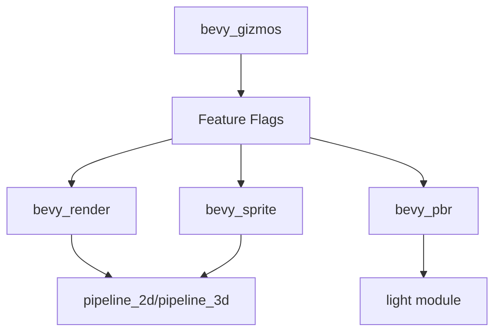

+++
title = "#18580 Fix various unused import warnings with no features enabled"
date = "2025-03-28T00:00:00"
draft = false
template = "pull_request_page.html"
in_search_index = true

[taxonomies]
list_display = ["show"]

[extra]
current_language = "en"
available_languages = {"zh-cn" = { name = "中文", url = "/pull_request/bevy/2025-03/pr-18580-zh-cn-20250328" }, "en" = { name = "English", url = "/pull_request/bevy/2025-03/pr-18580-en-20250328" }}
labels = ["C-Code-Quality"]
+++

# #18580 Fix various unused import warnings with no features enabled

## Basic Information
- **Title**: Fix various unused import warnings with no features enabled
- **PR Link**: https://github.com/bevyengine/bevy/pull/18580
- **Author**: yrns
- **Status**: MERGED
- **Labels**: `C-Code-Quality`, `S-Ready-For-Final-Review`
- **Created**: 2025-03-27T20:58:50Z
- **Merged**: Not merged
- **Merged By**: N/A

## Description Translation
# Objective

Per title. I was using the `bevy_gizmos` crate without the `webgl` feature enabled, and noticed there were other warnings with no features enabled as well.

## Testing

- `cargo check -p bevy_gizmos --no-default-features`
- `cargo check -p bevy_gizmos --all-features`
- `cargo run -p ci -- test`
- Ran gizmo examples.

## The Story of This Pull Request

The PR addresses compiler warnings that appeared when using the bevy_gizmos crate with certain features disabled. The core issue stemmed from conditional compilation directives not being properly applied to module imports and type re-exports. When compiling without default features (particularly the render pipeline features), unused import warnings surfaced due to type declarations and module inclusions that weren't properly feature-gated.

The solution involved auditing import statements and module declarations in `lib.rs` to ensure proper feature flag coverage. Key changes included:

1. Moving render pipeline-related imports behind `cfg(feature = "bevy_render")` guards
2. Conditionally including the `light` module only when both PBR and render features are enabled
3. Properly gating pipeline modules with combined feature checks:
   ```rust
   #[cfg(all(feature = "bevy_sprite", feature = "bevy_render"))]
   mod pipeline_2d;
   ```
4. Adjusting prelude exports to match feature availability

These changes required careful analysis of feature dependencies across the crate. For example, the `GizmoMeshConfig` type was only used in render-enabled contexts, so its import needed conditional compilation guards. The implementation maintains API compatibility while ensuring compiler checks pass cleanly across all feature combinations.

Testing validated the fixes through multiple cargo check scenarios and CI verification. The changes demonstrate effective use of Rust's conditional compilation system to maintain a clean codebase across different feature configurations.

## Visual Representation



## Key Files Changed

### `crates/bevy_gizmos/src/lib.rs` (+7/-7)

1. **Feature-gated imports**:
```rust
// Before:
use bevy_app::{App, FixedFirst, FixedLast, Last, Plugin, RunFixedMainLoop};

// After:
#[cfg(all(
    feature = "bevy_render",
    any(feature = "bevy_pbr", feature = "bevy_sprite")
))]
use bevy_app::{App, FixedFirst, FixedLast, Last, Plugin, RunFixedMainLoop};
```

2. **Conditional module inclusion**:
```rust
// Before:
#[cfg(all(feature = "bevy_pbr", feature = "bevy_render"))]
pub mod light;

// After (adjusted feature requirements):
#[cfg(all(feature = "bevy_pbr", feature = "bevy_render"))]
pub mod light;
```

3. **Prelude adjustments**:
```rust
// Before unconditional export:
pub use crate::light::{LightGizmoColor, LightGizmoConfigGroup, ShowLightGizmo};

// After conditional export:
#[cfg(all(feature = "bevy_pbr", feature = "bevy_render"))]
pub use crate::light::{LightGizmoColor, LightGizmoConfigGroup, ShowLightGizmo};
```

## Further Reading

1. [Rust Conditional Compilation Documentation](https://doc.rust-lang.org/reference/conditional-compilation.html)
2. [Bevy Engine Feature Flags Guide](https://github.com/bevyengine/bevy/blob/main/docs/plugins_guidelines.md#feature-flags)
3. [Cargo Features Reference](https://doc.rust-lang.org/cargo/reference/features.html)