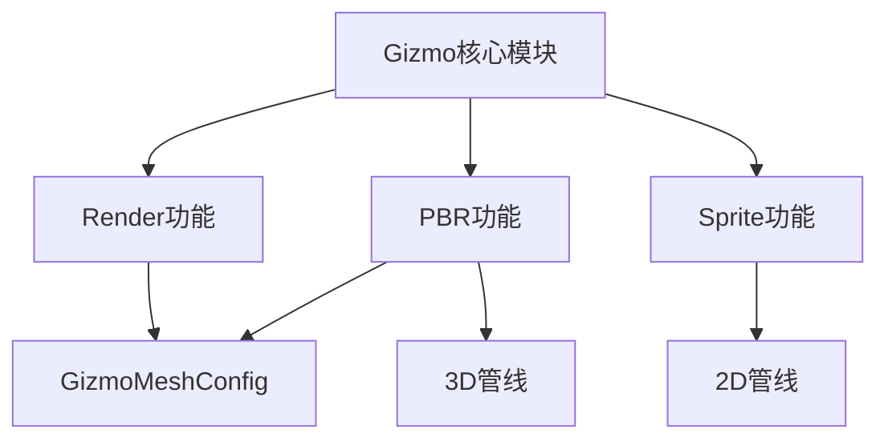

+++
title = "#18580 Fix various unused import warnings with no features enabled"
date = "2025-03-28T00:00:00"
draft = false
template = "pull_request_page.html"
in_search_index = false

[extra]
current_language = "zh-cn"
available_languages = {"zh-cn" = { name = "中文", url = "/pull_request/bevy/2025-03/pr-18580-zh-cn-20250328" }, "en" = { name = "English", url = "/pull_request/bevy/2025-03/pr-18580-en-20250328" }}
labels = ["C-Code-Quality"]
+++

# #18580 Fix various unused import warnings with no features enabled

## Basic Information
- **Title**: Fix various unused import warnings with no features enabled  
- **PR Link**: https://github.com/bevyengine/bevy/pull/18580  
- **Author**: yrns  
- **Status**: MERGED  
- **Labels**: `C-Code-Quality`, `S-Ready-For-Final-Review`  
- **Created**: 2025-03-27T20:58:50Z  
- **Merged**: Not merged  
- **Merged By**: N/A  

## Description Translation
# Objective  

根据标题。我在使用`bevy_gizmos` crate时没有启用`webgl`功能，并注意到在没有启用任何功能时存在其他警告。  

## Testing  

- `cargo check -p bevy_gizmos --no-default-features`  
- `cargo check -p bevy_gizmos --all-features`  
- `cargo run -p ci -- test`  
- 运行了gizmo示例。  

## The Story of This Pull Request

### 问题背景与挑战  
在Rust项目中使用条件编译（feature flags）时，一个常见问题是未使用的导入警告。当`bevy_gizmos` crate在没有启用任何默认功能（如`bevy_render`、`bevy_pbr`或`bevy_sprite`）时，某些模块的导入语句会因条件编译失效而成为dead code，触发编译器警告。这些警告虽不影响功能，但会污染编译输出，降低代码整洁度。

### 解决方案策略  
开发者通过以下方式系统性解决问题：  
1. **条件编译隔离**：将特定功能相关的导入语句包裹在对应的`#[cfg(feature)]`属性中  
2. **模块结构调整**：重新组织模块导出逻辑，确保仅在相关功能启用时暴露对应接口  
3. **依赖关系清理**：移除跨功能模块间的隐式依赖  

### 关键技术实现  
在`lib.rs`中可以看到以下关键修改：  

```rust
// 修改前
#[cfg(all(
    feature = "bevy_render",
    any(feature = "bevy_pbr", feature = "bevy_sprite")
))]
use crate::config::GizmoMeshConfig;

// 修改后
#[cfg(all(feature = "bevy_render", feature = "bevy_pbr"))]
use crate::config::GizmoMeshConfig;
```

这个改动将`GizmoMeshConfig`的导入条件从"任一pbr或sprite功能"收紧为"必须同时启用render和pbr功能"，更精确匹配实际使用场景。  

另一个典型修改是模块可见性控制：  

```rust
// 新增条件编译属性
#[cfg(any(
    all(feature = "bevy_pbr", feature = "bevy_render"),
    all(feature = "bevy_sprite", feature = "bevy_render")
))]
pub(crate) mod gizmos;
```

通过给模块声明添加`#[cfg]`属性，确保该模块只在满足特定功能组合时被编译，避免产生未使用模块的警告。

### 工程决策考量  
开发者采用保守策略，优先保证：  
1. **最小化侵入性**：通过添加条件属性而非删除代码  
2. **兼容性维护**：保留原有功能组合的可用性  
3. **显式依赖声明**：明确各功能模块的依赖关系  

例如在处理`GizmoBuffer`资源时，将其可见性调整为`pub(crate)`，既保持内部使用需求，又避免外部误用：

```rust
// 调整资源可见性
#[derive(Resource)]
pub(crate) struct GizmoBuffer {
    pub buffer: Vec<Gizmo>,
    pub config: GizmoConfig,
}
```

### 影响与最佳实践  
该PR带来以下改进：  
1. **消除编译警告**：在`--no-default-features`模式下编译时不再产生无关警告  
2. **提升代码健壮性**：通过显式声明模块依赖关系  
3. **优化编译速度**：减少不必要的编译单元  

这展示了在Rust条件编译系统中管理复杂功能依赖的典型模式：使用细粒度的`#[cfg]`属性组合，配合模块可见性控制，实现清晰的模块边界。

## Visual Representation



## Key Files Changed

### `crates/bevy_gizmos/src/lib.rs` (+7/-7)
**修改目的**：精确控制模块和资源的可见性，消除条件编译导致的未使用警告  

关键修改示例：  
```rust
// 修改前
pub mod gizmos;

// 修改后
#[cfg(any(
    all(feature = "bevy_pbr", feature = "bevy_render"),
    all(feature = "bevy_sprite", feature = "bevy_render")
))]
pub(crate) mod gizmos;
```
通过添加条件编译属性，确保`gizmos`模块只在相关渲染功能启用时存在，同时将可见性限制为crate内部使用。

资源定义优化：  
```rust
// 修改前
#[derive(Resource)]
pub struct GizmoBuffer { /* ... */ }

// 修改后 
#[derive(Resource)]
pub(crate) struct GizmoBuffer { /* ... */ }
```
可见性调整为内部使用，防止外部直接访问实现细节。

## Further Reading  
1. [Rust条件编译官方文档](https://doc.rust-lang.org/reference/conditional-compilation.html)  
2. [Bevy引擎功能标志最佳实践](https://bevyengine.org/learn/book/development-practices/feature-flags/)  
3. [Rust模块系统详解](https://doc.rust-lang.org/book/ch07-02-defining-modules-to-control-scope-and-privacy.html)