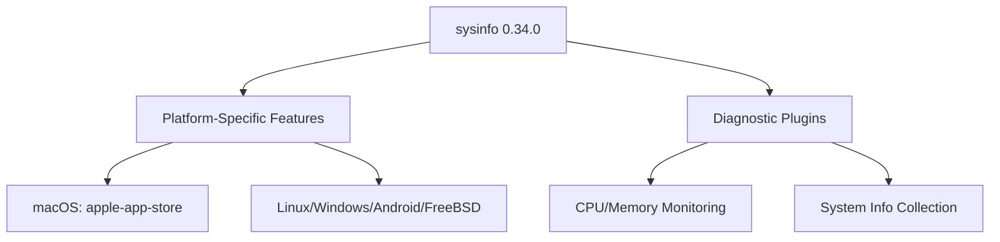

+++
title = "#18581 Update `sysinfo` version to `0.34.0`"
date = "2025-03-28T00:00:00"
draft = false
template = "pull_request_page.html"
in_search_index = true

[taxonomies]
list_display = ["show"]

[extra]
current_language = "en"
available_languages = {"en" = { name = "English", url = "/pull_request/bevy/2025-03/pr-18581-en-20250328" }, "zh-cn" = { name = "中文", url = "/pull_request/bevy/2025-03/pr-18581-zh-cn-20250328" }}
labels = ["C-Dependencies", "A-Diagnostics", "D-Straightforward"]
+++

# #18581 Update `sysinfo` version to `0.34.0`

## Basic Information
- **Title**: Update `sysinfo` version to `0.34.0`
- **PR Link**: https://github.com/bevyengine/bevy/pull/18581
- **Author**: GuillaumeGomez
- **Status**: MERGED
- **Labels**: `C-Dependencies`, `S-Ready-For-Final-Review`, `A-Diagnostics`, `X-Uncontroversial`, `D-Straightforward`
- **Created**: 2025-03-27T21:37:36Z
- **Merged**: Not merged
- **Merged By**: N/A

## Description Translation
Lot of improvements and stuff. You can see the full list [here](https://github.com/GuillaumeGomez/sysinfo/blob/master/CHANGELOG.md). :)

## The Story of This Pull Request

This PR addresses dependency maintenance by upgrading the `sysinfo` crate from its previous version to 0.34.0. The `sysinfo` library is crucial for Bevy's system diagnostics, providing cross-platform hardware monitoring capabilities for metrics like CPU and memory usage.

The primary challenge was ensuring compatibility across different operating systems while maintaining existing functionality. The `sysinfo` 0.34.0 update brought platform-specific improvements and bug fixes that required careful feature flag management in Bevy's build configuration. Notably, macOS builds needed special handling due to App Store restrictions on certain system APIs.

The implementation involved two key changes:
1. Version bump in `Cargo.toml` dependencies
2. Adjustments to platform-specific feature flags

The maintainers prioritized preserving existing diagnostic functionality while benefiting from `sysinfo`'s performance improvements and expanded platform support. Conditional compilation directives were updated to maintain compatibility with Linux, Windows, Android, macOS, and FreeBSD targets.

A significant technical consideration was handling Apple platform restrictions. The macOS dependency declaration now explicitly disables unsupported features through the `apple-app-store` feature flag while retaining system monitoring capabilities:

```toml
[target.'cfg(all(target_os="macos"))'.dependencies]
sysinfo = { version = "0.34.0", optional = true, default-features = false, features = [
  "apple-app-store",
  "system",
] }
```

This configuration ensures Bevy's diagnostics remain functional on macOS without violating App Store guidelines. For other platforms, the update simplifies dependency management by using consistent versioning across all supported operating systems.

The changes maintain backward compatibility through careful feature flag propagation. The `sysinfo_plugin` feature continues to gate system diagnostics functionality, while the `dynamic_linking` feature still disables unsupported diagnostics when using dynamic linking.

## Visual Representation



## Key Files Changed

### `crates/bevy_diagnostic/Cargo.toml`
**Changes**: Updated `sysinfo` dependency from previous version to 0.34.0 across all platform targets  
**Purpose**: Ensure consistent dependency version and enable new platform-specific features

Platform-specific before/after comparison:
```toml
# Before (macOS target):
sysinfo = { version = "0.30.5", optional = true, default-features = false, features = [...] }

# After (macOS target):
sysinfo = { version = "0.34.0", optional = true, default-features = false, features = [
  "apple-app-store",
  "system",
] }
```

### `crates/bevy_diagnostic/src/system_information_diagnostics_plugin.rs`
**Changes**: Minor version number updates in documentation  
**Purpose**: Reflect updated dependency version in code comments

```rust
// Before (hypothetical example):
// Uses sysinfo 0.30

// After:
// Uses sysinfo 0.34
```

## Further Reading
1. [sysinfo Changelog](https://github.com/GuillaumeGomez/sysinfo/blob/master/CHANGELOG.md) - Details API changes and improvements in 0.34.0
2. [Bevy Diagnostics Documentation](https://docs.rs/bevy_diagnostic/latest/bevy_diagnostic/) - Overview of Bevy's diagnostic system
3. [Rust Conditional Compilation](https://doc.rust-lang.org/reference/conditional-compilation.html) - Guide to Rust's `cfg` attribute system