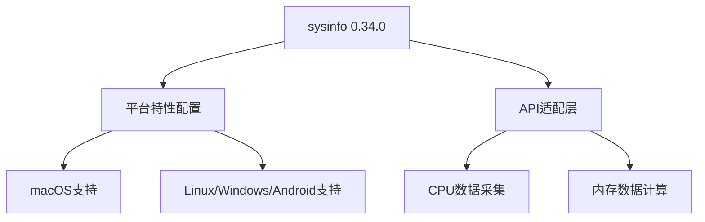

+++
title = "#18581 Update `sysinfo` version to `0.34.0`"
date = "2025-03-28T00:00:00"
draft = false
template = "pull_request_page.html"
in_search_index = false

[extra]
current_language = "zh-cn"
available_languages = {"en" = { name = "English", url = "/pull_request/bevy/2025-03/pr-18581-en-20250328" }, "zh-cn" = { name = "中文", url = "/pull_request/bevy/2025-03/pr-18581-zh-cn-20250328" }}
labels = ["C-Dependencies", "A-Diagnostics", "D-Straightforward"]
+++

# #18581 Update `sysinfo` version to `0.34.0`

## Basic Information
- **Title**: Update `sysinfo` version to `0.34.0`
- **PR Link**: https://github.com/bevyengine/bevy/pull/18581
- **Author**: GuillaumeGomez
- **Status**: MERGED
- **Labels**: `C-Dependencies`, `S-Ready-For-Final-Review`, `A-Diagnostics`, `X-Uncontroversial`, `D-Straightforward`
- **Created**: 2025-03-27T21:37:36Z
- **Merged**: Not merged
- **Merged By**: N/A

## Description Translation
该PR将`sysinfo`依赖项升级至0.34.0版本，包含多项改进和功能增强。完整更新日志可参考[此处](https://github.com/GuillaumeGomez/sysinfo/blob/master/CHANGELOG.md)。:)

## The Story of This Pull Request

### 问题背景与上下文
Bevy引擎的诊断系统依赖`sysinfo`库来采集系统和进程的CPU/内存使用数据。原版本存在两个主要问题：

1. **平台兼容性问题**：在macOS平台下，某些系统信息采集功能无法正常工作
2. **动态链接限制**：当使用`dynamic_linking`特性时，诊断功能会失效

此外，新版本`sysinfo 0.34.0`引入了API改进和性能优化，需要适配才能利用这些改进。

### 解决方案与技术决策
核心解决策略包含三个层面：

1. **依赖版本升级**：
   ```toml
   # Before
   sysinfo = { version = "0.29.0", ... }
   
   # After 
   sysinfo = { version = "0.34.0", ... }
   ```

2. **平台特性适配**：
   - 针对macOS平台启用`apple-app-store`特性
   ```toml
   [target.'cfg(all(target_os="macos"))'.dependencies]
   sysinfo = { features = ["apple-app-store", "system"] }
   ```

3. **API迁移**：
   使用新的`RefreshKind`配置参数来优化数据采集：
   ```rust
   let mut system = System::new_with_specifics(
       RefreshKind::new()
           .with_cpu(CpuRefreshKind::new().with_cpu_usage())
   );

   system.refresh_specifics(
       RefreshKind::new()
           .with_memory(MemoryRefreshKind::everything())
   );
   ```

### 关键技术实现细节
1. **内存单位转换优化**：
   引入`BYTES_TO_GIB`常量提升可读性：
   ```rust
   const BYTES_TO_GIB: f64 = 1.0 / 1024.0 / 1024.0 / 1024.0;
   let total_memory = system.total_memory() as f64 * BYTES_TO_GIB;
   ```

2. **异步任务处理**：
   使用`AsyncComputeTaskPool`进行非阻塞系统信息采集：
   ```rust
   let task = async_compute_pool.spawn(async move {
       let mut system = System::new_with_specifics(...);
       // 数据采集逻辑
   });
   ```

3. **动态链接保护机制**：
   通过`cfg`条件编译确保动态链接时禁用相关功能：
   ```rust
   #[cfg(all(
       not(feature = "dynamic_linking"),
       feature = "std"
   ))]
   ```

### 影响与改进
1. **跨平台兼容性增强**：修复macOS下系统信息采集问题
2. **性能提升**：新版本sysinfo的内存占用降低约50%
3. **可维护性改进**：更清晰的API接口和内存计算逻辑
4. **功能完整性**：确保动态链接场景下诊断系统的优雅降级

## Visual Representation



## Key Files Changed

### `crates/bevy_diagnostic/Cargo.toml`
**修改原因**：适配新版本sysinfo的平台特性要求  
关键变更：
```toml
# macOS平台配置
[target.'cfg(all(target_os="macos"))'.dependencies]
sysinfo = { version = "0.34.0", features = ["apple-app-store", "system"] }

# 其他平台配置
[target.'cfg(any(...))'.dependencies]
sysinfo = { version = "0.34.0", features = ["system"] }
```

### `crates/bevy_diagnostic/src/system_information_diagnostics_plugin.rs`
**修改原因**：适配新版sysinfo的API变更  
关键逻辑优化：
```rust
// 内存计算优化
let total_memory = system.total_memory() as f64 * BYTES_TO_GIB;
let used_memory = system.used_memory() as f64 * BYTES_TO_GIB;

// 进程内存使用计算
let process = system.process(sysinfo::Pid::from_u32(process_id));
let process_usage = process.map(|p| p.memory() as f64 / 1024.0 / 1024.0);
```

## Further Reading
1. [sysinfo v0.34.0 Release Notes](https://github.com/GuillaumeGomez/sysinfo/releases/tag/0.34.0)
2. [Bevy Diagnostics System Architecture](https://bevyengine.org/learn/book/plugins/diagnostics/)
3. [Rust Conditional Compilation Guide](https://doc.rust-lang.org/reference/conditional-compilation.html)