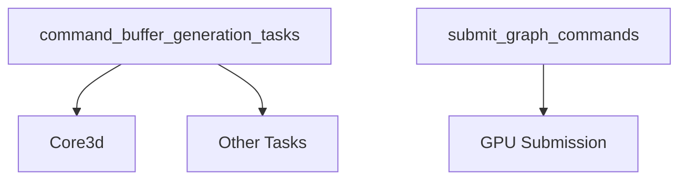

+++
title = "#18588 Fix and improve tracy rendering spans"
date = "2025-03-28T00:00:00"
draft = false
template = "pull_request_page.html"
in_search_index = true

[taxonomies]
list_display = ["show"]

[extra]
current_language = "en"
available_languages = {"en" = { name = "English", url = "/pull_request/bevy/2025-03/pr-18588-en-20250328" }, "zh-cn" = { name = "中文", url = "/pull_request/bevy/2025-03/pr-18588-zh-cn-20250328" }}
labels = ["A-Rendering", "A-Diagnostics"]
+++

# #18588 Fix and improve tracy rendering spans

## Basic Information
- **Title**: Fix and improve tracy rendering spans
- **PR Link**: https://github.com/bevyengine/bevy/pull/18588
- **Author**: JMS55
- **Status**: MERGED
- **Labels**: `A-Rendering`, `A-Diagnostics`, `S-Needs-Review`
- **Created**: 2025-03-28T05:16:30Z
- **Merged**: Not merged
- **Merged By**: N/A

## Description Translation
* `submit_graph_commands` was incorrectly timing the command buffer generation tasks as well, and not only the queue submission. Moved the span to fix that.
* Added a new `command_buffer_generation_tasks` span as a parent for all the individual command buffer generation tasks that don't run as part of the Core3d span.


## The Story of This Pull Request

### The Problem and Context
The Bevy engine's rendering system uses Tracy profiler spans to analyze performance characteristics. Two key timing issues were identified:

1. The existing `submit_graph_commands` span was incorrectly measuring both command buffer generation (CPU work) and actual queue submission (GPU work). This conflation made it difficult to isolate bottlenecks between CPU preparation and GPU execution.

2. Command buffer generation tasks lacked proper hierarchical organization in Tracy's visualization. While individual tasks like `Core3d` had their own spans, there was no parent span grouping all command generation work outside specific phases.

### The Solution Approach
The author addressed these issues through targeted span adjustments:

1. **Span Relocation**: Moved the `submit_graph_commands` span to exclusively time the final command buffer submission to the GPU queue, separating it from CPU-side preparation work.

2. **Hierarchical Organization**: Introduced a new parent span `command_buffer_generation_tasks` to encapsulate all command buffer generation activities, providing better structure in Tracy's visualization.

### The Implementation
Key changes in `graph_runner.rs`:

```rust
// Original span placement (incorrect timing)
let _span = info_span!("submit_graph_commands").entered();

// Moved span to only wrap queue submission
queue.submit(render_command_buffers);
```

Added hierarchical grouping in `mod.rs`:
```rust
let command_buffer_span = info_span!("command_buffer_generation_tasks");
let _command_buffer_guard = command_buffer_span.enter();

// Individual task spans now nest under parent span
for task in render_command_buffers {
    // ...
}
```

### Technical Insights
The implementation leverages Tracy's span nesting capabilities:
- Parent spans create logical groupings
- Child spans show detailed breakdowns
- Span hierarchy depth correlates with code execution depth

By separating CPU and GPU timing:
- Developers can distinguish between:
  - Command preparation time (CPU-bound)
  - Queue submission latency (GPU-bound)
- Memory pressure from command buffer creation becomes more visible

### The Impact
These changes enable:
1. Precise performance analysis through clean separation of concerns
2. Better visualization of task hierarchies in Tracy
3. More accurate identification of bottlenecks in the render graph

The accompanying Tracy visualization screenshot shows:
- Clear parent-child relationships between spans
- Distinct timing blocks for command generation vs submission
- Improved organizational structure for render tasks

## Visual Representation



## Key Files Changed

### `crates/bevy_render/src/renderer/graph_runner.rs`
- **Change**: Repositioned `submit_graph_commands` span
- **Purpose**: Isolate GPU submission timing from CPU work
```rust
// Before (incorrect scope):
let _span = info_span!("submit_graph_commands").entered();
let render_command_buffers = ...;
queue.submit(render_command_buffers);

// After (corrected):
let render_command_buffers = ...;
let _span = info_span!("submit_graph_commands").entered();
queue.submit(render_command_buffers);
```

### `crates/bevy_render/src/renderer/mod.rs`
- **Change**: Added parent span for command generation
- **Purpose**: Create hierarchical task grouping
```rust
// Added parent span:
let command_buffer_span = info_span!("command_buffer_generation_tasks");
let _command_buffer_guard = command_buffer_span.enter();

// Existing tasks now nest under this span
for task in render_command_buffers {
    // ...
}
```

## Further Reading
- [Tracy Profiler Manual](https://github.com/wolfpld/tracy/blob/master/doc/Manual.md)
- [Bevy Render Graph Documentation](https://bevyengine.org/learn/book/getting-started/rendering/)
- [wgpu Command Submission Model](https://wgpu.rs/wgpu/queue/struct.Queue.html#method.submit)