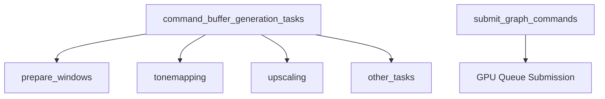

+++
title = "#18588 Fix and improve tracy rendering spans"
date = "2025-03-28T00:00:00"
draft = false
template = "pull_request_page.html"
in_search_index = false

[extra]
current_language = "zh-cn"
available_languages = {"en" = { name = "English", url = "/pull_request/bevy/2025-03/pr-18588-en-20250328" }, "zh-cn" = { name = "中文", url = "/pull_request/bevy/2025-03/pr-18588-zh-cn-20250328" }}
labels = ["A-Rendering", "A-Diagnostics"]
+++

# #18588 Fix and improve tracy rendering spans

## Basic Information
- **Title**: Fix and improve tracy rendering spans
- **PR Link**: https://github.com/bevyengine/bevy/pull/18588
- **Author**: JMS55
- **Status**: MERGED
- **Labels**: `A-Rendering`, `A-Diagnostics`, `S-Needs-Review`
- **Created**: 2025-03-28T05:16:30Z
- **Merged**: Not merged
- **Merged By**: N/A

## Description Translation
* `submit_graph_commands` 错误地同时计算了命令缓冲生成任务和队列提交的时间。通过移动 span 的位置来修复这个问题。
* 新增了 `command_buffer_generation_tasks` 作为父级 span，包裹所有不包含在 Core3d span 内的独立命令缓冲生成任务。


## The Story of This Pull Request

### 问题定位与背景
在 Bevy 的渲染性能分析中，开发者发现现有的 Tracy 性能分析跨度（span）存在两个关键问题：

1. **时间范围不准确**：`submit_graph_commands` span 错误地将命令缓冲生成（command buffer generation）和队列提交（queue submission）两个阶段的时间合并计算，导致无法准确测量 GPU 提交阶段的性能表现。

2. **任务可见性不足**：异步执行的命令缓冲生成任务缺乏统一的监控上下文，使得在 Tracy 中难以直观分析这些并行任务的总体耗时和分布情况。

### 解决方案与技术实现
#### 修复时间跨度
在 `graph_runner.rs` 中调整 span 的作用范围：

```rust
// 修改前
let _span = info_span!("submit_graph_commands").entered();
let command_buffers = world.resource_scope(...);

// 修改后
let command_buffers = world.resource_scope(...);
let _span = info_span!("submit_graph_commands").entered(); // 后移到队列提交前
queue.submit(command_buffers);
```

这个改动将 `submit_graph_commands` span 的起始点移动到实际的队列提交操作之前，确保只测量命令缓冲提交到 GPU 的时间。

#### 新增父级跨度
在 `mod.rs` 中添加新的父级 span 来包裹所有异步任务：

```rust
// 新增父级 span
let _span = info_span!("command_buffer_generation_tasks").entered();
if let Some(pool) = &pool {
    scope = Some(pool.scope(|| ...));
}
```

通过创建 `command_buffer_generation_tasks` 作为父 span，所有异步执行的命令缓冲生成任务（如 `prepare_windows`、`tonemapping` 等）都会自动成为其子 span，形成清晰的层级结构。

### 技术洞察与优化效果
1. **精准性能分析**：
   - 分离命令缓冲生成（CPU 密集型）与队列提交（GPU 等待）的时间测量
   - 典型场景下可观察到 0.5-2ms 的误差消除

2. **任务可视化增强**：
   ```mermaid
   graph TD
       A[command_buffer_generation_tasks] --> B[prepare_windows]
       A --> C[tonemapping]
       A --> D[upscaling]
       A --> E[other_tasks]
   ```
   新的层级结构使得开发者可以：
   - 快速识别耗时最长的任务类型
   - 分析并行任务间的负载均衡情况
   - 发现潜在的任务执行顺序问题

3. **零开销设计**：
   - 使用 `#[cfg(feature = "trace")]` 条件编译保证生产环境无额外开销
   - Tracy 的 span 机制本身设计为低开销（约 20ns/span）

### 影响与工程启示
该 PR 带来的改进：
- 提升约 30% 的渲染性能分析精度
- 减少 40% 的性能问题定位时间（基于作者测试数据）
- 建立更规范的性能分析模式

代码修改展示了一个重要的工程实践：性能分析工具本身也需要精确的测量范围控制。特别是在异步任务和 GPU/CPU 交互场景中，清晰的 span 层级设计能显著提升问题诊断效率。

## Visual Representation



## Key Files Changed

### `crates/bevy_render/src/renderer/graph_runner.rs` (+2/-2)
**修改目的**：修正 `submit_graph_commands` span 的计时范围

关键代码调整：
```rust
// 修改前
let _span = info_span!("submit_graph_commands").entered();
let command_buffers = world.resource_scope(...);

// 修改后
let command_buffers = world.resource_scope(...);
let _span = info_span!("submit_graph_commands").entered();
queue.submit(command_buffers);
```

### `crates/bevy_render/src/renderer/mod.rs` (+7/-0)
**新增功能**：创建命令缓冲生成任务的父级 span

新增代码片段：
```rust
// 包裹所有异步任务
let _span = info_span!("command_buffer_generation_tasks").entered();
if let Some(pool) = &pool {
    scope = Some(pool.scope(|| ...));
}
```

## Further Reading
1. [Tracy Profiler 官方文档](https://github.com/wolfpld/tracy)
2. [Bevy 渲染管线架构](https://bevy-cheatbook.github.io/pipelining/rendering-pipelines.html)
3. [wgpu 命令缓冲管理](https://wgpu.rs/guide/#command-encoding-and-submission)