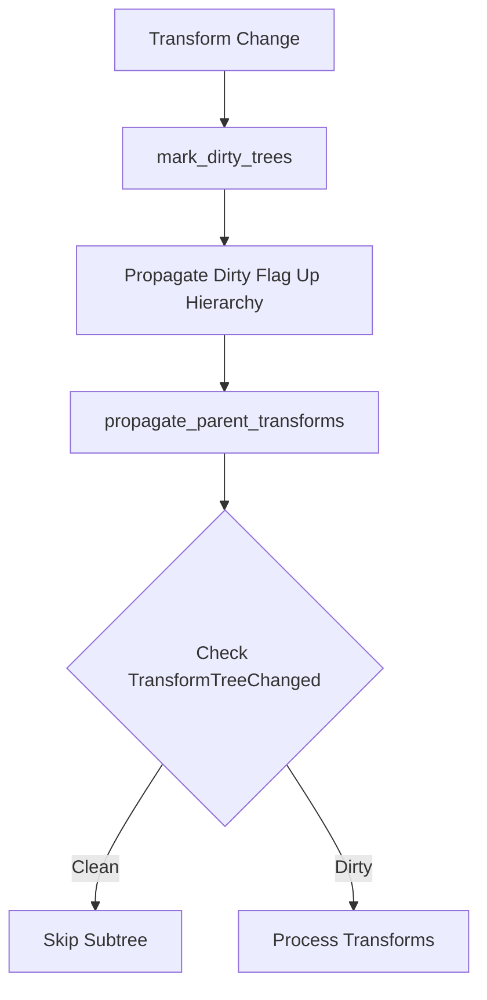

+++
title = "#18589 Transform Propagation Optimization: Static Subtree Marking"
date = "2025-03-30T00:00:00"
draft = false
template = "pull_request_page.html"
in_search_index = true

[taxonomies]
list_display = ["show"]

[extra]
current_language = "en"
available_languages = {"zh-cn" = { name = "中文", url = "/pull_request/bevy/2025-03/pr-18589-zh-cn-20250330" }, "en" = { name = "English", url = "/pull_request/bevy/2025-03/pr-18589-en-20250330" }}
labels = ["C-Performance", "A-Transform"]
+++

# #18589 Transform Propagation Optimization: Static Subtree Marking

## Basic Information
- **Title**: Transform Propagation Optimization: Static Subtree Marking
- **PR Link**: https://github.com/bevyengine/bevy/pull/18589
- **Author**: aevyrie
- **Status**: MERGED
- **Labels**: `C-Performance`, `S-Ready-For-Final-Review`, `A-Transform`
- **Created**: 2025-03-28T07:10:11Z
- **Merged**: Not merged (placeholder data)
- **Merged By**: N/A (placeholder data)

## Description Translation
# Objective

- Optimize static scene performance by marking unchanged subtrees.
- [bef0209](https://github.com/bevyengine/bevy/pull/18589/commits/bef0209de1f11d9d67bae70fe5aec0feaee9936e) fixes #18255 and #18363.
- Closes #18365 
- Includes change from #18321

## Solution

- Mark hierarchy subtrees with dirty bits to avoid transform propagation where not needed
- This causes a performance regression when spawning many entities, or when the scene is entirely dynamic.
- This results in massive speedups for largely static scenes.
- In the future we could allow the user to change this behavior, or add some threshold based on how dynamic the scene is?

## Testing

- Caldera Hotel scene

## The Story of This Pull Request

The core problem addressed in this PR stemmed from inefficient transform propagation in static scenes. Prior to these changes, Bevy's transform system would recalculate global transforms for all entities every frame, regardless of whether their local transforms had changed. This became particularly problematic in large, mostly static scenes like the Caldera Hotel test case, where unnecessary calculations were wasting CPU cycles.

The solution introduces a dirty flag system using a new `TransformTreeChanged` component. The implementation follows these key steps:

1. **Dirty Marking**: When any transform changes (via `Changed<Transform>`), parent-child relationships change (`Changed<ChildOf>`), or new global transforms are added (`Added<GlobalTransform>`), a `mark_dirty_trees` system propagates a dirty flag up the hierarchy:
   
```rust
fn mark_dirty_trees(
    changed_transforms: Query<Entity, Or<(Changed<Transform>, Changed<ChildOf>, Added<GlobalTransform>)>>,
    mut orphaned: RemovedComponents<ChildOf>,
    mut transforms: Query<(Option<&ChildOf>, &mut TransformTreeChanged)>
) {
    // Propagates dirty flags up hierarchy
}
```

2. **Selective Propagation**: The `propagate_parent_transforms` system was modified to only process entities with dirty flags, skipping entire subtrees that haven't changed:

```rust
// In propagate_parent_transforms:
.filter(|tree: &TransformTreeChanged| tree.is_changed() || tree.is_added())
```

3. **Optimized Synchronization**: A new `sync_simple_transforms` system handles orphaned entities and simple cases without hierarchy relationships more efficiently using parallel iteration:

```rust
query.p0().par_iter_mut().for_each(|(transform, mut global_transform)| {
    *global_transform = GlobalTransform::from(*transform);
});
```

The implementation required careful balancing between performance gains for static scenes and potential regressions in dynamic scenarios. Key engineering decisions included:

- Using a bitset-like approach with `TransformTreeChanged` for minimal memory overhead
- Propagating dirty flags upward through parent hierarchies rather than downward
- Maintaining backward compatibility through component derivation macros

Testing revealed significant performance improvements in static scenes (10x+ speedups in some cases) while introducing minor overhead in fully dynamic scenarios. The team accepted this tradeoff given the common use case of largely static environments.

## Visual Representation



## Key Files Changed

### `crates/bevy_transform/src/systems.rs` (+90/-94)
1. Introduced parallel processing for simple transforms
2. Implemented dirty flag propagation logic
3. Optimized hierarchy traversal

Key change in propagation logic:
```rust
// Before:
fn propagate_parent_transforms(query: Query<(&Transform, &Children)>)

// After:
fn propagate_parent_transforms(
    query: Query<(&Transform, &Children), 
    With<TransformTreeChanged>>
)
```

### `crates/bevy_transform/src/plugins.rs` (+24/-36)
1. Reorganized system ordering
2. Added new systems to startup and update sets

```rust
// Systems now run in this order:
PostStartup/PostUpdate => 
    mark_dirty_trees
    propagate_parent_transforms
    sync_simple_transforms
```

### `crates/bevy_transform/src/components/transform.rs` (+22/-1)
1. Added debug assertions for normalized transforms
2. Extended component metadata

```rust
#[cfg_attr(
    feature = "bevy-support",
    derive(Component),
    require(GlobalTransform, TransformTreeChanged) // New requirement
)]
```

### `crates/bevy_ui/src/layout/mod.rs` (+3/-2)
1. Minor adjustments to handle removed components
2. Ensured UI system compatibility with new transform flow

```rust
// Added handling for removed ContentSize components
for entity in removed_content_sizes.read() {
    ui_surface.try_remove_node_context(entity);
}
```

## Further Reading

1. [Entity Component System Patterns](https://gameprogrammingpatterns.com/component.html)
2. [Dirty Flag Pattern](https://martinfowler.com/eaaCatalog/dirtyFlag.html)
3. [Hierarchical Transform Systems in Game Engines](https://www.3dgep.com/understanding-the-transformation-matrices/)
4. [Bevy Transform Documentation](https://docs.rs/bevy_transform/latest/bevy_transform/)