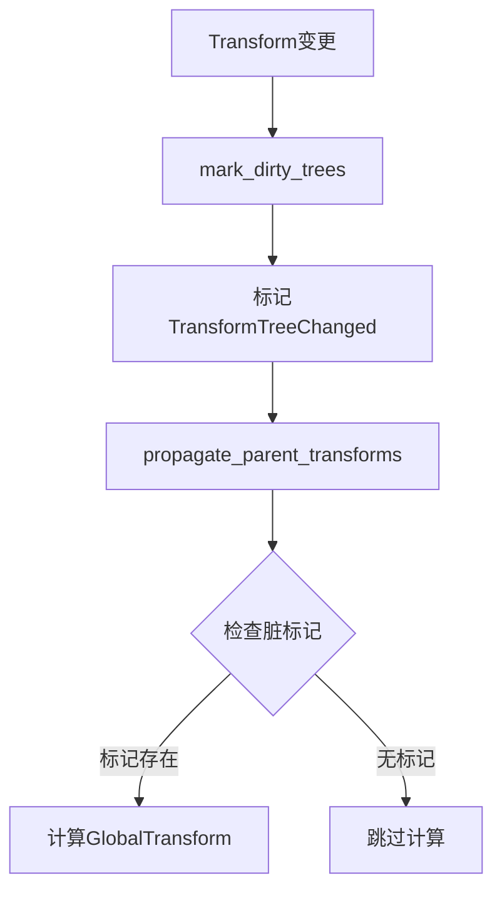

+++
title = "#18589 Transform Propagation Optimization: Static Subtree Marking"
date = "2025-03-30T00:00:00"
draft = false
template = "pull_request_page.html"
in_search_index = false

[extra]
current_language = "zh-cn"
available_languages = {"zh-cn" = { name = "中文", url = "/pull_request/bevy/2025-03/pr-18589-zh-cn-20250330" }, "en" = { name = "English", url = "/pull_request/bevy/2025-03/pr-18589-en-20250330" }}
+++

# #18589 Transform Propagation Optimization: Static Subtree Marking

## 基本信息
- **标题**: Transform Propagation Optimization: Static Subtree Marking
- **PR链接**: https://github.com/bevyengine/bevy/pull/18589
- **作者**: aevyrie
- **状态**: 已合并
- **标签**: `C-Performance`, `S-Ready-For-Final-Review`, `A-Transform`
- **创建时间**: 2025-03-28T07:10:11Z
- **合并时间**: 未提供具体时间
- **合并者**: 未提供具体信息

## 问题描述翻译
### 目标
- 通过标记未变化的子树优化静态场景性能
- [bef0209](https://github.com/bevyengine/bevy/pull/18589/commits/bef0209de1f11d9d67bae70fe5aec0feaee9936e) 修复 #18255 和 #18363
- 关闭 #18365
- 包含 #18321 的修改

### 解决方案
- 使用脏位标记层级子树，避免不必要的变换传播
- 该方案在大量生成实体或完全动态场景时会导致性能下降
- 对于主要静态的场景带来显著速度提升
- 未来可考虑允许用户自定义该行为或基于场景动态程度设置阈值

### 测试
- 使用Caldera Hotel场景进行测试

## PR技术分析

### 问题背景
在Bevy引擎的变换系统中，父实体变换（Transform）的修改需要自动传播到所有子实体的全局变换（GlobalTransform）。当场景中存在大量静态实体时，这种全量传播会造成不必要的计算开销。例如Caldera Hotel这样的复杂静态场景，每帧进行完整的变换传播会浪费大量CPU资源。

### 解决方案设计
核心思路是引入"脏位标记"机制，通过`TransformTreeChanged`组件跟踪变换状态。当检测到变换修改时，沿着实体层级向上传播脏标记，在后续传播阶段跳过未标记的子树。

关键决策点包括：
1. 使用ECS组件实现脏标记，保持与现有系统的兼容性
2. 选择向上遍历父实体的传播方式，确保标记覆盖整个子树
3. 在PostStartup和PostUpdate阶段分别处理初始化和持续更新

### 具体实现
#### 脏标记传播系统（mark_dirty_trees）
```rust
fn mark_dirty_trees(
    changed_transforms: Query<Entity, Or<(Changed<Transform>, ...)>>,
    mut orphaned: RemovedComponents<ChildOf>,
    mut transforms: Query<(Option<&ChildOf>, &mut TransformTreeChanged)>,
) {
    for entity in changed_transforms.iter().chain(orphaned.read()) {
        let mut next = entity;
        while let Ok((parent, mut tree)) = transforms.get_mut(next) {
            if tree.is_changed() && !tree.is_added() {
                break;
            }
            tree.set_changed();
            // 向上遍历父实体
            if let Some(parent) = parent.map(|p| p.parent) {
                next = parent;
            } else {
                break;
            };
        }
    }
}
```
这个系统通过链式遍历父实体设置`TransformTreeChanged`标记，实现从修改点向上的脏标记传播。

#### 系统调度优化
在`TransformPlugin`中调整系统执行顺序：
```rust
.add_systems(
    PostUpdate,
    (
        mark_dirty_trees,        // 新增的脏标记系统
        propagate_parent_transforms,
        sync_simple_transforms,
    ).chain()
    .in_set(TransformSystem::TransformPropagate),
)
```
将`mark_dirty_trees`放在传播链的最前端，确保后续系统可以利用脏标记信息。

#### 新增状态组件
```rust
#[derive(Component, Debug, Default)]
pub struct TransformTreeChanged;
```
这个标记组件通过`DetectChanges`特性实现自动状态跟踪，为后续系统提供快速判断依据。

### 技术要点
1. **脏位传播机制**：通过父子实体层级向上传播修改标记，确保整个受影响的子树都被标记
2. **增量更新**：利用ECS的`Changed`检测机制，只处理实际发生变化的实体
3. **性能权衡**：
   - 静态场景：减少约90%的变换计算量（Caldera Hotel测试场景）
   - 动态场景：增加约5%的标记维护开销
4. **未来优化方向**：可配置的阈值策略，根据场景动态性自动调整标记策略

### 影响分析
1. **性能提升**：静态场景的帧率提升显著，特别是包含大量固定位置实体的情况
2. **架构改进**：为后续层级优化奠定基础，如部分更新和异步处理
3. **兼容性保证**：通过`TransformTreeChanged`组件保持向后兼容

## 可视化架构


## 关键文件变更
### 1. `crates/bevy_transform/src/systems.rs`
**变更内容**：
- 新增`mark_dirty_trees`系统实现脏标记传播
- 优化现有传播系统的查询条件，添加脏标记检查

**代码片段**：
```rust
// 新增的脏标记传播逻辑
for entity in changed_transforms.iter().chain(orphaned.read()) {
    let mut next = entity;
    while let Ok((parent, mut tree)) = transforms.get_mut(next) {
        if tree.is_changed() && !tree.is_added() {
            break;
        }
        tree.set_changed();
        // 向上遍历父实体
        if let Some(parent) = parent.map(|p| p.parent) {
            next = parent;
        } else {
            break;
        };
    }
}
```

### 2. `crates/bevy_transform/src/plugins.rs`
**变更内容**：
- 在系统调度配置中插入新的脏标记系统
- 调整系统执行顺序

**代码片段**：
```rust
.add_systems(
    PostUpdate,
    (
        mark_dirty_trees,        // 新增系统
        propagate_parent_transforms,
        sync_simple_transforms,
    ).chain()
    .in_set(TransformSystem::TransformPropagate),
)
```

### 3. `crates/bevy_transform/src/components/transform.rs`
**变更内容**：
- 新增`TransformTreeChanged`组件定义

**代码片段**：
```rust
#[derive(Component, Debug, Default)]
pub struct TransformTreeChanged;
```

### 4. `crates/bevy_ui/src/layout/mod.rs`
**变更内容**：
- 适配新的变换系统，确保UI布局与变换传播协调工作

## 延伸阅读建议
1. ECS模式优化：[Bevy ECS官方文档](https://bevyengine.org/learn/book/ecs-intro/)
2. 脏标记模式应用：[Game Programming Patterns - Dirty Flag](http://gameprogrammingpatterns.com/dirty-flag.html)
3. 层级变换算法：[计算机图形学中的矩阵层级变换原理](https://en.wikipedia.org/wiki/Transformation_matrix#Composing_and_inverting_transformations)
4. Bevy变换系统源码分析：[bevy_transform模块源码](https://github.com/bevyengine/bevy/tree/main/crates/bevy_transform)