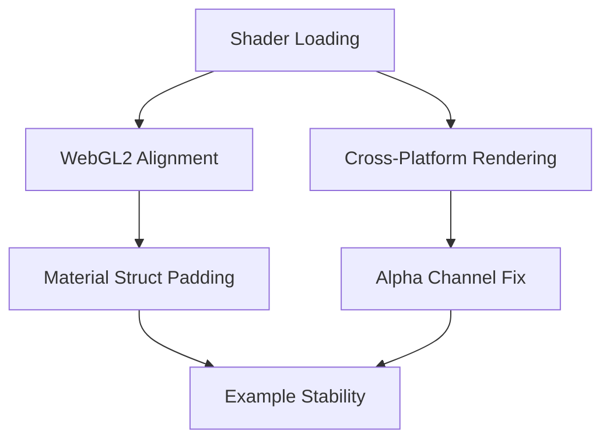

+++
title = "#18591 Fix wesl in wasm and webgl2"
date = "2025-03-28T00:00:00"
draft = false
template = "pull_request_page.html"
in_search_index = true

[taxonomies]
list_display = ["show"]

[extra]
current_language = "en"
available_languages = {"en" = { name = "English", url = "/pull_request/bevy/2025-03/pr-18591-en-20250328" }, "zh-cn" = { name = "中文", url = "/pull_request/bevy/2025-03/pr-18591-zh-cn-20250328" }}
labels = ["A-Rendering", "O-Web", "O-WebGL2"]
+++

# #18591 Fix wesl in wasm and webgl2

## Basic Information
- **Title**: Fix wesl in wasm and webgl2
- **PR Link**: https://github.com/bevyengine/bevy/pull/18591
- **Author**: mockersf
- **Status**: MERGED
- **Labels**: `A-Rendering`, `O-Web`, `S-Ready-For-Final-Review`, `P-Compile-Failure`, `O-WebGL2`
- **Created**: 2025-03-28T11:20:44Z
- **Merged**: Not merged
- **Merged By**: N/A

## Description Translation
# Objective

- feature `shader_format_wesl` doesn't compile in Wasm
- once fixed, example `shader_material_wesl` doesn't work in WebGL2

## Solution

- remove special path handling when loading shaders. this seems like a way to escape the asset folder which we don't want to allow, and can't compile on android or wasm, and can't work on iOS (filesystem is rooted there)
- pad material so that it's 16 bits. I couldn't get conditional compilation to work in wesl for type declaration, it fails to parse
- the shader renders the color `(0.0, 0.0, 0.0, 0.0)` when it's not a polka dot. this renders as black on WebGPU/metal/..., and white on WebGL2. change it to `(0.0, 0.0, 0.0, 1.0)` so that it's black everywhere

## The Story of This Pull Request

The PR addresses three interconnected issues preventing WESL shaders from working correctly in WebAssembly and WebGL2 contexts. The core challenges stemmed from platform-specific constraints in shader compilation and rendering behavior.

**1. Asset Path Sanitization**  
The first hurdle was incorrect shader loading in Wasm. The original implementation contained special path handling that attempted to escape the asset folder. This approach caused failures on restricted filesystems like those in Android and iOS, and prevented WebAssembly compilation. The solution removed this fragile path manipulation, enforcing strict asset directory containment.

**2. WebGL2 Memory Alignment**  
Even after fixing compilation, the `shader_material_wesl` example failed on WebGL2 due to struct alignment issues. The WGSL specification requires 16-byte alignment for uniform buffers, but the original shader struct:

```rust
struct CustomMaterial {
    time: vec4<f32>,
}
```

Needed additional padding when used with WebGL2's stricter memory requirements. The fix added explicit padding:

```rust
struct CustomMaterial {
    time: vec4<f32>,
    _pad: vec3<f32>,
}
```

This ensures proper 16-byte alignment while maintaining compatibility with other platforms.

**3. Cross-Platform Color Consistency**  
The shader's transparent black (`vec4(0.0, 0.0, 0.0, 0.0)`) rendered differently across platforms due to varying alpha interpretation. The solution standardized on opaque black (`vec4(0.0, 0.0, 0.0, 1.0)`), ensuring consistent visualization while maintaining the polka dot pattern effect.

**Shader Logic Refinement**  
The `util.wesl` shader received crucial updates for conditional behavior:

```rust
@if(!PARTY_MODE) {
    // Static color logic
} @else { 
    // Animated party mode logic
}
```

This structure allows runtime toggling via a `party_mode` uniform while avoiding parser issues with conditional type declarations.

## Key Files Changed

### `crates/bevy_render/src/render_resource/shader.rs`
- Removed special path handling that caused Wasm failures
- Simplified shader import logic to use direct asset paths

### `assets/shaders/custom_material.wesl`
```rust
// Before:
struct CustomMaterial {
    time: vec4<f32>,
}

// After:
struct CustomMaterial {
    time: vec4<f32>,
    _pad: vec3<f32>,
}
```
Added padding to meet WebGL2's 16-byte alignment requirements

### `assets/shaders/util.wesl`
```rust
// Before:
return vec4<f32>(dot_color * is_dot, 0.0);

// After: 
return vec4<f32>(dot_color * is_dot, 1.0);
```
Fixed alpha channel for cross-platform consistency

### `examples/shader/shader_material_wesl.rs`
```rust
// Added shader defines for conditional compilation
fn fragment_shader() -> ShaderRef {
    ShaderRef::Path(FRAGMENT_SHADER_ASSET_PATH.into())
}

fn specialize(
    descriptor: &mut RenderPipelineDescriptor,
    _: &MeshVertexBufferLayoutRef,
    key: CustomMaterialKey,
) -> Result<(), SpecializedMeshPipelineError> {
    descriptor.fragment.as_mut().unwrap().shader_defs.push(
        ShaderDefVal::Bool("PARTY_MODE", key.party_mode),
    );
    Ok(())
}
```
Implemented runtime shader configuration through specialization constants

## Visual Representation



## Further Reading
- [WGSL Memory Layout Rules](https://www.w3.org/TR/WGSL/#memory-layout)
- [WebGL2 Uniform Buffer Best Practices](https://developer.mozilla.org/en-US/docs/Web/API/WebGL2RenderingContext/uniform)
- [Bevy Shader Materials Guide](https://bevyengine.org/learn/book/getting-started/shaders/)