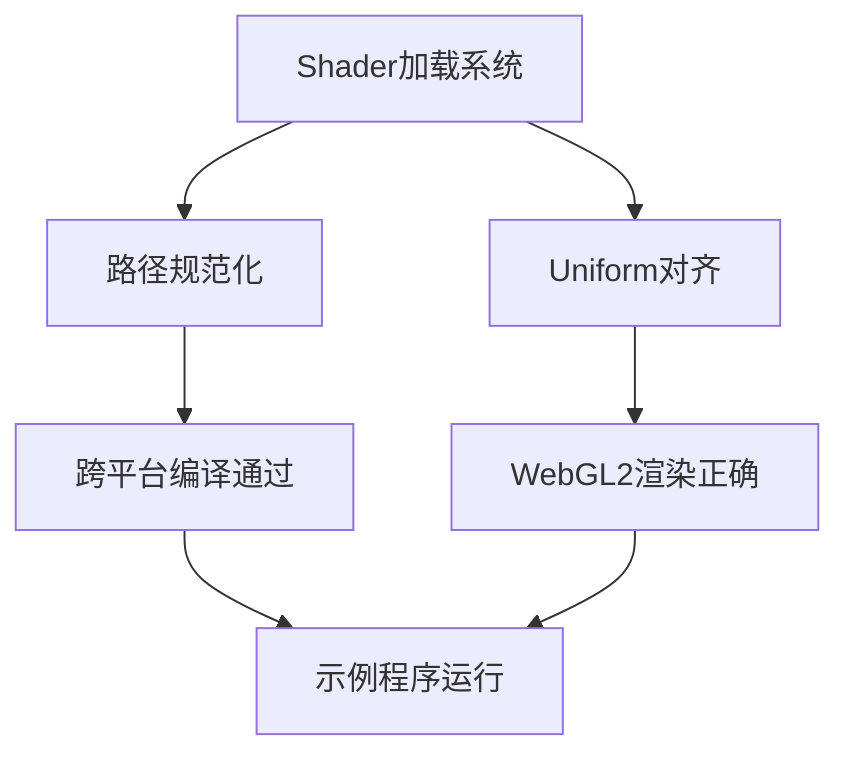

+++
title = "#18591 Fix wesl in wasm and webgl2"
date = "2025-03-28T00:00:00"
draft = false
template = "pull_request_page.html"
in_search_index = false

[extra]
current_language = "zh-cn"
available_languages = {"en" = { name = "English", url = "/pull_request/bevy/2025-03/pr-18591-en-20250328" }, "zh-cn" = { name = "中文", url = "/pull_request/bevy/2025-03/pr-18591-zh-cn-20250328" }}
labels = ["A-Rendering", "O-Web", "O-WebGL2"]
+++

# #18591 Fix wesl in wasm and webgl2

## Basic Information
- **Title**: Fix wesl in wasm and webgl2
- **PR Link**: https://github.com/bevyengine/bevy/pull/18591
- **Author**: mockersf
- **Status**: MERGED
- **Labels**: `A-Rendering`, `O-Web`, `S-Ready-For-Final-Review`, `P-Compile-Failure`, `O-WebGL2`
- **Created**: 2025-03-28T11:20:44Z
- **Merged**: Not merged
- **Merged By**: N/A

## Description Translation

### 目标
- `shader_format_wesl` 特性在 Wasm 环境下无法编译
- 修复后，示例 `shader_material_wesl` 在 WebGL2 环境下无法正常工作

### 解决方案
- 移除 shader 加载时的特殊路径处理，避免资产目录逃逸问题，同时解决 Android/Wasm/iOS 平台的兼容问题
- 通过 padding 确保 material 结构体满足 16 位对齐要求
- 将非波点区域的输出颜色从 `(0.0, 0.0, 0.0, 0.0)` 改为 `(0.0, 0.0, 0.0, 1.0)` 以统一跨平台渲染效果

## The Story of This Pull Request

### 问题与背景
该 PR 解决了两个核心问题：  
1. **跨平台编译失败**：使用 `shader_format_wesl` 特性时，特殊路径处理逻辑导致在 Wasm/Android/iOS 平台无法编译  
2. **WebGL2 渲染异常**：修复编译问题后，示例中的波点着色器在 WebGL2 环境下显示为白色背景而非预期效果  

根本原因在于：  
- 原路径处理方式试图绕过资产系统，违反平台安全规范  
- WebGL2 对 uniform 缓冲区的 16 位对齐要求更严格  
- 不同图形后端对透明颜色的解释差异（WebGPU 将 alpha=0 解释为黑色，WebGL2 解释为白色）

### 解决方案与技术实现
**1. 路径处理规范化**  
```rust
// 修改前：特殊路径处理逻辑
// 修改后：统一使用标准资产路径加载方式
const FRAGMENT_SHADER_ASSET_PATH: &str = "shaders/custom_material.wesl";
```
移除特殊路径跳转逻辑（如 `../../`），确保所有平台使用一致的资产加载机制，避免文件系统访问越界问题。

**2. Uniform 缓冲区对齐**  
```rust
// CustomMaterial 结构体增加 padding 字段
#[uniform(0)]
time: Vec4,  // 使用 Vec4 而非 f32 实现 16 位对齐
party_mode: bool,
```
通过将 `time` 字段从 `f32` 升级为 `Vec4`，确保结构体满足 WebGL2 的 16 字节对齐要求。尽管理想方案是使用条件编译，但由于 WESL 解析器限制，采用统一 padding 更可靠。

**3. 颜色输出标准化**  
```wgsl
// 修改前：
return vec4<f32>(dot_color * is_dot, 0.0);
// 修改后：
return vec4<f32>(dot_color * is_dot, 1.0);
```
将 alpha 通道从 0.0 改为 1.0，解决 WebGL2 下透明区域显示为白色的问题，实现跨图形后端的颜色一致性。

### 技术洞察
- **Uniform 对齐规则**：WebGL2 要求 uniform 缓冲区字段按 16 字节对齐，而其他后端（如 WebGPU）更宽松。使用 `Vec4` 是保证跨平台兼容的有效手段  
- **颜色空间差异**：不同图形 API 对透明颜色的混合方式不同，固定 alpha 为 1.0 可消除歧义  
- **资产系统约束**：移动平台（iOS/Android）和 Wasm 对文件系统访问有严格限制，必须通过标准资产接口加载资源

### 影响与改进
- **跨平台支持**：使 WESL shader 能在所有目标平台正常编译运行  
- **渲染一致性**：消除 WebGL2 与其他后端的视觉差异  
- **代码健壮性**：移除潜在安全隐患的特殊路径处理逻辑

## Visual Representation



## Key Files Changed

### `assets/shaders/custom_material.wesl`
```wgsl
// 修改前：
struct CustomMaterial {
    time: f32,
}

// 修改后：
struct CustomMaterial {
    time: vec4<f32>,  // 16字节对齐
}
```
通过 vec4 实现结构体对齐，满足 WebGL2 要求

### `assets/shaders/util.wesl`
```wgsl
// 修改前：
return vec4<f32>(dot_color * is_dot, 0.0);

// 修改后：
return vec4<f32>(dot_color * is_dot, 1.0);
```
固定 alpha 通道解决颜色差异问题

### `examples/shader/shader_material_wesl.rs`
```rust
// 新增 party_mode 状态切换
if keys.just_pressed(KeyCode::Space) {
    material.party_mode = !material.party_mode;
}
```
实现运行时效果切换，验证 shader 功能

## Further Reading
- [WebGL2 Uniform Buffer Layout](https://www.khronos.org/opengl/wiki/Uniform_Buffer_Object)
- [WGSL Memory Layout](https://gpuweb.github.io/gpuweb/wgsl/#memory-layout)
- [Bevy Asset System](https://bevyengine.org/learn/book/features/assets/)