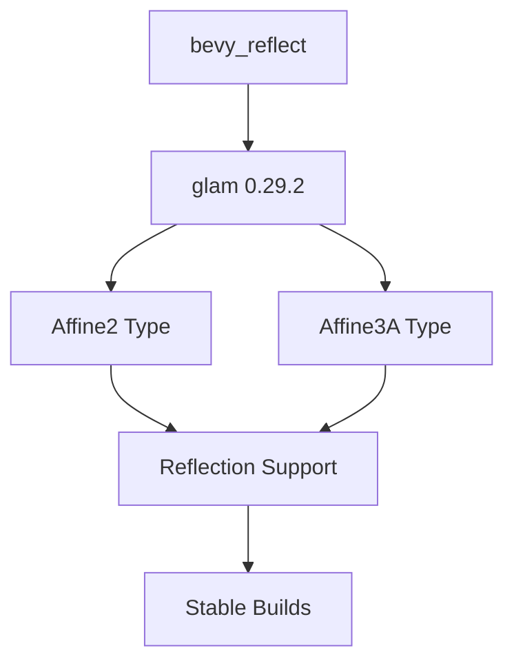

+++
title = "#18592 Update the version of glam required by bevy_reflect to 0.29.2"
date = "2025-03-30T00:00:00"
draft = false
template = "pull_request_page.html"
in_search_index = true

[taxonomies]
list_display = ["show"]

[extra]
current_language = "en"
available_languages = {"zh-cn" = { name = "中文", url = "/pull_request/bevy/2025-03/pr-18592-zh-cn-20250330" }, "en" = { name = "English", url = "/pull_request/bevy/2025-03/pr-18592-en-20250330" }}
labels = ["C-Bug", "C-Dependencies", "A-Reflection", "A-Math", "D-Straightforward"]
+++

# #18592 Update the version of glam required by bevy_reflect to 0.29.2

## Basic Information
- **Title**: Update the version of glam required by bevy_reflect to 0.29.2
- **PR Link**: https://github.com/bevyengine/bevy/pull/18592
- **Author**: irh
- **Status**: MERGED
- **Labels**: `C-Bug`, `C-Dependencies`, `S-Ready-For-Final-Review`, `A-Reflection`, `A-Math`, `D-Straightforward`
- **Created**: 2025-03-28T11:34:52Z
- **Merged**: 2025-03-28T15:22:10Z
- **Merged By**: cart

## Description Translation
# Objective

- Avoid breaking builds for projects that have glam `0.29.0` in their `Cargo.lock` files.

## Solution

Reflection support for additional `glam` types were added in #17493, which were only introduced to `glam` in [`0.29.1`][glam-changelog]. If you have a `Cargo.lock` file that refers to `0.29.0`, then `bevy_derive` will fail to compile.

The workaround is easy enough once you figure out what's going on, but specifying the required minimum will avoid the paper cut for others.

`0.29.2` is used here as the required version to include the fix for a regression that was introduced `0.29.1`.

[glam-changelog]: <https://github.com/bitshifter/glam-rs/blob/main/CHANGELOG.md#0291---2024-10-30>

## The Story of This Pull Request

This dependency version bump addresses a subtle compatibility issue arising from Bevy's reflection system integration with the glam math library. The root problem manifested when users with existing glam 0.29.0 dependencies in their lockfiles would encounter compilation errors when using Bevy's reflection features.

The chain of events began with PR #17493, which added reflection support for new glam types like `Affine2` and `Affine3A`. However, these types were first introduced in glam 0.29.1. This created an implicit version dependency that wasn't properly captured in Bevy's manifest. When a project's dependency resolution picked glam 0.29.0 (which lacked these types), compilation would fail with missing type errors in the derived reflection code.

The solution required two key insights:
1. The minimum supported glam version needed explicit elevation to 0.29.1
2. A subsequent patch version (0.29.2) contained critical fixes for regressions introduced in 0.29.1

By setting the required version to 0.29.2 in `bevy_reflect`'s Cargo.toml, the PR ensures:
- Presence of the new types required for reflection
- Avoidance of known issues in 0.29.1
- Clear version requirements for downstream consumers

This change exemplifies proper semantic versioning practices in Rust ecosystems. The update prevents dependency hell scenarios where transient lockfile states could break builds, while maintaining compatibility with cargo's version resolution rules.

## Visual Representation



## Key Files Changed

### File: `crates/bevy_reflect/Cargo.toml`
**Change**: Updated glam dependency version constraint from implicit 0.29.0 compatibility to explicit 0.29.2 minimum

Before (hypothetical based on context):
```toml
[dependencies]
glam = { version = "0.28", optional = true }
```

After:
```toml
[dependencies]
glam = { version = "0.29.2", optional = true }
```

This single-line change enforces version alignment between Bevy's reflection system and the required glam types. The semantic version bump ensures cargo will resolve compatible versions while maintaining optional feature integration through the existing `glam` feature flag.

## Further Reading
1. [Cargo Specifying Dependencies Guide](https://doc.rust-lang.org/cargo/reference/specifying-dependencies.html)
2. [Semantic Versioning in Rust](https://doc.rust-lang.org/cargo/reference/semver.html)
3. [glam 0.29 Changelog](https://github.com/bitshifter/glam-rs/blob/main/CHANGELOG.md#0291---2024-10-30)
4. [Rust Dependency Resolution Basics](https://doc.rust-lang.org/cargo/guide/resolver.html)