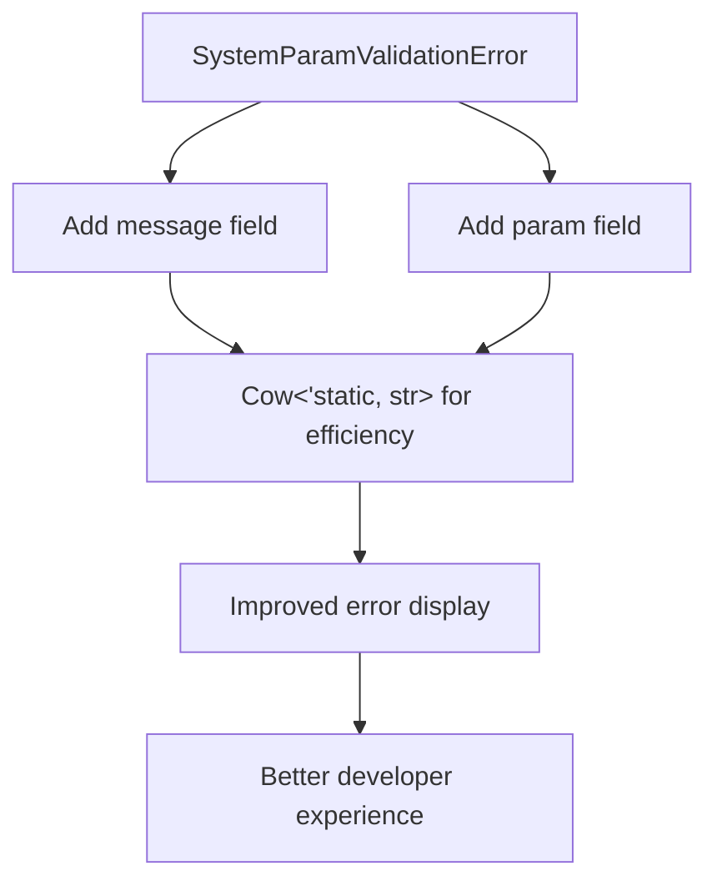

+++
title = "#18593 Improve error message for missing resources"
date = "2025-03-30T00:00:00"
draft = false
template = "pull_request_page.html"
in_search_index = true

[taxonomies]
list_display = ["show"]

[extra]
current_language = "en"
available_languages = {"zh-cn" = { name = "中文", url = "/pull_request/bevy/2025-03/pr-18593-zh-cn-20250330" }, "en" = { name = "English", url = "/pull_request/bevy/2025-03/pr-18593-en-20250330" }}
labels = ["A-ECS", "C-Usability"]
+++

# #18593 Improve error message for missing resources

## Basic Information
- **Title**: Improve error message for missing resources
- **PR Link**: https://github.com/bevyengine/bevy/pull/18593
- **Author**: chescock
- **Status**: MERGED
- **Labels**: `A-ECS`, `C-Usability`, `S-Ready-For-Final-Review`
- **Created**: 2025-03-28T15:07:11Z
- **Merged**: Not merged
- **Merged By**: N/A

## Description Translation
# Objective

Fixes #18515 

After the recent changes to system param validation, the panic message for a missing resource is currently: 

```
Encountered an error in system `missing_resource_error::res_system`: SystemParamValidationError { skipped: false }
```

Add the parameter type name and a descriptive message, improving the panic message to:

```
Encountered an error in system `missing_resource_error::res_system`: SystemParamValidationError { skipped: false, message: "Resource does not exist", param: "bevy_ecs::change_detection::Res<missing_resource_error::MissingResource>" }
```

## Solution

Add fields to `SystemParamValidationError` for error context.  Include the `type_name` of the param and a message.  

Store them as `Cow<'static, str>` and only format them into a friendly string in the `Display` impl.  This lets us create errors using a `&'static str` with no allocation or formatting, while still supporting runtime `String` values if necessary.  

Add a unit test that verifies the panic message.

## Future Work

If we change the default error handling to use `Display` instead of `Debug`, and to use `ShortName` for the system name, the panic message could be further improved to:

```
Encountered an error in system `res_system`: Parameter `Res<MissingResource>` failed validation: Resource does not exist
```

However, `BevyError` currently includes the backtrace in `Debug` but not `Display`, and I didn't want to try to change that in this PR.  

## The Story of This Pull Request

The core issue addressed in this PR stemmed from unhelpful error messages when systems attempted to access non-existent resources. Prior to these changes, a missing resource would produce a cryptic error containing only a boolean `skipped` flag, offering no context about which resource was missing or why the validation failed. This made debugging systems significantly more difficult than necessary.

The solution focused on enhancing the `SystemParamValidationError` structure to carry contextual information. By adding `message` and `param` fields using `Cow<'static, str>`, the implementation achieves zero-cost static strings for common cases while retaining flexibility for dynamic messages. The key implementation steps were:

1. **Error Structure Enhancement**:
```rust
// Before
pub struct SystemParamValidationError {
    pub skipped: bool,
}

// After
pub struct SystemParamValidationError {
    pub skipped: bool,
    pub message: Cow<'static, str>,
    pub param: Cow<'static, str>,
}
```

2. **Error Construction**:
```rust
// Updated validation code in extract_param.rs
Err(SystemParamValidationError {
    skipped: false,
    message: "Resource does not exist".into(),
    param: std::any::type_name::<P>().into(),
})
```

3. **Display Implementation**:
```rust
impl Display for SystemParamValidationError {
    fn fmt(&self, f: &mut std::fmt::Formatter<'_>) -> std::fmt::Result {
        write!(
            f,
            "Parameter `{}` failed validation: {}",
            self.param, self.message
        )
    }
}
```

The implementation strategically uses `Cow` to avoid unnecessary allocations for static error messages while allowing runtime-generated messages when needed. This balances performance with diagnostic utility.

A unit test was added to verify the enhanced error messaging:
```rust
#[test]
#[should_panic(expected = "Resource does not exist")]
fn missing_resource_panic() {
    let mut world = World::new();
    world.run_system(res_system);
}
```

The changes particularly impact Bevy's ECS validation system, where parameter validation now carries sufficient context to identify problematic system parameters. This improvement directly addresses developer experience pain points when working with resource dependencies.

## Visual Representation



## Key Files Changed

### `crates/bevy_ecs/src/system/system_param.rs` (+77/-17)
1. Enhanced error structure and display logic:
```rust
// Before
pub struct SystemParamValidationError {
    pub skipped: bool,
}

// After
pub struct SystemParamValidationError {
    pub skipped: bool,
    pub message: Cow<'static, str>,
    pub param: Cow<'static, str>,
}
```

2. Updated Display implementation:
```rust
impl Display for SystemParamValidationError {
    fn fmt(&self, f: &mut std::fmt::Formatter<'_>) -> std::fmt::Result {
        write!(
            f,
            "Parameter `{}` failed validation: {}",
            self.param, self.message
        )
    }
}
```

### `crates/bevy_render/src/extract_param.rs` (+3/-1)
1. Added contextual error information:
```rust
// Updated error return
Err(SystemParamValidationError {
    skipped: false,
    message: "Resource does not exist".into(),
    param: std::any::type_name::<P>().into(),
})
```

These changes work together to provide specific resource missing information while maintaining Bevy's performance characteristics through careful use of zero-cost abstractions.

## Further Reading
1. [Rust Cow type documentation](https://doc.rust-lang.org/std/borrow/enum.Cow.html)
2. [Bevy ECS System Parameters](https://bevyengine.org/learn/book/ecs/system-params/)
3. [Type Name introspection in Rust](https://doc.rust-lang.org/std/any/fn.type_name.html)
4. [Error Handling in Bevy](https://bevyengine.org/learn/book/error-handling/)