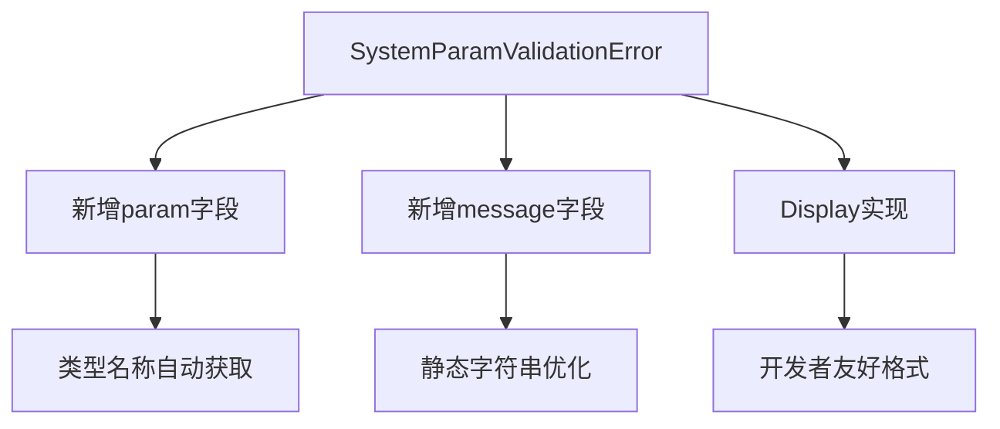

+++
title = "#18593 Improve error message for missing resources"
date = "2025-03-30T00:00:00"
draft = false
template = "pull_request_page.html"
in_search_index = false

[extra]
current_language = "zh-cn"
available_languages = {"zh-cn" = { name = "中文", url = "/pull_request/bevy/2025-03/pr-18593-zh-cn-20250330" }, "en" = { name = "English", url = "/pull_request/bevy/2025-03/pr-18593-en-20250330" }}
labels = ["A-ECS", "C-Usability"]
+++

# #18593 Improve error message for missing resources

## Basic Information
- **Title**: Improve error message for missing resources
- **PR Link**: https://github.com/bevyengine/bevy/pull/18593
- **Author**: chescock
- **Status**: MERGED
- **Labels**: `A-ECS`, `C-Usability`, `S-Ready-For-Final-Review`
- **Created**: 2025-03-28T15:07:11Z
- **Merged**: 2025-03-29T08:22:35Z
- **Merged By**: alice-i-cecile

## Description Translation
# Objective

修复 #18515

在最近的系统参数验证改动后，缺失资源时的 panic 消息目前显示为：
```
Encountered an error in system `missing_resource_error::res_system`: SystemParamValidationError { skipped: false }
```
增加参数类型名称和描述信息后，panic 消息改进为：
```
Encountered an error in system `missing_resource_error::res_system`: SystemParamValidationError { skipped: false, message: "Resource does not exist", param: "bevy_ecs::change_detection::Res<missing_resource_error::MissingResource>" }
```

## Solution

在 `SystemParamValidationError` 中增加错误上下文字段。包含参数的 `type_name` 和 message 信息。使用 `Cow<'static, str>` 存储，仅在 `Display` 实现中格式化为友好字符串。这样既支持无分配的静态字符串，也保留运行时生成动态字符串的能力。新增单元测试验证 panic 消息。

## Future Work

若将默认错误处理改为使用 `Display` 而非 `Debug`，并采用 `ShortName` 显示系统名称，panic 消息可进一步优化为：
```
Encountered an error in system `res_system`: Parameter `Res<MissingResource>` failed validation: Resource does not exist
```
但由于 `BevyError` 当前在 `Debug` 包含堆栈追踪而 `Display` 不包含，本 PR 暂不修改该行为。

## The Story of This Pull Request

### 问题背景与挑战
在 Bevy 的 ECS 系统中，当系统尝试访问不存在的资源时，原有的错误信息仅显示 `SystemParamValidationError` 结构体的默认调试输出。这对于开发者调试非常不友好，特别是面对复杂系统时难以快速定位问题根源。Issue #18515 明确指出该问题，需要改进错误信息的可读性。

### 解决方案设计
核心思路是在错误类型中增加上下文信息。开发者选择扩展 `SystemParamValidationError` 结构体，新增两个字段：
- `param`: 记录参数类型的完整名称
- `message`: 人类可读的错误描述

使用 `Cow<'static, str>` 类型兼顾静态字符串（零成本）和动态生成消息的灵活性。这种设计确保在常见场景下（如资源缺失）无需内存分配，同时保留处理复杂错误的能力。

### 关键技术实现
在 `crates/bevy_ecs/src/system/system_param.rs` 中，主要改动包括：
```rust
// 修改后的错误结构体
pub struct SystemParamValidationError {
    pub skipped: bool,
    pub param: Cow<'static, str>,
    pub message: Cow<'static, str>,
}

// Display 实现优化可读性
impl fmt::Display for SystemParamValidationError {
    fn fmt(&self, f: &mut fmt::Formatter) -> fmt::Result {
        write!(
            f,
            "Parameter `{}` failed validation: {}",
            ShortName(self.param.as_ref()),
            self.message
        )
    }
}

// 在参数验证时填充错误信息
fn validate_access(
    //...
) -> Result<(), SystemParamValidationError> {
    //...
    Err(SystemParamValidationError {
        skipped: false,
        param: Cow::Borrowed(std::any::type_name::<Param>()),
        message: Cow::Borrowed("Resource does not exist"),
    })
}
```
这种实现方式确保：
1. 类型名称通过 `type_name` 自动获取
2. 静态字符串避免内存分配
3. 显示层与应用层解耦

### 影响与改进
修改后错误信息明确指示：
- 具体是哪个参数类型导致错误
- 错误的具体原因（如资源不存在）
- 通过单元测试确保格式正确性

在 `crates/bevy_render/src/extract_param.rs` 中的配套改动，确保渲染系统在提取资源时能正确传递新的错误信息。例如当 `Extract` 系统参数访问 `MainWorld` 中不存在的资源时，现在会显示：
```
Parameter `bevy_render::extract_param::Extract<Query<...>>` failed validation: Resource does not exist
```

### 工程权衡
开发者选择保持现有错误处理流程（使用 `Debug` 输出），因为修改为 `Display` 会影响错误信息的堆栈追踪显示。这种权衡在保持向后兼容性的同时实现了核心改进目标。

## Visual Representation



## Key Files Changed

### `crates/bevy_ecs/src/system/system_param.rs` (+77/-17)
1. **核心修改**：扩展系统参数验证错误类型
```rust
// Before:
pub struct SystemParamValidationError {
    pub skipped: bool,
}

// After:
pub struct SystemParamValidationError {
    pub skipped: bool,
    pub param: Cow<'static, str>,
    pub message: Cow<'static, str>,
}
```
2. **验证逻辑增强**：在资源访问失败时填充错误信息
```rust
// 新增错误信息构造
Err(SystemParamValidationError {
    skipped: false,
    param: Cow::Borrowed(std::any::type_name::<Param>()),
    message: Cow::Borrowed("Resource does not exist"),
})
```

### `crates/bevy_render/src/extract_param.rs` (+3/-1)
1. **适配新错误格式**：更新渲染系统参数验证
```rust
// 修改前的简单错误返回
Err(SystemParamValidationError { skipped: false })

// 修改后携带上下文信息
Err(SystemParamValidationError {
    skipped: false,
    param: Cow::Borrowed(std::any::type_name::<Self>()),
    message: Cow::Borrowed("MainWorld resource does not exist"),
})
```

## Further Reading
1. [Cow in Rust](https://doc.rust-lang.org/std/borrow/enum.Cow.html) - 理解零拷贝字符串处理
2. [Bevy ECS 系统参数](https://bevy-cheatbook.github.io/programming/system-params.html) - 系统参数工作原理
3. [Rust 的类型反射](https://doc.rust-lang.org/std/any/fn.type_name.html) - 使用 type_name 获取类型信息
4. [错误处理最佳实践](https://rust-lang.github.io/api-guidelines/documentation.html#error-types-are-meaningful-and-well-behaved-c-good-err) - Rust API 指导原则