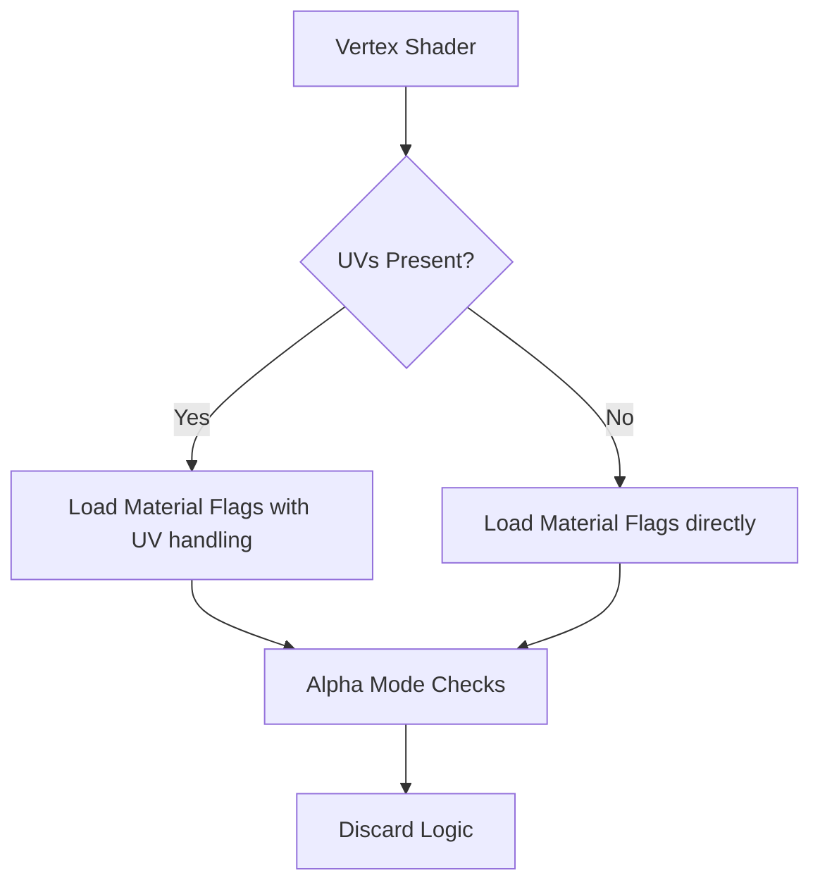

+++
title = "#18602 Fix shader pre-pass compile failure when using AlphaMode::Blend and a Mesh without UVs (`0.16.0-rc.2`)"
date = "2025-03-30T00:00:00"
draft = false
template = "pull_request_page.html"
in_search_index = true

[taxonomies]
list_display = ["show"]

[extra]
current_language = "en"
available_languages = {"en" = { name = "English", url = "/pull_request/bevy/2025-03/pr-18602-en-20250330" }, "zh-cn" = { name = "中文", url = "/pull_request/bevy/2025-03/pr-18602-zh-cn-20250330" }}
labels = ["C-Bug", "A-Rendering", "C-Usability"]
+++

# #18602 Fix shader pre-pass compile failure when using AlphaMode::Blend and a Mesh without UVs (`0.16.0-rc.2`)

## Basic Information
- **Title**: Fix shader pre-pass compile failure when using AlphaMode::Blend and a Mesh without UVs (`0.16.0-rc.2`)
- **PR Link**: https://github.com/bevyengine/bevy/pull/18602
- **Author**: aloucks
- **Status**: MERGED
- **Labels**: `C-Bug`, `A-Rendering`, `C-Usability`, `S-Ready-For-Final-Review`
- **Created**: 2025-03-29T04:06:11Z
- **Merged**: 2025-03-29T12:34:15Z
- **Merged By**: cart

## Description Translation
# Objective

The flags are referenced later outside of the VERTEX_UVS ifdef/endif block. The current behavior causes the pre-pass shader to fail to compile when UVs are not present in the mesh, such as when using a `LineStrip` to render a grid. 

Fixes #18600

## Solution

Move the definition of the `flags` outside of the ifdef/endif block.

## Testing

Ran a modified `3d_example` that used a mesh and material with alpha_mode blend, `LineStrip` topology, and no UVs.

## The Story of This Pull Request

The problem stemmed from a conditional compilation block in Bevy's WGSL shader code that controlled material flag accessibility. When using AlphaMode::Blend with meshes lacking UV coordinates (like LineStrip primitives), the pre-pass shader would fail to compile due to an undefined `flags` variable reference.

The root cause lay in the scoping of material flags within the shader's conditional blocks. The original code defined the `flags` variable inside the `#ifdef VERTEX_UVS` block but referenced it later in alpha mode checks that existed outside this conditional. For meshes without UVs (where VERTEX_UVS isn't defined), the compiler would never see the `flags` declaration, leading to a fatal error.

The solution required careful adjustment of variable scoping in the WGSL shader code. By moving the `flags` declaration outside the VERTEX_UVS conditional block, the variable became available regardless of whether UV coordinates were present. This change maintained correct behavior for materials with UVs while fixing compilation for those without.

Key technical considerations included:
1. Preserving bindless rendering support (handled through `BINDLESS` conditional blocks)
2. Maintaining correct material property lookups for both bindless and non-bindless paths
3. Ensuring alpha cutoff calculations remained conditional on UV availability

The implementation demonstrates proper shader code organization by separating material property access from UV-dependent texture sampling. This separation allows essential material properties like alpha mode to remain accessible even when texture coordinates aren't available.

## Visual Representation



## Key Files Changed

### File: `crates/bevy_pbr/src/render/pbr_prepass_functions.wgsl`

**Change Summary**: Moved material flags declaration outside UV-dependent conditional block

Before:
```wgsl
#ifdef BINDLESS
    let flags = pbr_bindings::material_array[material_indices[slot].material].flags;
#else
    let flags = pbr_bindings::material.flags;
#endif
```

After:
```wgsl
#ifdef BINDLESS
    let flags = pbr_bindings::material_array[material_indices[slot].material].flags;
#else
    let flags = pbr_bindings::material.flags;
#endif  // BINDLESS
```

The critical change moves the `flags` declaration outside the `VERTEX_UVS` conditional block, ensuring it's always available for subsequent alpha mode checks. The `#endif` comment was also updated for consistency.

## Further Reading

1. [Bevy Rendering Architecture](https://bevyengine.org/learn/book/implementation/rendering/)
2. [WGSL Shader Language Specification](https://www.w3.org/TR/WGSL/)
3. [Alpha Compositing Techniques](https://developer.nvidia.com/content/alpha-blending-pre-or-not-pre)
4. [Bevy Material System Documentation](https://github.com/bevyengine/bevy/blob/main/docs/plugins_guidelines.md#material-system)