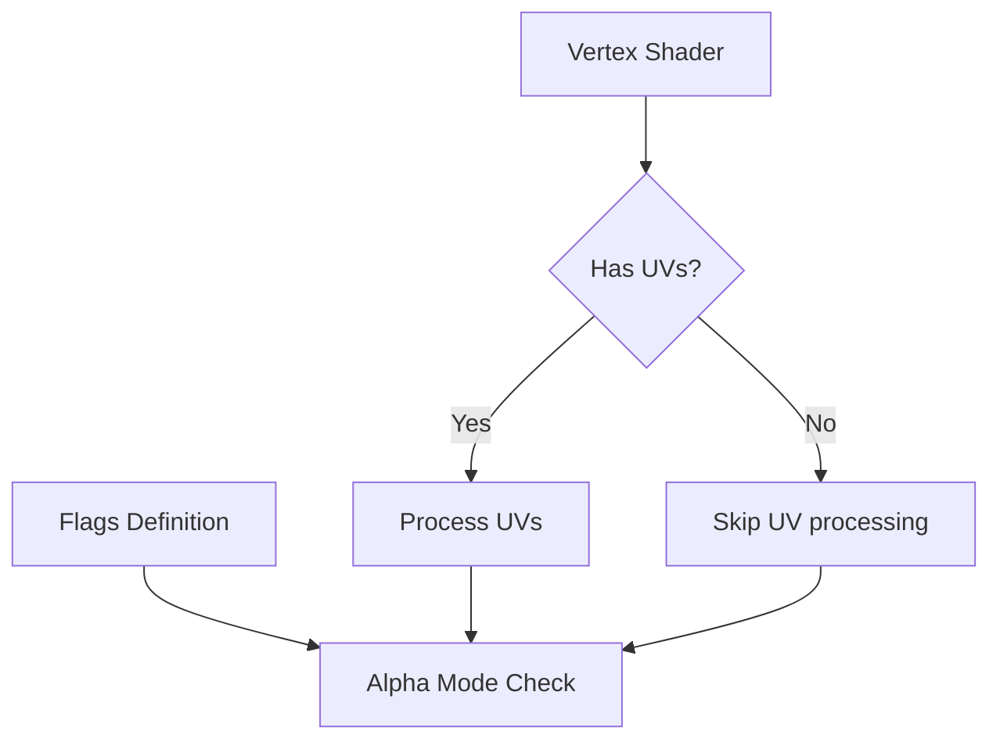

+++
title = "#18602 Fix shader pre-pass compile failure when using AlphaMode::Blend and a Mesh without UVs (`0.16.0-rc.2`)"
date = "2025-03-30T00:00:00"
draft = false
template = "pull_request_page.html"
in_search_index = false

[extra]
current_language = "zh-cn"
available_languages = {"en" = { name = "English", url = "/pull_request/bevy/2025-03/pr-18602-en-20250330" }, "zh-cn" = { name = "中文", url = "/pull_request/bevy/2025-03/pr-18602-zh-cn-20250330" }}
labels = ["C-Bug", "A-Rendering", "C-Usability"]
+++

# #18602 Fix shader pre-pass compile failure when using AlphaMode::Blend and a Mesh without UVs (`0.16.0-rc.2`)

## Basic Information
- **Title**: Fix shader pre-pass compile failure when using AlphaMode::Blend and a Mesh without UVs (`0.16.0-rc.2`)
- **PR Link**: https://github.com/bevyengine/bevy/pull/18602
- **Author**: aloucks
- **Status**: MERGED
- **Labels**: `C-Bug`, `A-Rendering`, `C-Usability`, `S-Ready-For-Final-Review`
- **Created**: 2025-03-29T04:06:11Z
- **Merged**: Not merged
- **Merged By**: N/A

## Description Translation
### 目标
当在网格没有UV坐标（例如使用`LineStrip`渲染网格）时，预处理shader（pre-pass shader）会因为`flags`变量在`VERTEX_UVS`条件块外部引用而编译失败。本PR修复该问题（issue #18600）。

### 解决方案
将`flags`变量的定义移动到`VERTEX_UVS`条件块外部。

### 测试
修改了`3d_example`用例，使用无UV的`LineStrip`拓扑结构和`alpha_mode = Blend`的材质进行验证。

## The Story of This Pull Request

### 问题背景与上下文
在Bevy的PBR渲染管线中，预处理shader (`pbr_prepass_functions.wgsl`) 负责处理材质alpha通道的逻辑。当开发者尝试使用`AlphaMode::Blend`配合没有UV坐标的网格（如`LineStrip`）时，shader编译会失败。这个问题直接影响使用简单几何体实现透明效果的可行性。

根本问题出在shader代码的条件编译结构上。原有的`flags`变量（存储材质特性标志）被错误地放在`#ifdef VERTEX_UVS`条件块内部定义。当网格没有UV坐标时，`VERTEX_UVS`宏未定义，导致`flags`变量未声明，但后续的alpha模式判断仍试图访问该变量，引发编译错误。

### 解决方案分析
核心解决思路是调整`flags`变量的作用域。通过将`flags`的定义移动到`VERTEX_UVS`条件块外部，确保无论是否存在UV坐标，后续逻辑都能访问到材质标志。

在代码实现中，存在两种配置路径：
1. **BINDLESS模式**（资源绑定优化模式）：
```wgsl
#ifdef BINDLESS
let flags = pbr_bindings::material_array[material_indices[slot].material].flags;
#else
let flags = pbr_bindings::material.flags;
#endif
```
2. **非BINDLESS模式**：
```wgsl
let flags = pbr_bindings::material.flags;
```

原代码将这两个flags定义嵌套在`#ifdef VERTEX_UVS`块内，导致当没有UV坐标时这些定义被跳过。修改后将其提升到条件块外部，确保在任何情况下都能正确声明。

### 技术实现细节
关键修改体现在代码结构的调整：

原代码结构：
```wgsl
#ifdef VERTEX_UVS
    // UV处理逻辑...
    #ifdef BINDLESS
        let flags = ...;
    #else
        let flags = ...;
    #endif
#endif // VERTEX_UVS

// 后续使用flags进行alpha模式判断 ← 此处flags可能未定义
```

修改后结构：
```wgsl
#ifdef BINDLESS
    let flags = ...;
#else
    let flags = ...;
#endif

#ifdef VERTEX_UVS
    // UV处理逻辑...
#endif // VERTEX_UVS

// 后续使用flags进行alpha模式判断 ← 此处flags已正确定义
```

这种结构调整保证：
1. `flags`的定义不再依赖UV坐标的存在
2. UV相关的纹理采样逻辑仍保持条件编译
3. Alpha模式判断逻辑保持完整可用性

### 影响与启示
该修复：
1. 解决了特定配置下的shader编译失败问题
2. 保持原有渲染逻辑不变
3. 提升框架对非传统网格类型的支持能力

工程经验：
- 在WGSL等shader语言中，条件编译可能意外改变变量作用域
- 需要特别注意跨条件块的变量可见性问题
- 测试用例应覆盖各种资源组合（如有/无UV、不同拓扑结构）

## Visual Representation



## Key Files Changed

### File: `crates/bevy_pbr/src/render/pbr_prepass_functions.wgsl`

**修改说明**：
将`flags`变量的定义从`VERTEX_UVS`条件块内部移动到外部，确保无UV时仍能访问材质标志。

**代码变更**：
```wgsl
// Before:
#ifdef VERTEX_UVS
...
#ifdef BINDLESS
    let flags = pbr_bindings::material_array[material_indices[slot].material].flags;
#else
    let flags = pbr_bindings::material.flags;
#endif
...
#endif // VERTEX_UVS

// After:
#ifdef BINDLESS
    let flags = pbr_bindings::material_array[material_indices[slot].material].flags;
#else
    let flags = pbr_bindings::material.flags;
#endif

#ifdef VERTEX_UVS
...
#endif // VERTEX_UVS
```

## Further Reading
1. [WGSL Specification - Scoping and Lifetime](https://www.w3.org/TR/WGSL/#scope-and-lifetime)
2. [Bevy PBR Material System Documentation](https://bevyengine.org/learn/book/features/pbr/)
3. [WebGPU Shader Validation Best Practices](https://gpuweb.github.io/gpuweb/wgsl/#validation)