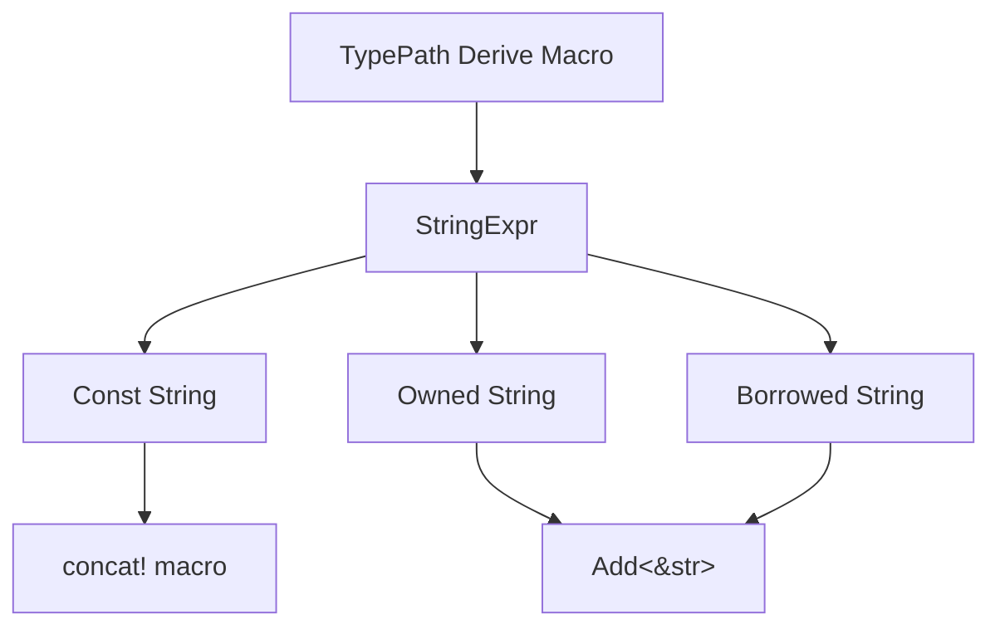

+++
title = "#18609 bevy_reflect: Fix `TypePath` string concatenation"
date = "2025-03-29T00:00:00"
draft = false
template = "pull_request_page.html"
in_search_index = true

[taxonomies]
list_display = ["show"]

[extra]
current_language = "en"
available_languages = {"zh-cn" = { name = "中文", url = "/pull_request/bevy/2025-03/pr-18609-zh-cn-20250329" }, "en" = { name = "English", url = "/pull_request/bevy/2025-03/pr-18609-en-20250329" }}
labels = ["C-Bug", "D-Trivial", "A-Reflection"]
+++

# #18609 bevy_reflect: Fix `TypePath` string concatenation

## Basic Information
- **Title**: bevy_reflect: Fix `TypePath` string concatenation
- **PR Link**: https://github.com/bevyengine/bevy/pull/18609
- **Author**: MrGVSV
- **Status**: MERGED
- **Labels**: `C-Bug`, `D-Trivial`, `S-Ready-For-Final-Review`, `A-Reflection`
- **Created**: 2025-03-29T19:18:20Z
- **Merged**: Not merged
- **Merged By**: N/A

## Description Translation
# Objective

Fixes #18606

When a type implements `Add` for `String`, the compiler can get confused when attempting to add a `&String` to a `String`.

Unfortunately, this seems to be [expected behavior](https://github.com/rust-lang/rust/issues/77143#issuecomment-698369286) which causes problems for generic types since the current `TypePath` derive generates code that appends strings in this manner.

## Solution

Explicitly use the `Add<&str>` implementation in the `TypePath` derive macro.

## Testing

You can test locally by running:

```
cargo check -p bevy_reflect --tests
```

## The Story of This Pull Request

The core issue stemmed from Rust's type inference limitations when combining different string types through the `Add` trait. The `TypePath` derive macro generated code that attempted to concatenate string expressions using `+` operator between owned `String` and borrowed `&String` values. This triggered compiler confusion due to overlapping trait implementations, particularly when generic types were involved.

The solution focused on eliminating type ambiguity by explicitly specifying which `Add` trait implementation to use. The key insight was recognizing that using `Add<&str>` instead of the default `Add<String>` would resolve the compilation errors while maintaining equivalent functionality.

In the `StringExpr` implementation, the critical change occurred in the `appended_by` method. When combining non-constant string expressions, the code was modified to explicitly call `Add::<&str>::add`:

```rust
// Before:
::core::ops::Add::add(#owned, #borrowed)

// After:
::core::ops::Add::<&str>::add(#owned, #borrowed)
```

This modification forces the compiler to use the `Add` implementation for `&str` operands, avoiding the ambiguous situation where multiple trait implementations could apply. The change leverages Rust's trait disambiguation syntax (`::<T>`) to specify the exact type parameter for the `Add` trait.

The implementation maintains efficiency by:
1. Using `concat!` macro for compile-time constant strings
2. Converting to owned `String` only when necessary
3. Operating on string slices (`&str`) for borrowed content

This approach ensures minimal allocations while resolving the type inference issues. The changes affect the code generation in `TypePath` derive macro, which is critical for Bevy's reflection system to correctly produce type paths for reflected types.

## Visual Representation



## Key Files Changed

### File: `crates/bevy_reflect/derive/src/string_expr.rs`
**Change**: Modified string concatenation to explicitly use `Add<&str>`

Before:
```rust
::core::ops::Add::add(#owned, #borrowed)
```

After:
```rust
::core::ops::Add::<&str>::add(#owned, #borrowed)
```

This change specifies the exact `Add` trait implementation to use during string concatenation, resolving compiler ambiguity.

### File: `crates/bevy_reflect/src/lib.rs`
**Change**: Added test cases for type path generation

Though the full contents aren't shown, this file likely contains test validations ensuring the fixed string concatenation works correctly across various type scenarios.

## Further Reading
- [Rust Trait Disambiguation Syntax](https://doc.rust-lang.org/reference/expressions/call-expr.html#disambiguation-function-calls)
- [String vs &str in Rust](https://doc.rust-lang.org/book/ch08-02-strings.html)
- [Bevy Reflection System](https://bevyengine.org/learn/book/getting-started/reflection/)