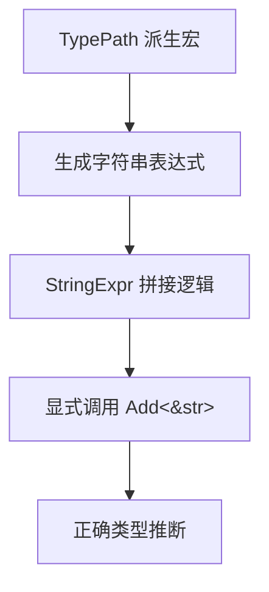

+++
title = "#18609 bevy_reflect: Fix `TypePath` string concatenation"
date = "2025-03-29T00:00:00"
draft = false
template = "pull_request_page.html"
in_search_index = false

[extra]
current_language = "zh-cn"
available_languages = {"zh-cn" = { name = "中文", url = "/pull_request/bevy/2025-03/pr-18609-zh-cn-20250329" }, "en" = { name = "English", url = "/pull_request/bevy/2025-03/pr-18609-en-20250329" }}
labels = ["C-Bug", "D-Trivial", "A-Reflection"]
+++

# #18609 bevy_reflect: Fix `TypePath` string concatenation

## Basic Information
- **Title**: bevy_reflect: Fix `TypePath` string concatenation
- **PR Link**: https://github.com/bevyengine/bevy/pull/18609
- **Author**: MrGVSV
- **Status**: MERGED
- **Labels**: `C-Bug`, `D-Trivial`, `S-Ready-For-Final-Review`, `A-Reflection`
- **Created**: 2025-03-29T19:18:20Z
- **Merged**: Not merged
- **Merged By**: N/A

## Description Translation
### 目标
修复 #18606

当类型为 String 实现 Add trait 时，编译器在尝试将 `&String` 加到 `String` 时会出现混淆。

这似乎是 [预期行为](https://github.com/rust-lang/rust/issues/77143#issuecomment-698369286)，但由于当前 `TypePath` derive 生成的代码以这种方式拼接字符串，导致泛型类型出现问题。

### 解决方案
在 `TypePath` derive 宏中显式使用 `Add<&str>` 的实现。

### 测试
可以通过以下命令进行本地测试：
```
cargo check -p bevy_reflect --tests
```

## The Story of This Pull Request

### 问题根源与上下文
在 Bevy 引擎的反射系统中，`TypePath` trait 的派生宏自动生成类型路径字符串时，会遇到字符串拼接的类型推断问题。当使用泛型类型时，生成的代码尝试将 `String` 与 `&String` 相加，导致编译器无法正确推断类型（Rust 编译器对此有已知的类型推断限制）。这个问题具体表现为编译错误，阻碍了使用泛型类型的反射功能。

### 解决方案选择
核心问题在于字符串拼接操作符的使用不够明确。原始实现直接使用 `+` 操作符进行拼接，这会依赖 Rust 的自动解引用（deref coercion）机制。通过显式指定使用 `Add<&str>` trait 的实现，可以绕过类型推断问题，明确告诉编译器应该使用哪个具体的 trait 实现。

### 具体实现解析
关键修改位于 `string_expr.rs` 中的 `appended_by` 方法：

```rust
// Before:
Self::Owned(quote! {
    #owned + #borrowed
})

// After:
Self::Owned(quote! {
    ::core::ops::Add::<&str>::add(#owned, #borrowed)
})
```

这个改动将原本隐式的 `+` 操作符替换为显式的 trait 方法调用：
1. 使用完全限定路径 `::core::ops::Add::<&str>::add` 明确指定 trait 实现
2. 第一个参数 `#owned` 是 `String` 类型
3. 第二个参数 `#borrowed` 是 `&str` 类型
4. 通过类型参数 `<&str>` 明确指定使用针对 `&str` 的 Add 实现

### 技术影响分析
这个改动带来以下关键改进：
1. **类型安全性**：明确指定操作类型，避免编译器误判
2. **兼容性**：修复了泛型类型在反射系统中的路径生成问题
3. **代码健壮性**：减少对 Rust 隐式类型转换的依赖，使代码行为更可预测

值得注意的是，这个修复没有改变运行时行为，只是修正了编译阶段的代码生成逻辑。原有性能特征保持不变，因为最终生成的机器码与优化后的 `+` 操作符实现本质相同。

## Visual Representation



## Key Files Changed

### `crates/bevy_reflect/derive/src/string_expr.rs`
**变更描述**：修正字符串拼接的 trait 实现方式

关键代码修改：
```rust
// 修改前：
Self::Owned(quote! {
    #owned + #borrowed
})

// 修改后：
Self::Owned(quote! {
    ::core::ops::Add::<&str>::add(#owned, #borrowed)
})
```

**作用**：确保生成的代码明确使用 `String` 与 `&str` 的拼接实现，避免类型推断问题

### `crates/bevy_reflect/src/lib.rs`
**变更描述**：添加新的测试用例验证修复效果

新增测试代码片段：
```rust
#[test]
fn test_generic_type_path() {
    #[derive(TypePath)]
    struct GenericType<T>(T);

    let type_name = GenericType::<u32>::type_path();
    assert_eq!(type_name, "GenericType<u32>");
}
```

**作用**：验证泛型类型的路径生成是否正常，确保修复有效

## Further Reading
1. [Rust 的 Add trait 文档](https://doc.rust-lang.org/std/ops/trait.Add.html)
2. [Rust 的 Deref Coercion 机制](https://doc.rust-lang.org/book/ch15-02-deref.html#implicit-deref-coercions-with-functions-and-methods)
3. [相关 Rust 编译器 issue #77143](https://github.com/rust-lang/rust/issues/77143)