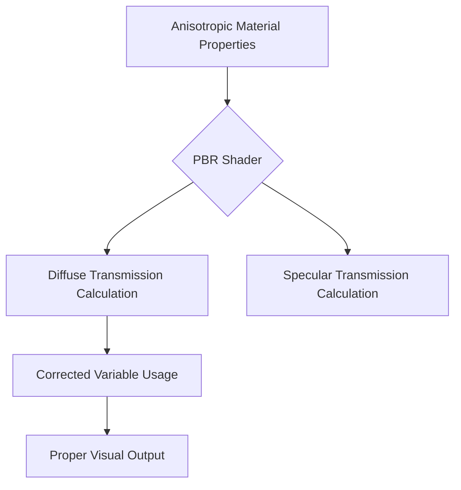

+++
title = "#18610 Fix diffuse transmission for anisotropic materials"
date = "2025-03-30T00:00:00"
draft = false
template = "pull_request_page.html"
in_search_index = true

[taxonomies]
list_display = ["show"]

[extra]
current_language = "en"
available_languages = {"zh-cn" = { name = "中文", url = "/pull_request/bevy/2025-03/pr-18610-zh-cn-20250330" }, "en" = { name = "English", url = "/pull_request/bevy/2025-03/pr-18610-en-20250330" }}
labels = ["C-Bug", "A-Rendering"]
+++

# #18610 Fix diffuse transmission for anisotropic materials

## Basic Information
- **Title**: Fix diffuse transmission for anisotropic materials
- **PR Link**: https://github.com/bevyengine/bevy/pull/18610
- **Author**: JMS55
- **Status**: MERGED
- **Labels**: `C-Bug`, `A-Rendering`, `S-Ready-For-Final-Review`
- **Created**: 2025-03-29T19:38:34Z
- **Merged**: 2025-03-30T14:22:15Z
- **Merged By**: cart

## Description Translation
Expand the diff, this was obviously just a copy paste bug at some point.

## The Story of This Pull Request

The PR addresses a specific rendering bug in Bevy's Physically Based Rendering (PBR) system where anisotropic materials with diffuse transmission properties were not being handled correctly. Anisotropic materials require different treatment from isotropic ones due to their direction-dependent surface properties, particularly in how they interact with transmitted light.

The core issue stemmed from a variable naming inconsistency in the WGSL shader code. When implementing transmission support for anisotropic materials, a copy-paste error led to using `specular_transmission` instead of `diffuse_transmission` in the relevant calculations. This mistake caused the anisotropic materials' diffuse transmission effects to improperly use specular transmission values, resulting in incorrect visual output.

The fix required three key changes in `pbr_functions.wgsl`:

1. Correcting the base color calculation for diffuse transmission
2. Fixing the diffuse light transmission multiplier
3. Updating the final color blending logic

These changes ensure that anisotropic materials properly use their diffuse transmission values rather than accidentally inheriting specular transmission properties. The implementation maintains consistency with existing PBR calculations while addressing the specific needs of anisotropic surface interactions.

## Visual Representation



## Key Files Changed

### File: `crates/bevy_pbr/src/render/pbr_functions.wgsl`

**Before:**
```wgsl
// In diffuse transmission calculation
color *= material.specular_transmission;
// ...
diffuse_light_transmission *= material.specular_transmission;
// ...
output_color = mix(output_color, color, material.specular_transmission);
```

**After:**
```wgsl
// Corrected to use diffuse_transmission
color *= material.diffuse_transmission;
// ...
diffuse_light_transmission *= material.diffuse_transmission;
// ...
output_color = mix(output_color, color, material.diffuse_transmission);
```

**Significance:**
- Fixes three instances of incorrect `specular_transmission` usage
- Ensures proper separation between diffuse and specular transmission effects
- Maintains physical accuracy in material lighting calculations

## Further Reading

1. [Bevy PBR Documentation](https://bevyengine.org/learn/book/features/pbr/)
2. [Physically Based Rendering: Diffuse and Specular Transmission](https://media.disneyanimation.com/uploads/production/publication_asset/48/asset/s2012_pbs_disney_brdf_notes_v3.pdf)
3. [WGSL Shader Language Specification](https://www.w3.org/TR/WGSL/)
4. [Anisotropic Material Theory](https://blog.selfshadow.com/publications/s2012-shading-course/burley/s2012_pbs_disney_brdf_notes_v3.pdf)